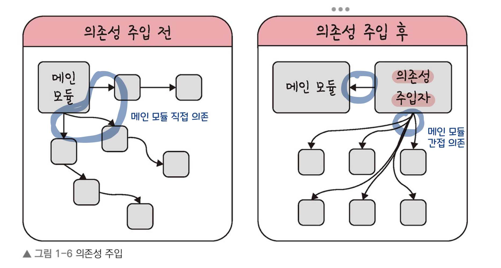
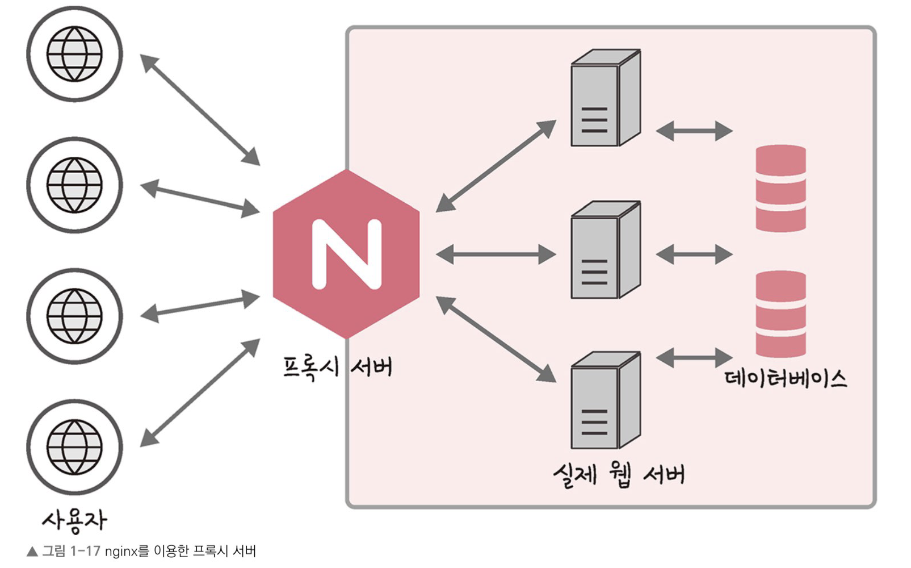
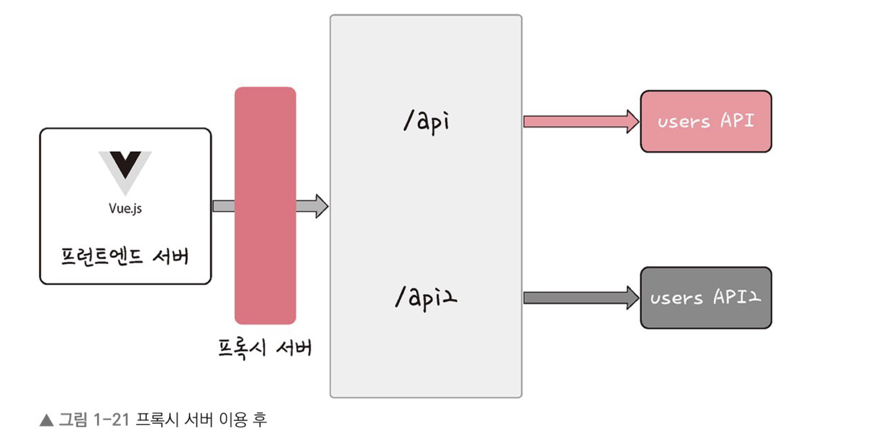
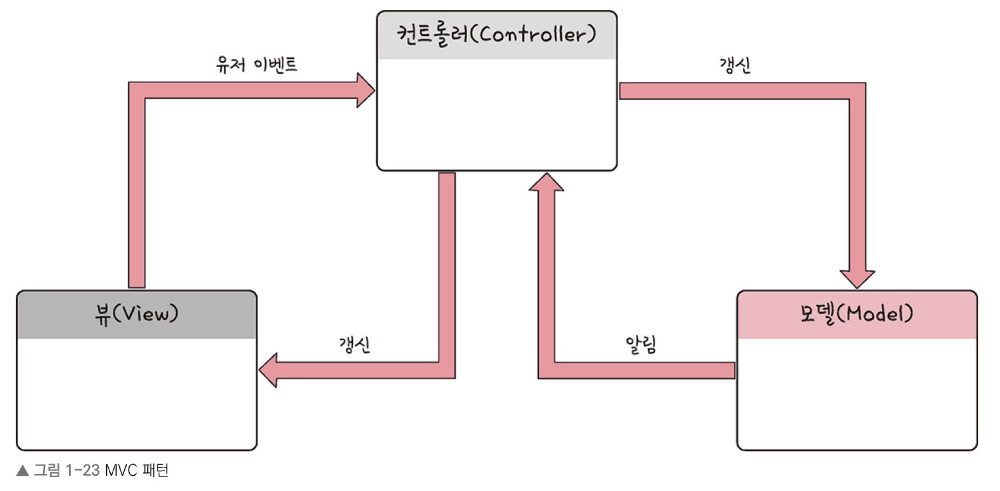
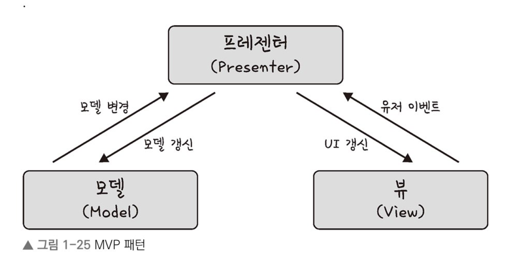
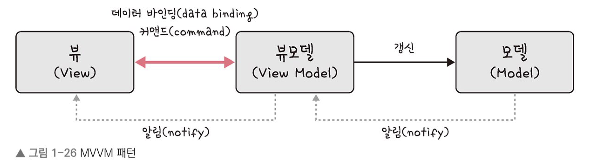
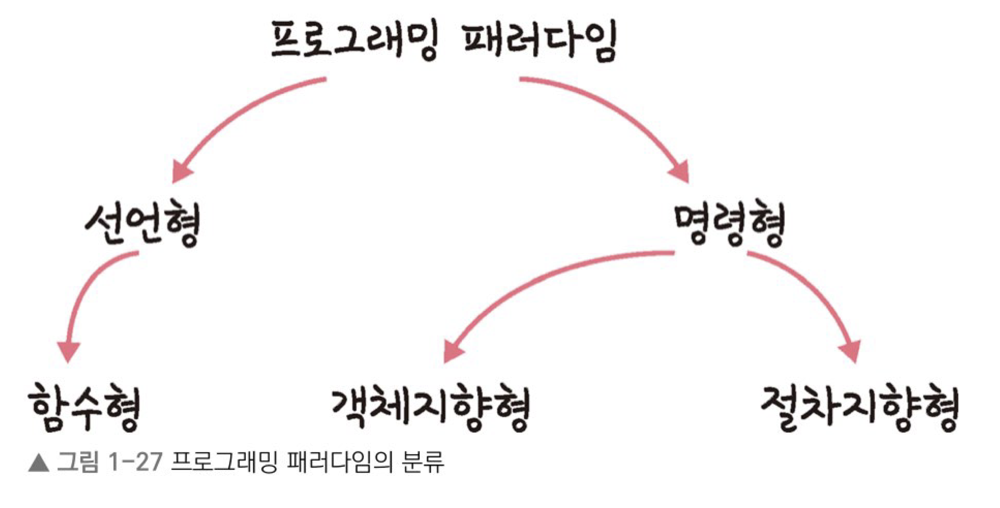

# CHAPTER 1. 디자인 패턴과 프로그래밍 패러다임

## SECTION 1.1 디자인 패턴

> 💡 디자인 패턴이란 **프로그램을 설계할 때 발생했던 문제점들을 객체 간의 상호 관계 등을 이용하여 해결할 수 있도록 하나의 ‘규약’ 형태로 만들어 놓은 것**을 의미


### 1.1.1 싱글톤 패턴 (Singleton Pattern)

- **하나의 클래스에 오직 하나의 인스턴스만 가지는 패턴**
- 데이터 베이스 연결 모듈에 많이 사용
- 장점
    - 인스턴스 생성 비용 감소
- 단점
    - 의존성 증가
    - 모듈 간의 결합을 강하게 만들 수 있음
    - 각 테스트마다 **독립적인 인스턴스**를 만들기 어려워져 TDD (test Driven Development) 하기 힘들어짐
- 사용법
    1. 클래스 밖에서는 오브젝트를 생성하지 못하도록 **기본 생성자를 private**로 만든다.
    2. 생성된 Singleton Object를 저장할 수 있는 **자신과 같은 타입의 static 필드**를 정의한다.
    3. static 팩토리 메소드인 **getInstance()**를 만들고 이 메소드가 **최초로 호출되는 시점**에서 한 번만 오브젝트가 만들어지게 한다.

       생성된 오브젝트는 **static 필드에 저장**된다. 또는 **static 필드의 초기값으로 오브젝트를 미리 만들어둘 수도** 있다.

    4. 한 번 오브젝트가 만들어지고 난 후에는 getInstance() 메소드를 통해 **이미 만들어져 static 필드에 저장해둔 오브젝트**를 넘겨준다.
- **자바에서의 싱글톤 패턴**

    ```java
    class Singleton {
    	private static class singleInstanceHolder {
    		private static final Singleton INSTANCE = new Singleton(); // 싱글톤 인스턴스 생성
    	}
    	public static Singleton getInstance() {
    		return singleInstanceHolder.INSTANSE; // 싱글톤 인스턴스 반환
    	}
    }
    
    public class HelloWorld {
    	public static void main(String[] args) {
    		Singleton a = Singleton.getInstance();
    		Singleton b = Singleton.getInstance(); // a와 동일한 해시코드를 갖는 인스턴스
    		System.out.println(a.hashCode()); // 705922765
    		System.out.println(b.hashCode()); // 705922765
    		if (a == b) { // a와 b는 동일한 해시코드를 가지므로
    			System.out.println(true); // 해당 내용은 출력됨
    		}
    	}
    }
    ```


#### **의존성 주입 (DI, Dependency Injection)**

- 모듈 간의 결합을 조금 더 느슨하게 만들어 싱글톤의 단점을 해결할 수 있음
- 의존성
    - 종속성이라고도 함
    - A가 B에 의존성이 있다는 것은 B의 변경사항에 대해 A 또한 변해야 된다는 것을 의미
    - 의존성 주입자를 통해 메인 모듈이 **간접적으로 의존성을 주입**하는 방식 (디커플링이 된다고도 함)

      

- 장점
    - 모듈들을 쉽게 교체할 수 있는 구조가 됨 ⇒ **테스팅과 마이그레이션이 쉬워짐**
    - 애플리케이션 **의존성 방향이 일관**됨
    - 애플리케이션을 **쉽게 추론**할 수 있음
    - 모듈 간의 **관계들이 조금 더 명확**해짐
- 단점
    - 늘어나는 클래스 수에 따른 **복잡성 증가**
    - 약간의 **런타임 패널티**가 생기기도 함
- 원칙

  **“상위 모듈은 하위 모듈에서 어떠한 것도 가져오지 않아야 합니다. 또한, 둘 다 추상화에 의존해야 하며, 이 때 추상화는 세부사항에 의존하지 말아야 합니다.”** 라는 의존성 주입 원칙을 지켜주면서 만들어야 함.


### 1.1.2 팩토리 패턴 (Factory Pattern)

- **객체를 사용하는 코드에서 객체 생성 부분을 떼어내 추상화한 패턴**
- 상속 관계에 잇는 두 클래스에서 **상위 클래스가 중요한 뼈대를 결정**하고, **하위 클래스에서 객체 생성에 관한 구체적인 내용을 결정**하는 패턴
- 장점
    - 상위 클래스와 하위 클래스가 분리되기 때문에 **느슨한 결합**을 가짐
    - 상위 클래스에서 인스턴스 생성 방식에 대해 알 필요가 없어 **더 많은 유연성**을 가짐
    - 객체 생성 로직이 따로 떼어져 있기 때문에 **유지 보수성이 증가**됨
- 단점
    - 새로 생성할 객체가 늘어날 때마다, Factory 클래스에 추가해야 하기 때문에 **클래스가 많아짐**
- 라떼 레시피와 아메리카노 레시피, 우유 레시피라는 구체적인 내용이 들어 있는 하위 클래스가 컨베이어 벨트를 통해 전달되고, 상위 클래스인 바리스타 공장에서 이 레시피들을 토대로 우유 등을 생상하는 생상 공정을 생각하면 됨
- **자바의 팩토리 패턴**

    ```java
    abstract class Coffe { // 상위 클래스 - 중요한 뼈대 결정
    	public abstract int getPrice();
    
    	@Override
    	public String toString() {
    		return "Hi this coffee is " + this.getPrice();
    	}
    }
    
    class CoffeFactory { // 팩토리 클래스
    	public static Coffe getCoffe(String type, int price) {
    		if ("Latte".equalsIgnoreCase(type)) return new Latte(price);
    		else if ("Americano".equalsIgnoreCase(type)) return new Americano(price);
    		else { return new DefaultCoffe(); }
    	}
    }
    
    // 하위 클래스 - 객체 생성에 관한 구체적인 내용 결정----------------------
    class DefaultCoffe extends Coffe {
    	private int price;
    
    	public DefaultCoffe() {
    		this.price = -1;
    	}
    
    	@Override
    	public int getPrice() {
    		return this.price;
    	}
    }
    
    class Latte extends Coffe {
    	private int price;
    
    	public Latte() {
    		this.price = -1;
    	}
    
    	@Override
    	public int getPrice() {
    		return this.price;
    	}
    }
    
    class Americano extends Coffe {
    	private int price;
    
    	public Americano() {
    		this.price = -1;
    	}
    
    	@Override
    	public int getPrice() {
    		return this.price;
    	}
    }
    // -----------------------------------------------------------------------
    
    public class HelloWorld {
    	public static void main(String[] args) {
    		Coffe latte = CoffeFactory.getCoffee("Latte", 4000);
    		Coffe ame = CoffeFactory.getCoffee("Americano", 3000);
    		System.out.println("Factory latte ::" + latte);
    		System.out.println("Factory ame ::" + ame);
    	}
    }
    ```


### 1.1.3 전략 패턴 (Strategy Pattern)

- **정책 패턴(Policy Pattern)**이라고도 함
- 객체의 행위를 바꾸고 싶은 경우 **‘직접’ 수정하지 않고** 전략이라고 부르는 **‘캡슐화한 알고리즘’을 컨텍스트 안에서 바꿔주면서 상호 교체가 가능하게 만드는 패턴**
- **자바의 전략 패턴**

    ```java
    interface PaymentStrategy { // 전략 => 결제 방식
    	public void pay(int amount);
    }
    
    class KAKAOCardStrategy implements PaymentStrategy { // 결제 방식 1
    	private String name;
    	private String cardNumber;
    	private String cvv;
    	private String dateOfExpiry;
    
    	public KAKAOCardStrategy(String nm, String ccNum, String cvv, String expiryDate) {
    		this.name = nm;
    		this.cardNumber = ccNum;
    		this.cvv = cvv;
    		this.dateOfExpiry = expiryDate;
    	}
    
    	@Override
    	public void pay(int amount) {
    		System.out.println(amount + " paid using KAKAOCard.");
    	}
    }
    
    class LUNACardStrategy implements PaymentStrategy { // 결제 방식 2
    	private String emailId;
    	private String password;
    
    	public LUNACardStrategy(String email, String pwd) {
    		System.out.println(amount + " paid using LUNACard.");
    	}
    }
    
    Class Item { 
    	private String name;
    	private int price;
    	public Item(String name, int cost) {
    		this.name = name;
    		this.price = cost;
    	}
    
    	public String getName() {
    		return name;
    	}
    
    	public int getPrice() {
    		return price;
    	}
    }
    
    class ShoppingCart {
    	List<Item> items;
    
    	public ShoppingCart() {
    		this.items = new ArrayList<Item>();
    	}
    
    	public void addItem(Item item) {
    		this.items.add(item);
    	}
    
    	public void removeItem(Item item) {
    		this.items.remove(item);
    	}
    
    	public int calculateTotal() {
    		int sum = 0;
    		for (Item item : item) {
    			sum += item.getPrice();
    		}
    		return sum;
    	}
    }
    
    public class HelloWorld {
    	public static void main(String[] args){
    		ShoppingCart cart = new ShoppingCart();
    
    		Item A = new Item("kundolA", 100);
    		Item B = new Item("kundolB", 300);
    
    		cart.addItem(A);
    		cart.addItem(B);
    
    		// pay by LUNACard
    		cart.pay(new LUNACardStrategy("kundal@example.com", "pukubababo")); // 400 paid using LUNACard.
    
    		// pay by KAKAOCard
    		cart.pay(new KAKAOCardStrategy("Ju hongchul", "123456789", "123", "12/01")); // 400 paid using KAKAOCard.
    	}
    }
    ```


### 1.1.4 옵저버 패턴 (Observer Pattern)

- 주체가 어떤 객체(subject)의 상태 변화를 관찰하다가 **상태 변화가 있을 때마다** 메서드 등을 통해 옵저버 목록에 있는 **옵저버들에게 변화를 알려주는 디자인 패턴**
- 객체와 주체가 분리되어 있는 옵저버 패턴
    - 주체 : 객체의 상태 변화를 보고 있는 관찰자
    - 옵저버 : 객체의 상태 변화에 따라 전달되는 메서드 등을 기반으로 **‘추가 변경 사항’**이 생기는 객체
- 객체와 주체가 합쳐진 옵저버 패턴
    - 상태가 변경되는 객체를 기반으로 구축
- **대표적 서비스 : 트위터**
- 카프카의 provider 와 consumer 도 옵저버 패턴이라고 볼 수 있음
- 주로 이벤트 기반 시스템에 사용
- MVC (Model-View-Controller) 패턴에도 사용됨
    - 주체라고 볼 수 있는 모델에서 변경 사항이 생겨 update() 메서드로 옵저버인 뷰에 알려주고 이를 기반으로 컨트롤러 등이 작동
- **자바에서의 옵저버 패턴**

    ```java
    interface Subject { // 객체
    	public void register(Observer obj);
    	public void unregister(Observer obj);
    	public void notifyObservers();
    	public Object getUpdate(Observer obj);
    }
    
    interface Observer { // 옵저버
    	public void update();
    }
    
    class Topic implements Subject { // Topic은 주체이자 객체
    	private List<Observer> observers;
    	private String message;
    
    	public Topic() {
    		this.observers = new ArrayList<>();
    		this.message = "";
    	}
    
    	@Override
    	public void register(Observer obj) {
    		if (!observers.contains(obj)) observers.add(obj); // 추가되지 않은 옵저버만 등록
    	}
    
    	@Override
    	public void unregister(Observer obj) {
    		observers.remove(obj);
    	}
    
    	@Override
    	public void notifyObservers() {
    		this.observers.forEach(Observer::update); // 모든 옵저버 업데이트
    	}
    
    	@Override
    	public Object getUpdate(Observer obj) {
    		return this.message;
    	}
    
    	public void postMessage(String msg) { // 메시지 전달
    		System.out.println("Message sended to Topic : " + msg);
    		this.message = msg;
    		notifyObservers();
    	}
    }
    
    class TopicSubscriber implements Observer {
    	private String name;
    	private Subject topic;
    
    	public TopicSubscriber(String name, Subject topic) {
    		String msg = (String) topic.getUpdate(this);
    		System.out.println(name + "::get message >> " + msg);
    	}
    }
    
    public class HelloWorld {
    	public static void main(String[] args) {
    		Topic topic = new Topic();
    		Observer a = new TopicSubscriber("a", topic);
    		Observer b = new TopicSubscriber("b", topic);
    		Observer c = new TopicSubscriber("c", topic);
    		topic.register(a);
    		topic.register(b);
    		topic.register(c);
    
    		topic.postMessage("amumu is op champion!!"); // 메시지 전달
    	}
    }
    
    /* 토픽을 전달 받은 옵저버들이 전달 받은 내용 출력
    a:: got message >> amumu is op champion!!
    b:: got message >> amumu is op champion!!
    c:: got message >> amumu is op champion!!
    */
    ```


<pre>
💡 <b>자바: 상속과 구현</b>
앞에서부터 코드에 계속 나왔던 자바의 상속과 구현에 대해 알아보겠습니다!
상속 (extends)
- 자식 클래스가 부모 클래스의 메서드 등을 상속 받아 사용하며 자식 클래스에서 추가 및 확장할 수 있는 것을 말함
- 재사용성, 중복성의 최소화가 이루어짐
- 일반 클래스, abstract 클래스 기반으로 구현
구현 (implements)
- 부모 인터페이스를 자식 클래스에서 반드시 재정의하여 구현하는 것
- 인터페이스 기반으로 구현
</pre>

### 1.1.5 프록시 패턴(Proxy Pattern)과 프록시 서버(Proxy Server)

#### **프록시 패턴**

- **대상 객체(subject)에 접근하기 전** 그 접근에 대한 **흐름을 가로채 대상 객체 앞단의 인터페이스 역할을 하는 디자인 패턴**
- 객체의 속성, 변환 등을 보완
- 보안, 데이터 검증, 캐싱, 로깅에 사용

<pre>
💡 <b>프록시 서버에서의 캐싱</b>
- 캐시 안에 정보를 담아두고, 캐시 안에 있는 정보를 요구하는 요청에 대해 다시 저 멀리 있는 원격 서버에 요청하지 않고 캐시 안에 있는 데이터를 활용하는 것
- 장점 :  <b>불필요하게 외부와 연결하지 않기 때문에 트래픽을 줄일 수 있다</b>
</pre>

#### **프록시 서버**

- 서버와 클라이언트 사이에서 클라이언트가 자신을 통해 **다른 네트워크 서비스에 간접적으로 접속할 수 있게 해주는** 컴퓨터 시스템이나 응용 프로그램
- **프록시 서버로 쓰는 nginx**

  

    - nginx
        - 비동기 이벤트 기반의 구조
        - 다수와 연결을 효과적으로 처리 가능한 웹 서버
    - 익명 사용자의 직접적인 서버로의 접근을 차단하고 간접적으로 한 단계 더 거침으로써 보안성을 더욱 강화할 수 있음
    - 실제 포트를 숨길 수 있고, 정적 자원을 gzip 압축하거나 메인 서버 앞단에서의 로깅을 할 수 있음
- **CORS와 프론트엔드의 프록시 서버**

  

    - CORS (Cross-Origin Resource Sharing)
        - 서버가 웹 브라우저에서 리소스를 로드할 때 다른 오리진을 통해 로드하지 못하게 하는 HTTP 헤더 기반 메커니즘
        - 오리진 : 프로토콜과 호스트 이름, 포트의 조합

          https://subin.com:980320/test 라는 주소에서 오리진은 https://subin.com:980320

    - CORS 에러를 해결하기 위해 프론트엔드에서 프록시 서버를 만들기도 함
    - 프론트엔드에서 127.0.0.1:3000 으로 테스팅 하는데 백엔드 서버는 127.0.0.1:8080 이라면 포트 번호가 달라 CORS 에러가 발생함. 이 때 프록시 서버를 둬서 프론트엔드 서버에서 요청되는 오리진을 127.0.0.1:8080 으로 바꿔 CORS 에러를 해결할 수 있음

### 1.1.6 이터레이터 패턴 (Iterator Pattern)

- **이터레이터(iterator)를 사용하여 컬렉션(collection)의 요소들에 접근하는 디자인 패턴**
- **자바스크립트에서의 이터레이터 패턴**

    ```jsx
    const map = new Map()
    map.set('a', 1)
    map.set('b', 2)
    const set = new Set()
    set.add(1)
    set.add(2)
    for (let a of map) console.log(a)
    for (let a of set) console.log(b)
    /* 분명히 다른 자로구조임에도 똑같은 for a of b 라는 이터레이터 프로토콜을 통해 순회
    ['a', 1]
    ['b', 2]
    1
    2
    */
    ```


### 1.1.7 노출모듈 패턴 (Revealing Module Pattern)

- **즉시 실행 함수를 통해 private, public 같은 접근 제어자를 만드는 패턴**
- private나 public 같은 접근 제어자가 존재하지 않고 전역 범위에서 스크립트가 실행되는 자바스크립트에서는 노출모듈 패턴을 통해 접근 제어자를 구현하기도 함
- 노출모듈 패턴을 기반으로 만든 자바 스크립트 모듈 방식으로는 CJS(CommonJS) 모듈 방식이 있음
- **자바스크립트에서의 노출모듈 패턴**

    ```jsx
    const pukuba = (() => {
    	const a = 1
    	const b = () => 2
    	const public = {
    		c : 2,
    		d : () => 3
    	}
    	return public
    })()
    
    ```


### 1.1.8 MVC 패턴

- **모델(Model), 뷰(View), 컨트롤러(Controller)로 이루어진 디자인패턴**

  

- 장점
    - 각각의 구성 요소에만 집중해서 개발 할 수 있음
    - 재사용성과 확장성이 용이함
- 단점
    - 애플리케이션이 복잡해질수록 모델과 뷰의 관계가 복잡해짐
- **모델 (Model)**
    - 애플리케이션의 데이터인 데이터베이스, 상수, 변수 등을 의미함
- **뷰 (View)**
    - 사용자 인터페이스 요소
    - 모델 기반으로 사용자가 볼 수 있는 화면
    - 변경이 일어나면 컨트롤러에 전달
- **컨트롤러 (Controller)**
    - 하나 이상의 모델과 하나 이상의 뷰를 잇는 다리 역할
    - 이벤트 등 메인 로직을 담당
    - 모델과 뷰의 생명주기 관리
    - 모델이나 뷰의 변경 통지를 받으면 이를 해석하여 각각의 구성 요소에 해당 내용을 알려줌
- MVC 패턴의 예 - 리액트 (React.js)

### 1.1.9 MVP 패턴

- MVC 패턴으로부터 파생 → MVC에서 C에 해당하는 **컨트롤러가 프레젠터(Presenter)로 교체된 패턴**

  

- **뷰와 프레젠터는 일대일 관계**이기 때문에 MVC패턴보다 더 강한 결합을 지님

### 1.1.10 MVVM 패턴

- MVC 패턴으로부터 파생 → MVC에서 C에 해당하는 **컨트롤러가 뷰모델(View Model)로 바뀐 패턴**

  

- 커맨드와 데이터 바인딩을 가짐
- 뷰 모델 : 뷰를 더 추상화한 계층
- 장점
    - 뷰와 뷰모델 사이의 **양방향 데이터 바인딩** 지원
    - UI를 별도의 코드 수정 없이 재사용
    - **단위 테스팅하기 쉬움**
- MVVM 패턴의 예 - 뷰 (Vue.js)

## SECTION 1.2 프로그래밍 패러다임

- 프로그래밍 패러다임
    - 프로그래머에게 프로그래밍의 관점을 갖게 해주는 역할을 하는 개발 방법론
- 크게 선언형, 명령형으로 나누며, 선언형은 함수형을 하위 집합으로 갖고, 명령형은 다시 객체지향, 절차지향으로 나눔

  


### 1.2.1 선언형과 함수형 프로그래밍

#### **선언형 프로그래밍 (Declarative Programming)**

- **“무엇을”** 풀어내는가에 집중한 패러다임
- **“프로그램은 함수로 이루어진 것이다.”** 라는 명제가 담겨있는 패러다임

### **함수형 프로그래밍 (Functional Programming)**

- 선언형 패러다임의 일종
- <b>"순수 함수"</b>들을 블록처럼 쌓아 로직을 구현하고, <b>"고차 함수"</b>를 통해 재사용성을 높인 프로그래밍 패러다임
- **순수 함수**
    - 출력이 입력에만 의존하는 것

    ```jsx
    const pure = (a, b) => {
    	return a + b
    }
    ```

- **고차 함수**
    - 함수가 함수를 값처럼 매겨변수로 받아 로직을 생성할 수 있는 것
    - 고차 함수를 쓰기 위해서는 **일급 객체**여야 함
        - 변수나 메서드에 함수를 할당할 수 있음
        - 함수 안에 함수를 매개변수로 담을 수 있음
        - 함수가 함수를 반환할 수 있음
- **커링 (Currying)**
    - 함수에 인자를 하나씩 적용해나가다가 필요한 인자가 모두 채워지면 함수 본체를 실행하는 기법
    - 재사용성을 높여줌 ⇒ 생산성 증가 및 유지보수 유용

    ```jsx
    // 커링 함수
    function multiplyTree(x) {
    	// 클로저로 생성된 공간
    	return function(y) {
    		return function(z) {
    			console.log(x * y * z);
    		}
    	}
    }
    
    multiplyThree(4)(5)(2); // 40
    
    // ES6
    let multiplyTree = x => y => z => console.log(x * y * z); // 커링 함수
    multiplyThree(4)(5)(2); // 40
    ```

- **불변성 (Immutability)**
    - 데이터는 변하지 않는 특징
    - 데이터 변경이 필요한 경우, 원본 데이터 구조를 변경하지 않고 그 데이터의 복사본을 만들어서 작업 진행
- **장점**
    - 높은 수준의 추상화 제공
    - 함수 단위의 코드 재사용 수월
    - 불변성을 지향하기 때문에 프로그램의 동작 예측이 쉬워짐
- **단점**
    - 순수함수 구현을 위해서는 코드 가독성이 좋지 않을 수 있음
    - 함수형 프로그래밍에서는 반복이 for 문이 아닌 재귀를 통해 이루어짐 (deep copy) ⇒ 무한 루프에 빠질 수 있음
    - 순수 함수 사용은 쉽지만, 조합은 쉽지 않음

### 1.2.2 객체지향 프로그래밍 (OOP, Object-Oriented Programming)

- **객체들의 집합으로 프로그램의 상호 작용을 표현하며 데이터를 객체로 취급하여 객체 내부에 선언된 메서드를 활용하는 방식**
- 단점
    - 설계에 많은 시간 소요
    - 처리 속도가 다른 프로그래밍 패러다임에 비해 상대적으로 느림

#### 객체지향 프로그래밍의 특징

- **추상화 (Abstraction)**
    - 복잡한 시스템으로부터 핵심적인 개념 또는 기능을 간추려내는 것
- **캡슐화 (Encapsulation)**
    - 객체의 속성과 메서드를 하나로 묶고 일부를 외부에 감추어 은닉하는 것
- **상속성 (Inheritance)**
    - 상위 클래스의 특성을 하위 클래스가 이어받아서 재사용하거나 추가, 확장하는 것
    - 코드의 재사용 측면, 계층적인 관계 생성, 유지 보수성 측면에서 중요
- **다형성 (Polymorphism)**
    - 하나의 메서드나 클래스가 다양한 방법으로 동작하는 것
    - **대표적 - 오버로딩, 오버라이딩**

  **오버로딩 (Overloading)**

    - **같은 이름**을 가진 메서드를 여러 개 두는 것
    - 컴파일 중에 발생하는 **정적 다형성**

  **오버라이딩 (Overriding)**

    - 주로 **메서드 오버라이딩**을 말함
    - 상위 클래스로부터 상속받은 메서드를 하위 클래스가 **재정의** 하는 것
    - 런타임 중에 발생하는 **동적 다형성**

#### 설계 원칙

- 객체지향 프로그래밍을 설계할 때는 SOLID 원칙을 지켜주어야 함
- **S : 단일 책임 원칙 (SRP, Single Responsibility Principle)**
    - **모든 클래스는 각각 하나의 책임만 가져야 하는 원칙**
    - A라는 로직이 존재할 때 어떠한 클래스는 A에 관한 클래스여야 하고 이를 수정할 때 A와 관련된 수정이어야 함
- **O : 개방-폐쇄 원칙 (OCP, Open Closed Principle)**
    - **유지 보수 사항이 생긴다면 코드를 쉽게 확장할 수 있도록 하고 수정할 때는 닫혀 있어야 하는 원칙**
    - 기존의 코드는 잘 변경하지 않으면서도 확장은 쉽게 할 수 있어야 함
- **L : 리스코프 치환 법칙 (LSP, Liskov Substitution Principle)**
    - **프로그램의 객체는 프로그램의 정확성을 깨뜨리지 않으면서 하위 타입의 인스턴스로 바꿀 수 있어야 하는 것**
    - 클래스가 상속되어 부모, 자식이라는 계층 관계를 가질 때, **부모 객체에 자식 객체를 넣어도 시스템이 문제 없이 동작해야 함**
- **I : 인터페이스 분리 원칙 (ISP, Interface Segregation Principle)**
    - **하나의 일반적인 인터페이스보다 구체적인 여러 개의 인터페이스를 만들어야 하는 원칙**
- **D : 의존 역전 원칙 (DIP, Dependency Inversion Principle)**
    - **자신보다 변하기 쉬운 것에 의존하던 것을 추상화된 인터페이스나 상위 클래스를 두어 변하기 쉬운 것의 변화에 영향을 받지 않게 하는 원칙**
    - **상위 계층은 하위 계층의 변화에 대한 구현으로부터 독립해야 함**

### 1.2.3 절차형 프로그래밍

- **로직이 수행되어야 할 연속적인 절차 과정으로 이루어짐**
- **장점**
    - 코드의 가독성이 좋음
    - 실행 속도가 빠름
- **단점**
    - 모듈화하기 어려움
    - 유지 보수성이 떨어짐

### 1.2.4 패러다임의 혼합

- **비즈니스 로직이나 서비스의 특징을 고려해서 패러다임을 정하는 것이 좋음**
- e.g. 백엔드에 머신 러닝 파이프라인과 거래 관련 로직이 있다면, 머신 러닝 파이프라인은 절차지향형 패러다임, 거래 관련 로직은 함수형 프로그래밍 적용이 좋음

## 참고

- 면접을 위한 CS 전공지식 노트
- [https://ssoco.tistory.com/65](https://ssoco.tistory.com/65)
- [https://velog.io/@lsj8367/자바-팩토리패턴](https://velog.io/@lsj8367/%EC%9E%90%EB%B0%94-%ED%8C%A9%ED%86%A0%EB%A6%AC%ED%8C%A8%ED%84%B4)
- [https://frontsom.tistory.com/10](https://frontsom.tistory.com/10)
- [https://jongminfire.dev/함수형-프로그래밍이란](https://jongminfire.dev/%ED%95%A8%EC%88%98%ED%98%95-%ED%94%84%EB%A1%9C%EA%B7%B8%EB%9E%98%EB%B0%8D%EC%9D%B4%EB%9E%80)