# CHAPTER 2. 네트워크

## SECTION 2.1 네트워크 기초

**네트워크**

- 컴퓨터 등의 장치들이 통신 기술을 이용하여 구축하는 연결망을 지칭하는 용어
- 노드(node)와 링크(link)가 서로 연결되어 있으며 리소스를 공유하는 집합
    - 노드 : 서버, 라우터, 스위치 등 네트워크 장치
    - 링크 : 유선 또는 무선
- 네트워크를 구축할 때 **‘좋은’ 네트워크**를 만드는 것이 중요 ⇒ **많은 처리량을 처리할 수 있으며 지연 시간이 짧고 장애 빈도가 적으며 좋은 보안을 갖춘 네트워크**

### 2.1.1 처리량과 지연 시간

#### 처리량 (Throughput)

- **링크를 통해 전달되는 단위 시간당 데이터 양**
- 단위 : bps (bits per second, 초당 전송 또는 수신되는 비트 수)
- 트래픽, 네트워크 장치 간 대역폭, 에러, 장치의 하드웨어 스펙에 영향을 받음

#### 지연 시간 (Latency)

- **요청이 처리되는 시간**
- 어떤 메시지가 두 장치 사이를 왕복하는 데 걸린 시간
- 매체 타입(무선, 유선), 패킷 크기, 라우터의 패킷 처리 시간에 영향을 받음

### 2.1.2 네트워크 토폴로지와 병목 현상

#### 네트워크 토폴로지 (Network Topology)

- **노드와 링크가 어떻게 배치되어 있는지에 대한 방식이자 연결 형태**
- **트리 토폴로지 (Tree Topology)**

  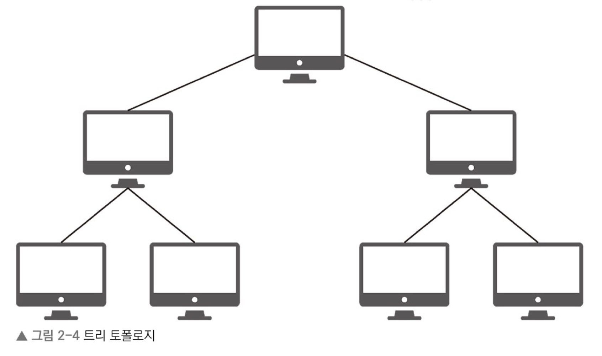

    - 계층형 토폴로지
    - 트리 형태로 배치한 네트워크 구성
    - **장점**
        - 노드의 추가, 삭제가 쉬움
    - **단점**
        - 특정 노드에 트래픽이 집중될 때 하위 노드에 영향을 끼침
- **버스 토폴로지 (Bus Topology)**

  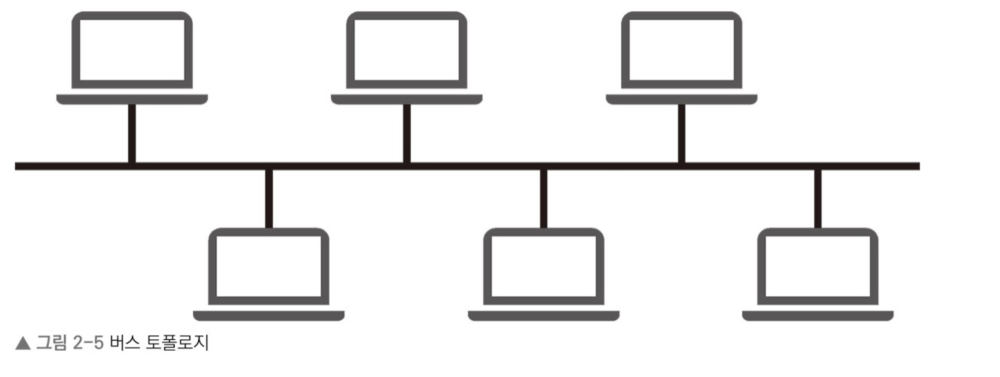

    - 중앙 통신 회선 하나에 여러 개의 노드가 연결되어 공유하는 네트워크 구성
    - 근거리 통신망(LAN)에서 사용
    - **장점**
        - 설치 비용이 적음
        - 신뢰성이 우수함
        - 중앙 통신 회선에 노드를 추가하거나 삭제하기 쉬움
    - **단점**
        - 스푸핑이 가능함

      **스푸핑이란?**

        - LAN 상에서 송신부의 패킷을 송신과 관련 없는 다른 호스트에 가지 않도록 하는 스위칭 기능을 마비시키거나 속여서 특정 노드에 해당 패킷이 오도록 처리하는 것

- **스타 토폴로지 (Star Topology)**

  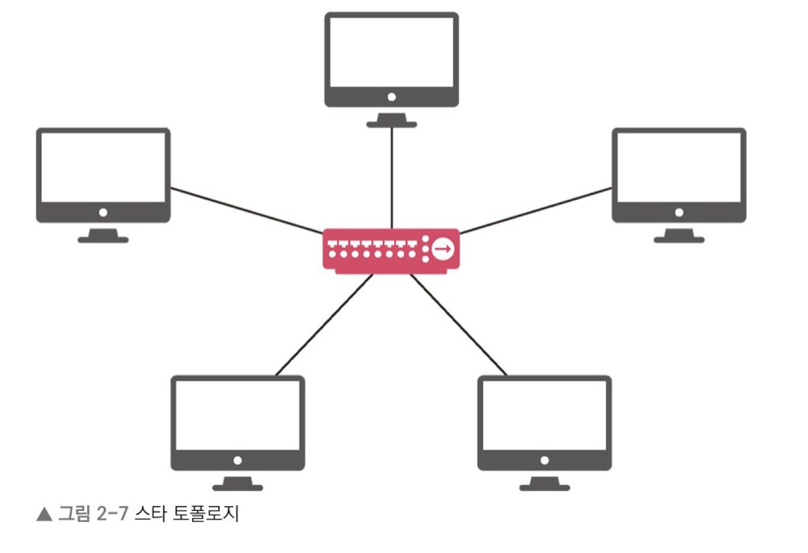

    - 성형 토폴로지
    - 중앙에 있는 노드에 모두 연결된 네트워크 구성
    - **장점**
        - 노드를 추가하거나 에러 탐지가 쉬움
        - 패킷 충돌 발생 가능성이 적음
        - 장애 노드가 중앙 노드가 아닐 경우 다른 노드에 영향 끼침이 적음
    - **단점**
        - 중앙 노드에 장애가 발생하면 전체 네트워크를 사용할 수 없음
        - 설치 비용이 고가
- **링형 토폴로지 (Ring Topology)**

  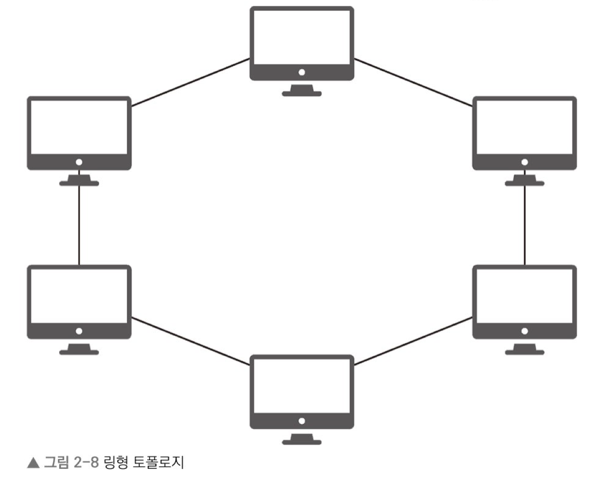

    - 각각의 노드가 양 옆의 두 노드와 연결하여 전체적으로 고리처럼 하나의 연속된 길을 통해 통신하는 구성 방식
    - 데이터는 노드에서 노드로 이동하게 되며, 각각의 노드는 고리 모양의 길을 통해 패킷 처리
    - **장점**
        - 노드 수가 증가되어도 네트워크상의 손실이 거의 없음
        - 충돌 발생 가능성이 적음
        - 노드의 고장 발견을 쉽게 찾을 수 있음
    - **단점**
        - 네트워크 구성 변경이 어려움
        - 회선에 장애 발생 시 전체 네트워크에 영향을 끼침
- **메시 토폴로지 (Mesh Topology)**

  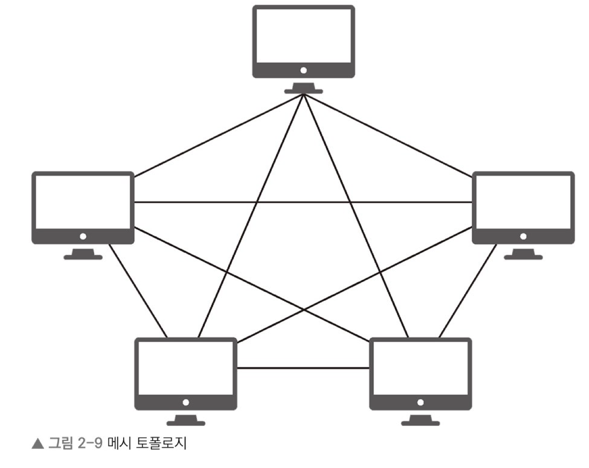

    - 망형 토폴로지
    - 그물망처럼 연결되어 있는 구조
    - **장점**
        - 한 단말 장치에 장애가 발생해도 네트워크를 계속 사용할 수 있음
        - 트래픽 분산 처리 가능
    - **단점**
        - 노드 추가가 어려움
        - 구축 비용와 운용 비용이 고가

  #### 병목 현상

    - **전체 시스템의 성능이나 용량이 하나의 구성 요소로 인해 제한 받는 현상**
    - **토폴로지**가 중요한 이유는 **병목 현상을 찾을 때 중요한 기준**이 되기 때문
    - 네트워크가 어떤 토폴로지를 갖는지, 또한, 어떠한 경로로 이루어져 있는지 알아야 병목 현상을 올바르게 해결할 수 있음

### 2.1.3 네트워크 분류

- **규모 기반으로 분류**

  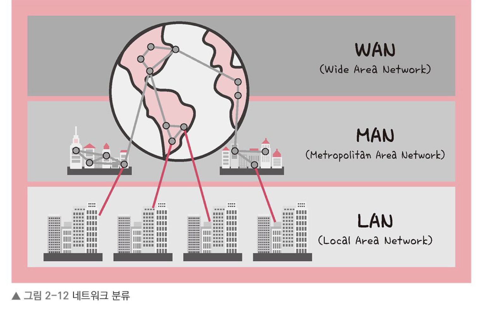

- **LAN (Local Area Network)**
    - 근거리 통신망
    - 같은 건물이나 캠퍼스 같은 좁은 공간
    - **전송 속도가 빠르고 혼잡하지 않음**
- **MAN (Metropolitan Area Network)**
    - 대도시 지역 네트워크
    - **전송 속도는 평균이며, LAN 보다는 더 많이 혼잡**
- **WAN (Wide Area Network)**
    - 광역 네트워크
    - 국가 또는 대륙 같은 더 넓은 지역
    - **전송 속도는 낮으며 MAN 보다 더 혼잡**

### 2.1.4 네트워크 성능 분석 명령어

- **네트워크 병목 현상의 주된 원인**
    - 네트워크 대역폭
    - 네트워크 토폴로지
    - 서버 CPU, 메모리 사용량
    - 비효율적인 네트워크 구성
- **네트워크 관련 테스트와 네트워크와 무관한 테스트를 통해 “네트워크로부터 발생한 문제점”인 것을 확인 후 네트워크 성능 분석을 해야 함**

#### ping (Pracket INternet Groper)

- **네트워크 상태를 확인하려는 대상 노드를 향해 일정 크기의 패킷을 전송하는 명령어**
- 해당 노드의 패킷 수신 상태와 도달하기까지의 시간 등을 알 수 있음
- **해당 노드까지 네트워크가 잘 연결되어 있는지 확인할 수 있음**
- ICMP 프로토콜을 통해 동작

#### netstat

- **접속되어 있는 서비스들의 네트워크 상태 표시에 사용됨**
- 네트워크 접속, 라우팅 테이블, 네트워크 프로토콜 리스트를 보여줌
- **주로 서비스 포트가 열려 있는지 확인할 때 씀**

#### nslookup

- **DNS 관련 내용을 확인하기 위해 쓰는 명령어**
- **특정 도메인에 매핑된 IP를 확인하기 위해 사용**

#### tracert (Windows) / traceroute (Linux)

- **목적지 노드까지 네트워크 경로를 확인할 때 사용하는 명령어**
- 목적지 노드까지 구간들 중 어느 구간에서 응답 시간이 느려지는지 등을 확인할 수 있음

### 2.1.5 네트워크 프로토콜 표준화

- **다른 장치들끼리 데이터를 주고 받기 위해 설정된 공통된 인터페이스**
- IEEE 또는 IETF라는 표준화 단체가 정함
- IEEE802.3 : 유선 LAN 프로토콜, 유선으로 LAN 구축 시 사용
- HTTP : 웹 접속할 때 쓰이는 프로토콜, HTTP 프로토콜을 통해 노드들은 웹 서비스 기반으로 데이터를 주고받을 수 있음

## SECTION 2.2 TCP/IP 4계층 모델

### 2.2.1 계층 구조

#### TCP/IP 4계층 vs. OSI 7계층

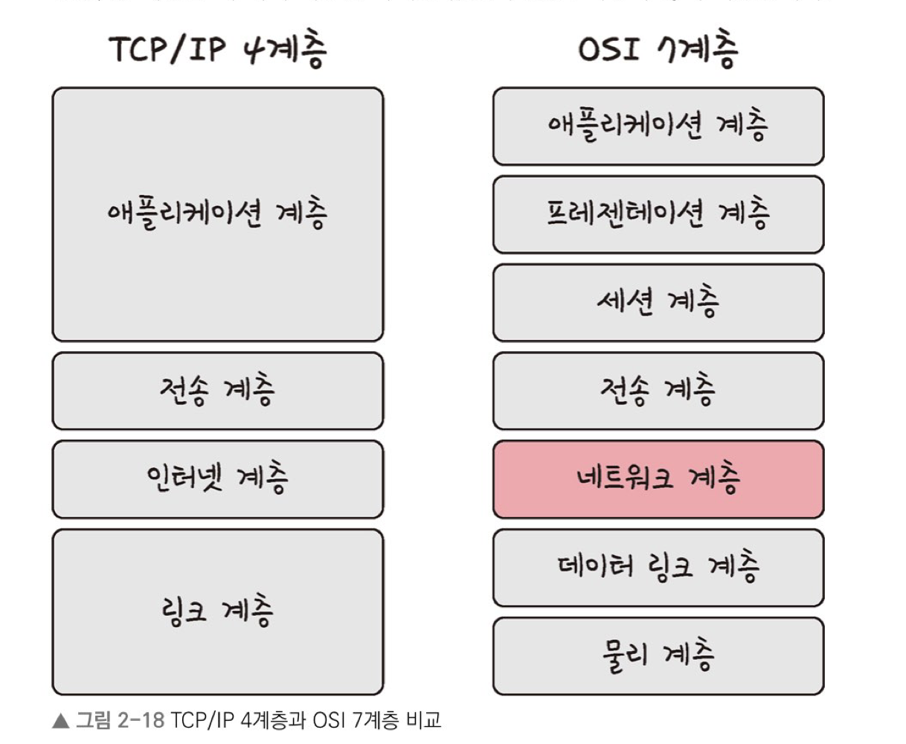

|  | TCP/IP | OSI |
| --- | --- | --- |
| 모델 | 클라이언트-서버 모델 | 개념 모델 |
| 계층 수 | 4 | 7 |
| 개발 | 미 국방성 | 국제 표준화 기구 ISO |
| 구성 | 프로토콜 집합 기반 | 역할 기반 |
| 기술 | 데이터 전송기술 특화 | 통신 전반 기술 표준화 |
| 활용 | 실무적 통신 기술 구현 | 통신 모델 표준 제시 |

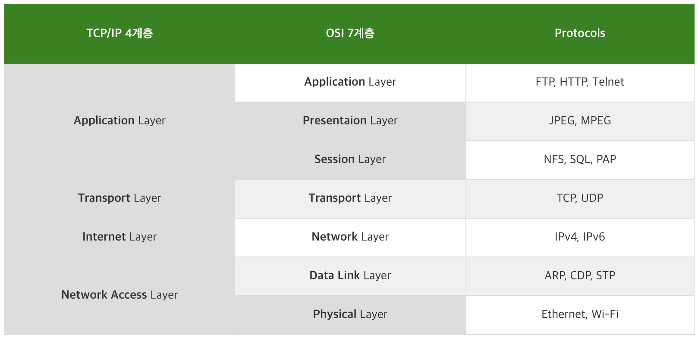

이미지 출처 : [https://programmingtilseungho.tistory.com/entry/OSI-7계층-TCPIP-4계층-비교?category=1058195](https://programmingtilseungho.tistory.com/entry/OSI-7%EA%B3%84%EC%B8%B5-TCPIP-4%EA%B3%84%EC%B8%B5-%EB%B9%84%EA%B5%90?category=1058195)

#### 애플리케이션 계층 (Application Layer)

- **FTP, HTTP, SSH, SMTP, DNS 등 응용 프로그램이 사용되는 프로토콜 계층**
- 웹 서비스, 이메일 등 **서비스를 실질적으로** 사람들에게 **제공하는 계층**
- **FTP**
    - 장치와 장치 간의 파일을 전송하는 데 사용되는 표준 통신 프로토콜
- **SSH**
    - 보안되지 않은 네트워크에서 네트워크 서비스를 안전하게 운영하기 위한 암호화 네트워크 프로토콜
- **HTTP**
    - World Wide Web을 위한 데이터 통신의 기초이자 웹 사이트를 이용하는 데 쓰는 프로토콜
- **SMTP**
    - 전자 메일 전송을 위한 인터넷 표준 통신 프로토콜
- **DNS**
    - 도메인 이름과 IP 주소를 매핑해주는 서버
    - IP 주소가 바뀌어도 사용자들에게 똑같은 도메인 주소로 서비스 할 수 있음

#### 전송 계층 (Transport Layer)

- **송신자와 수신자를 연결하는 통신 서비스 제공**
- **연결 지향 데이터 스트림 지원, 신뢰성, 흐름 제어 제공**
- 애플리케이션과 인터넷 계층 사이의 데이터가 전달될 때 **중계 역할**을 함
- **TCP vs. UDP**
    - **가상회선 패킷 교환 방식**

      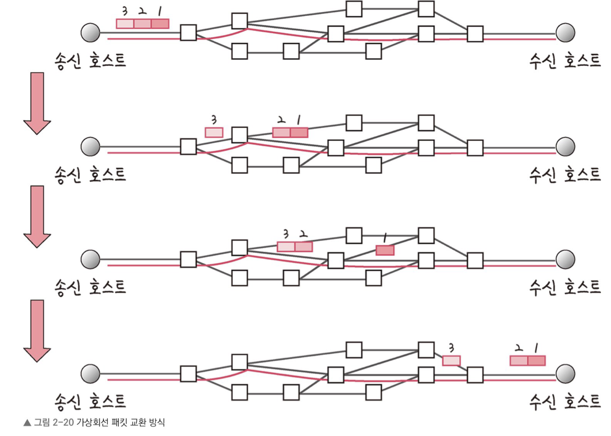
        
        - 각 패킷에는 가상회선 식별자가 포함되며 모든 패킷을 전송하면 가상회선이 해제되고 패킷들은 **전송된 순서대로 도착하는 방식**
    - **데이터그램 패킷 교환 방식**

      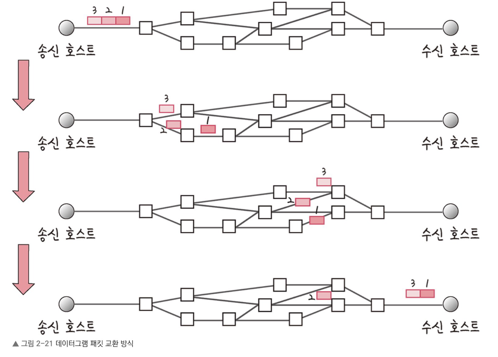
        - 패킷이 독립적으로 이동하며 최적의 경로를 선택하여 전송됨
        - 하나의 메시지에서 분할된 여러 패킷은 서로 다른 경로로 전송될 수 있으며 **도착한 순서가 다를 수 있음**

|  | TCP | UDP |
| --- | --- | --- |
| 연결 방식 | 연결형 서비스 | 비연결형 서비스 |
| 패킷 교환 방식 | 가상회선 방식 | 데이터그램 방식 |
| 수신 여부 확인 | 전송 순서 보장 | 전송 순서가 바뀔 수 있음 |
| 통신 방식 | 1:1 통신 | 1:1 or 1:N or N:M 통신 |
| 신뢰성 | 높음 | 낮음 |
| 속도 | 느림 | 빠름 |

**TCP 연결 성립 과정**

- <b>3-웨이 핸드셰이크 (3-way handshake)</b>로 신뢰성 확보

  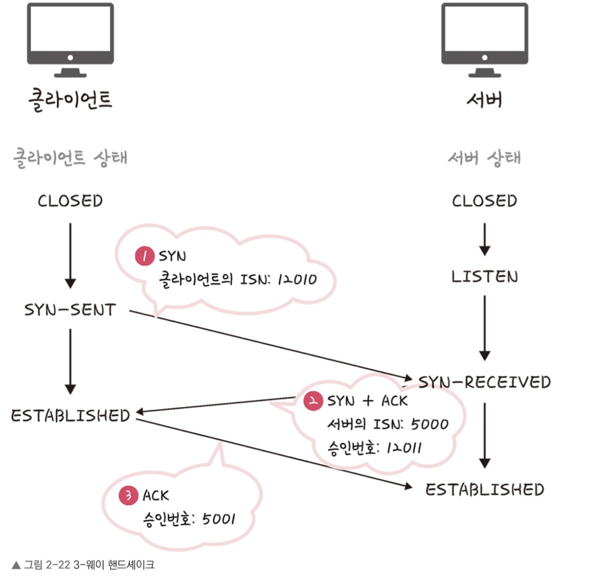

    1. **SYN 단계** : 클라이언트는 ISN을 담은 SYN을 서버로 보냄 (ISN : 첫 번째 패킷에 할당된 임의의 시퀀스 번호)
    2. **SYN + ACK 단계** : 서버는 클라이언트의 SYN을 수신하고 서버의 ISN을 보내며 승인 번호로 클라이언트의 ISN + 1을 보냄 (일반적으로 ISN + 1 을 보냄)
    3. **ACK 단계** : 클라이언트는 서버의 ISN + 1한 값인 승인번호를 담아 ACK를 서버로 보냄

    <pre>
    <b>SYN</b> : Synchronization 약자, 연결 요청 플래그
    <b>ACK</b> : Acknowledgement 약자, 응답 플래그
    <b>ISN</b> : Initial Sequence Numbers 약어, 초기 네트워크 연결을 할 때 할당된 32비트 고유 시퀀스 번호
    </pre>

**TCP 연결 해제 과정**

- **4-웨이 핸드셰이크 (4-way handshake)** 과정 발생

  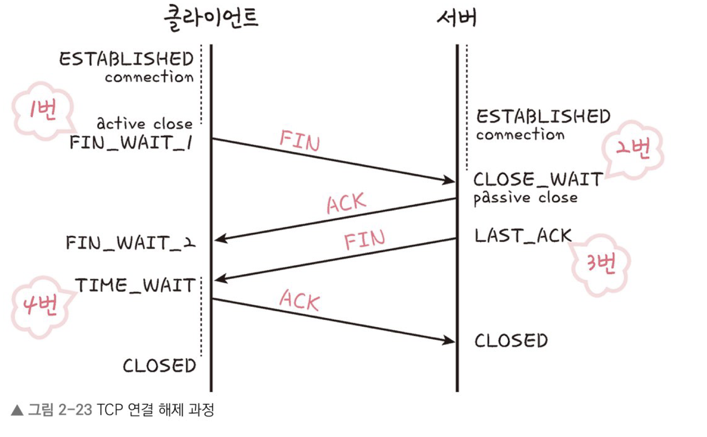

    1. 클라이언트가 연결을 닫으려 할 때 FIN으로 설정된 세그먼트를 서버로 전송 → 클라이언트는 FIN_WAIT_1 상태가 되어 서버의 응답을 기다림
    2. 서버는 클라이언트로 ACK라는 승인 세그먼트를 보내고 CLOSE_WAIT 상태가 됨 → 클라이언트는 서버로부터 세그먼트를 받으면 FIN_WAIT_2 상태로 들어감
    3. 서버는 ACK를 보내고 일정 시간 이후 클라이언트에 FIN이라는 세그먼트를 보냄
    4. 클라이언트는 TIME_WAIT 상태가 되고 다시 서버로 ACK를 보내 서버는 CLOSED 상태가 됨. → 어느 정도 시간 대기 후 클라이언트의 연결이 닫히고 서버와 모든 자원 연결이 해제됨
- **일정 시간 뒤에 연결을 닫는 이유는? (TIME_WAIT 하는 이유)**
    - **지연 패킷이 발생할 경우를 대비하기 위함** → 패킷이 뒤늦게 도착하고 처리하지 못한다면 데이터 무결성 문제 발생
    - **두 장치가 연결이 닫혔는지 확인하기 위함**

    <pre>
    <b>TIME_WAIT</b> : 소켓이 바로 소멸되지 않고 일정 시간 유지되는 상태
    <b>데이터 무결성</b> : 데이터의 정확성과 일관성을 유지하고 보증하는 것
    </pre>

#### 인터넷 계층

- **장치로부터 받은 네트워크 패킷을 IP 주소로 지정된 목적지에 전송하기 위해 사용되는 계층**
- **Protocol : IP, ARP, ICMP**
- 패킷을 수신해야 할 상대의 주소를 지정하여 데이터 전달
- 상대방이 제대로 받았는지 보장하지 않는 **비연결형적**인 특징을 가지고 있음

#### 링크 계층

- 전선, 광섬유, 무선 등으로 **실질적으로 데이터를 전달**하며 장치 간에 **신호를 주고 받는 규칙을 정하는 계층**
- 물리 계층와 데이터 링크 계층으로 나누기도 함
    - 물리 계층 : 무선 LAN과 유선 LAN을 통해 0과 1로 이루어진 데이터를 보내는 계층
    - 데이터 링크 계층 : ‘이더넷 프레임’을 통해 에러 확인, 흐름 제어, 접근 제어를 담당하는 계층
- **유선 LAN (IEEE802.3)**
    - IEEE802.3 이라는 프로토콜에 따르며 전이중화 통신을 씀
    - **전이중화 통신 (Full Duplex)**
        - **양쪽 장치가 동시에 송수신할 수 있는 방식**
    - **CSMA/CD (Carrier Sense Multiple Access with Collision Detection)**
        - 이전에는 유선 LAN에서 반이중화 통신 중 하나인 CSMA/CD 방식 사용
        - 데이터를 보낸 이후 충돌이 발생한다면 일정 시간 이후 재전송하는 방식
- **유선 LAN을 이루는 케이블**
    - **트위스트 페어 케이블 (Twisted Pair Cable, TP 케이블)**
        - 하나의 케이블처럼 보이지만 실제로는 여덟 개의 구리선을 두 개씩 꼬아서 묶은 케이블
    - **광섬유 케이블**
        - 광섬유로 만든 케이블
        - 레이저를 이용해서 통신하기 때문에 구리선과 비교할 수 없을 만큼 장거리 및 고속 통신 가능
- **무선 LAN (IEEE802.11)**
    - 수신과 송신에 같은 채널을 사용하기 때문에 반이중화 통신 사용
    - **반이중화 통신 (Half Duplex)**
        - 양쪽 장치는 서로 통신할 수 있지만, 동시에는 통신할 수 없으며 **한 번에 한 방향으로만 통신할 수 있는 방식**
        - 장치가 신호를 수신하기 시작하면 응답 전에 전송이 완료될때까지 기다려야 함
        - 충돌 방지 시스템 필요
    - **CSMA/CA**
        - 반이중화 통신 중 하나
        - 장치에서 데이터를 보내기 전에 캐리어 감지 등으로 사전에 가능한 충돌을 방지하는방식
        - 과정
            1. **데이터 송신 전 무선 매체를 살핌**
            2. **캐리어 감지** : 회선이 비어있는지 판단
            3. **IFS (Inter FrameSpace)** : 랜덤 값 기반으로 정해진 시간만큼 기다리며, 만약 무선 매체가 사용 중이면 점차 간격을 늘려가며 기다림
            4. **이후 데이터 송신**
- **무선 LAN을 이루는 주파수**
    - **와이파이 (Wi-Fi)**
        - 전자기기들이 무선 LAN 신호에 연결할 수 있게 하는 기술
        - 무선 접속 장치 (AP, Access Point) 필요 ⇒ 공유기
    - **BSS (Basic Service Set)**
        - 기본 서비스 집합
        - 동일 BSS 내에 있는 AP들과 장치들이 서로 통신 가능한 구조
    - **ESS (Extended Service Set)**
        - 하나 이상 연결된 BSS 그룹
        - **장거리 무선 통신을 제공하며 BSS보다 더 많은 가용성과 이동성 지원**

          ⇒ 사용자는 한 장소에서 다른 장소로 이동하며 중단 없이 네트워크 연결 가능

- **이더넷 프레임**

  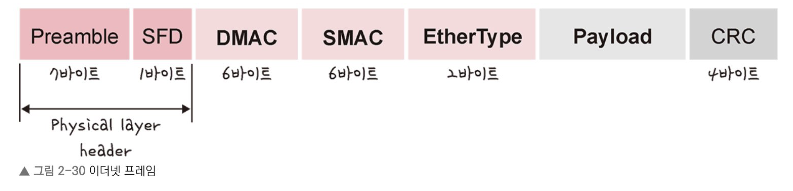

    - Preamble : 이더넷 프레임이 시작임을 알림
    - SFD (Start Frame Delimiter) : 다음 바이트부터 MAC 주소 필드가 시작됨을 알림
    - DMAC, SMAC : 수신, 송식 MAC 주소
    - EtherType : 데이터 계층 위 계층인 IP 프로토콜 정의 (IPv4 or IPv6)
    - Payload : 전달 받은 데이터
    - CRC : 에러 확인 비트

#### 계층 간 데이터 송수신 과정

- **계층 간 데이터 송수신 과정**

  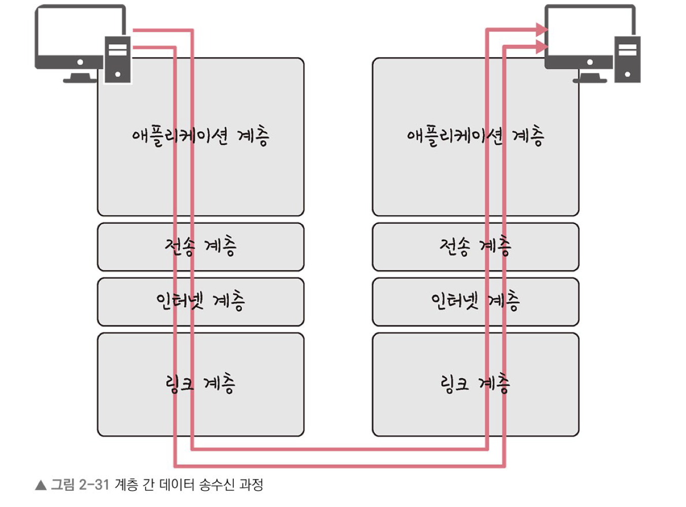

- **캡슐화 과정**
    - 상위 계층의 헤더와 데이터를 하위 계층의 데이터 부분에 포함시키고 해당 계층의 헤더를 삽입하는 과정

  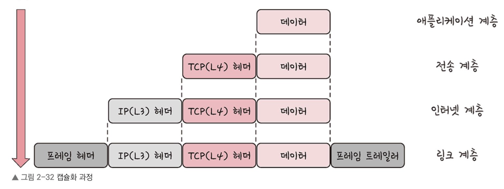

- **비캡슐화 과정**
    - 하위 계층에서 상위 계층으로 가며 각 계층의 헤더 부분을 제거하는 과정

  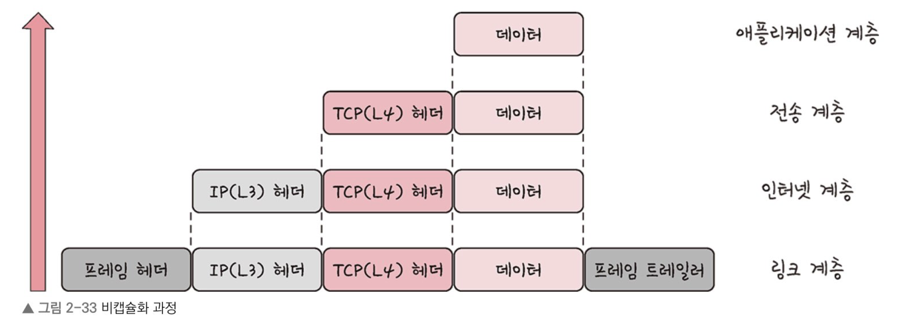

### 2.2.2 PDU (Protocol Data Unit)

- **네트워크의 어떠한 계층에서 계층으로 데이터가 전달될 때의 한 단위**
- 헤더 : 제어 관련 정보들이 포함됨
- 페이로드 : 데이터
- **계층마다 부르는 명칭이 다름**
    - 애플리케이션 계층 : 메시지
    - 전송 계층 : 세그먼트(TCP), 데이터그램(UDP)
    - 인터넷 계층 : 패킷
    - 링크 계층 : 프레임(데이터 링크 계층 ), 비트(물리 계층)

## SECTION 2.3 네트워크 기기

### 2.3.1 네트워크 기기의 처리 범위

- 계층별로 처리 범위를 나눌 수 있음
- 애플리케이션 계층 : L7 스위치
- 인터넷 계층 : 라우터, L3 스위치
- 데이터 링크 계층 : L2 스위치, 브리지
- 물리 계층 : NIC, 리피터, AP

### 2.3.2 애플리케이션 계층을 처리하는 기기

#### L7 스위치

> 💡 **스위치**  
> 여러 장비를 연결하고 데이터 통신을 중재하며 목적지가 연결된 포트로만 전기 신호를 보내 데이터를 전송하는 통신 네트워크 장비

- **로드 밸런서** 라고도 함
- **서버 부하를 분산하는 기기**
- 클라이언트로부터 오는 요청들을 뒤쪽의 여러 서버로 나누는 역할
- 시스템이 처리할 수 있는 트래피 증가를 목표로함
- **URL, 서버, 캐시, 쿠키 기반으로 트래픽 분산**
- **바이러스, 불필요한 외부 데이터 등을 걸러내는 필터링 기능**
- 응용 프로그램 수준의 **트래픽 모니터링**도 가능
- **정기적으로 헬스 체크를 이용하여 장애 감시**
- **L4 스위치 vs. L7 스위치**
  - **공통점**
      - 로드 밸런서
      - 서버 부하를 분산하는 기기
      - 헬스 체크를 통해 서버 상태 판별 (정상/비정상)

      |  | L4 스위치 | L7 스위치 |
      | --- | --- | --- |
      | 처리 범위 | 전송 계층을 처리하는 기기 | 애플리케이션 계층을 처리하는 기기 |
      | 트래픽 분산 | IP와 포트 기반 |  IP, 포트 외에도 URL, HTTP 헤더, 쿠키 등을 기반 |
      | 클라우드 서비스 컴포넌트 | NLB 컴포넌트(Network Load Balancer) | ALB 컴포넌트(Application Load Balancer) |
    
- **헬스 체크**
    - **서버에 부하가 되지 않을 만큼** 전송 주기와 재전송 횟수 등을 설정한 이후 **반복적으로 서버에 요청을 보내는 것**
- **로드밸런서를 이용한 서버 이중화**
    - 2대 이상의 서버를 기반으로 가상 IP를 제공하고 이를 기반으로 안정적인 서비스 제공
    - 에러가 발생하여 서버 1대가 종료되더라도 서비스 안정적으로 운용 가능

      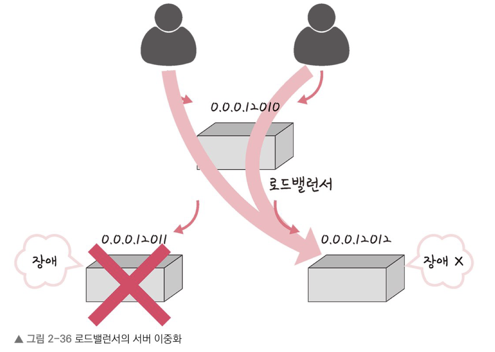

### 2.3.3 인터넷 계층을 처리하는 기기

#### 라우터 (Router)

- **여러 개의 네트워크를 연결, 분할, 구분시켜주는 역할**
- “다른 네트워크에 존재하는 장치끼리 서로 데이터를 주고 받을 때 패킷 소모를 최소화하고 경로를 최적화하여 최소 경로로 패킷을 포워딩”하는 라우팅을 하는 장비

#### L3 스위치

- **L2 스위치의 기능과 라우팅 장비를 갖춘 장비**
- L3 스위치를 라우터라고 해도 무방함
- L3 스위치 vs. L2 스위치

    |  | L2 스위치 | L3 스위치 |
    | --- | --- | --- |
    | 참조 테이블 | MAC 주소 테이블 | 라우팅 테이블 |
    | 참조 PDU | 이더넷 프레임 | IP 패킷 |
    | 참조 주소 | MAC 주소 | IP 주소 |

### 2.3.4 데이터 링크 계층을 처리하는 기기

#### L2 스위치

- **장치들의 MAC 주소를 MAC 주소 테이블을 통해 관리**
- **연결된 장치로부터 패킷이 왔을 때 패킷 전송을 담당**
- 단순히 패킷의 MAC 주소를 읽어 스위칭하는 역할
- 목적지가 MAC 주소 테이블에 없다면 전체 포트에 전달하고 MAC 주소 테이블의 주소는 일정 시간 이후 삭제하는 기능도 있음

#### 브리지(Bridge)

- **두 개의 근거리 통신망(LAN)을 상호 접속할 수 있도록 하는 통신망 연결 장치**
- 포트와 포트 사이의 다리 역할
- 장치에서 받아온 **MAC 주소를 MAC 테이블로 관리**

### 2.3.5 물리 계층을 처리하는 기기

#### NIC (Network Interface Card)

- LAN 카드
- 2대 이상의 컴퓨터 네트워크를 구성하는 데 사용
- 네트워크와 빠른 속도로 데이터를 송수신할 수 있도록 컴퓨터 내에 설치하는 확장 카드

#### 리피터 (Repeater)

- 들어오는 약해진 신호 정도를 증폭하여 다른 쪽으로 전달하는 장치 ⇒ 패킷이 더 멀리 갈 수 있음
- 광케이블에 보급됨에 따라 현재는 잘 쓰이지 않음

#### AP (Access Point)

- 패킷을 복사하는 기기
- AP에 유선 LAN을 연결한 후 다른 장치에서 무선 LAN 기술을 사용하여 무선 네트워크 연결을 할 수 있음

## SECTION 2.4 IP 주소

### 2.4.1 ARP (Address Resolution Protocol)

- **IP 주소로부터 MAC 주소를 구하는 IP**와 **MAC 주소**의 **다리 역할**을 하는 프로토콜
- ARP를 통해 가상 주소인 IP를 실제 주소인 MAC 주소로 변환
- 반대로 RARP를 통해 실제 주소인 MAC 주소를 가상 주소인 IP 주소로 변환하기도 함

  

### 2.4.2 홉바이홉 통신 (hop by  hop)

- **IP 주소를 통해 통신하는 과정**
- 통신 장치에 있는 라우팅 테이블의 IP를 통해 **시작 주소부터** 다음 IP로 계속 이동하는 **라우팅 과정을 거쳐 패킷이 최종 목적지까지 도달하는 통신**

  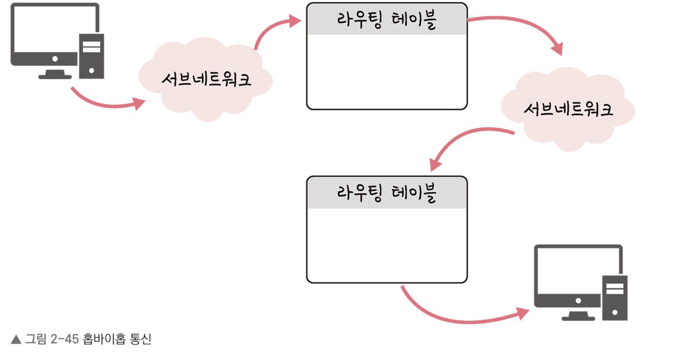

- **라우팅 테이블 (Routing Table)**
    - 송신지에서 수신지까지 도달하기 위해 사용
    - 라우터에 들어가 있는 목적지 정보들과 그 목적지로 가기 위한 방법이 들어 있는 리스트
- **게이트웨이 (Gateway)**
    - 서로 다른 통신망, 프로토콜을 사용하는 네트워크 간의 통신을 가능하게 하는 관문 역할을 하는 컴퓨터나 소프트웨어
    - **서로 다른 네트워크상의 통신 프로토콜을 변환해주는 역할**

### 2.4.3 IP 주소 체계

#### IPv4 vs. IPv6

|  | IPv4 | IPv6 |
| --- | --- | --- |
| 주소 길이 | 32비트 | 128비트 |
| 표시 방법 | 8비트씩 4부분 10진수 표시 | 16비트 8부분 16진수 표시 |
| 주소 개수 | 약 43억개 | 2^128개 (약 43억 * 43억 * 43억 * 43억) |
| 주소 할당 방식 | A, B, C, D, E의 클래스 기반 비순차 할당 방식 | 네트워크 규모, 단말기 수에 따라 순차 할당 |
| 브로드캐스트 주소 | 있음 | 없음 대신 로컬 범위 내 모든 노드에 대한 멀티 캐스트 주소 사용) |
| 헤더 크기 | 가변 | 고정 |
| QoS 제공 | 미흡 | 제공 |
| 보안 | IPSec 프로토콜 별도 설치 | IPSec 자체 지원 |
| 서비스 품질 | 제한적 품질 보장 (Type of Service에 의한 서비스 품질 일부 지원) | 확장된 품질 보장 (트래픽 클래스, 플로우 레이블에 의한 서비스 품질 지원) |
| Plug&Play | 불가 (DHCP 이용 시 가능) | 가능 |
- QoS (Quality of Service)
    - 트래픽을 생성하는 애플리케이션의 필수 동작에 맞게 라우터나 스위치 같은 네트워크 디바이스가 해당 트래픽으로 전달할 수 있도록 트래픽을 조작하는 것
- IPSec (Internet Protocol Security)
    - 통신 세션의 각 IP 패킷을 암호화하고 인증하는 안전한 인터넷 프로토콜 (IP, Internet Protocol) 통신을 위한 인터넷 프로토콜 스위트 (Internet Protocol Suite)
    - 통신 세션의 개별 IP 패킷을 인증하고 암호화함으로써 처리됨
    - 세션 시작에서 에이전트들 사이에서 상호 인증을 확립하거나 세션을 맺는 중 사용될 암호화 키 협상을 위한 프로토콜을 포함하고 있음
    - 호스트와 호스트, 보안 게이트와 사이 (네트워크와 네트워크), 보안 게이트와 호스트 사이에 데이터 흐름을 보호하기 위해 사용
- Plug&Play (PnP)
    - 컴퓨터 실행 중 주변 장치를 부착해도 별다른 설정 없이 작동함을 뜻함

#### 클래스 기반 할당 방식 (Classful Network Addressing)

- A, B, C, D, E 다섯 개의 클래스로 구분
- **앞에 있는 부분을 네트워크 주소**, **그 뒤에 있는 부분을** 컴퓨터에서 부여하는 주소인 **호스트 주소**로 놓아서 사용

  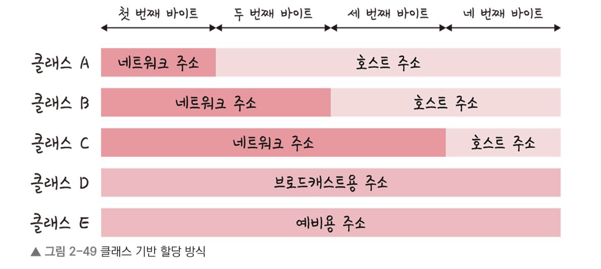

    - 클래스 A-B-C : 일대일 통신
    - 클래스 D : 브로드캐스트 통신
    - 클래스 E : 앞으로 사용할 예비용
- **“구분 비트”**를 맨 왼쪽에 있는 비트로 설정

  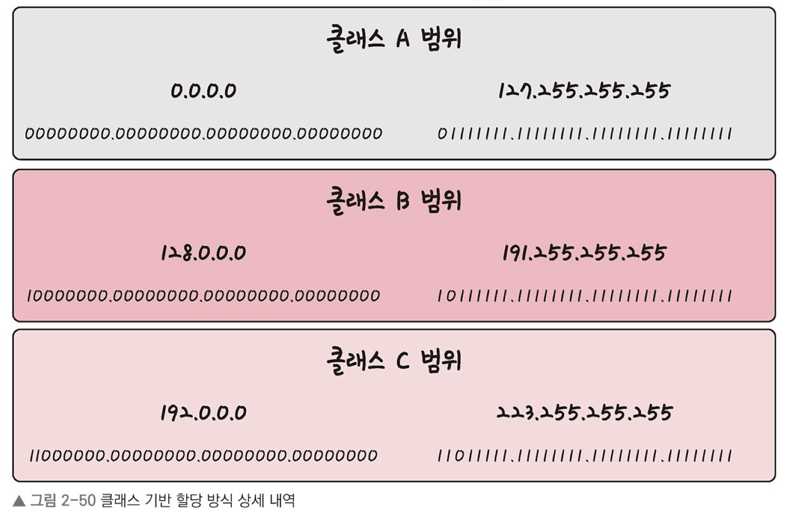

- 네트워크의 첫 번째 주소는 네트워크 주소로 사용되고, 가장 마지막 주소는 브로드캐스트용 주소로 네트워크에 속해 있는 모든 컴퓨터에 데이터를 보낼 때 사용

- **단점**
    - **사용하는 주소보다 버리는 주소가 많음**

      ⇒ 해소하기 위해 **DHCP, IPv6, NAT** 가 나옴

#### DHCP (Dynamic Host Configuration Protocol)

- **IP 주소 및 기타 통신 매개 변수를 자동으로 할당하기 위한 네트워크 관리 프로토콜**
- 장치의 IP 주소를 수동으로 설정할 필요 없이 인터넷에 접속할 때마다 자동으로 IP 주소 할당

#### NAT (Network Address Translation)

- **패킷이 라우팅 장치를 통해 전송되는 동안 패킷의 IP 주소 정보를 수정하여 IP 주소를 다른 주소로 매핑하는 방법**
- **공인 IP와 사설 IP로 나눠서 많은 주소 처리**  ⇒ IPv4 주소 체계만으로는 많은 주소들을 모두 감당하지 못한다는 단점 해결

  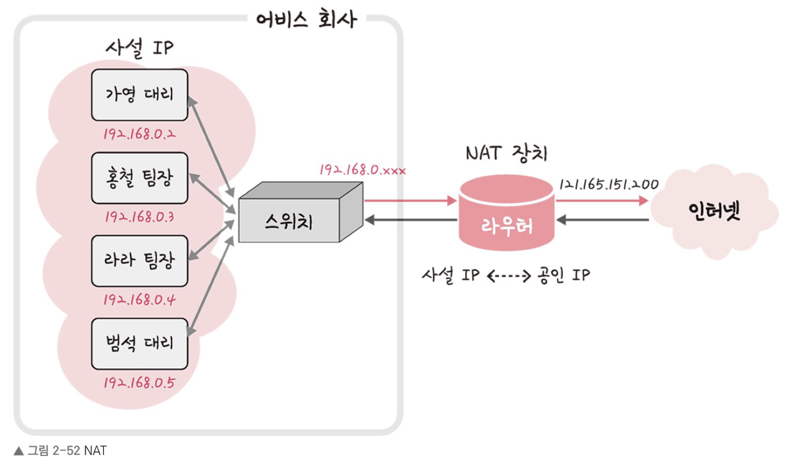

- **인터넷 공유기에 NAT 기능이 탑재**되어 있어 하나의 공인 IP 주소를 사용해 여러 대의 호스트가 인터넷 접속 가능

### 2.4.4 IP 주소를 이용한 위치 정보

- IP 주소는 인터넷에서 사용하는 네트워크 주소
- 동 또는 구까지 위치 추적 가능

## SECTION 2.5 HTTP
> 💡 **HTTP는 애플리케이션 계층으로서 웹 서비스 통신에 사용됨**

### 2.5.1 HTTP/1.0

- **한 연결당 하나의 요청을 처리**하도록 설계 ⇒ **RTT 증가를 불러옴**

  !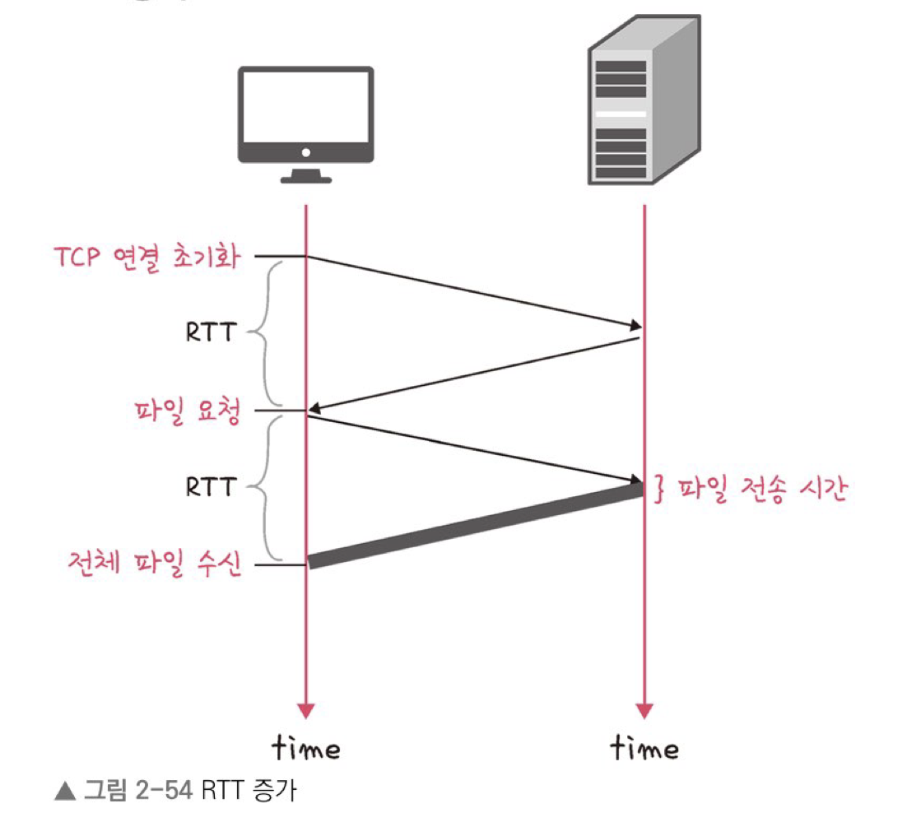

    <pre>
    <b>RTT</b>
    - 패킷이 목적지에 도달하고 나서 다시 출발지로 돌아오기까지 걸리는 시간
    - 패킷 왕복 시간
    </pre>

#### RTT 증가를 해결하기 위한 방법

- **이미지 스플리팅**
    - 많은 이미지가 합쳐 있는 하나의 이미지를 다운로드 받고, 이를 기반으로 background-image의 position을 이용하여 이미지를 표기하는 방법
- **코드 압축**
    - 코드를 압축해서 개행 문자, 빈칸을 없애서 코드의 크기를 최소화하는 방법
- **이미지 Base64 인코딩**
    - 64진법으로 이루어진 문자열을 인코딩하는 방법
    - **장점** : 서버와의 연결을 열고 이미지에 대해 **서버에 HTTP 요청을 할 필요가 없음**
    - **단점** : 원본보다 **37% 정도** 크기가 더 커짐

    <pre>
    <b>인코딩</b>>
    정보의 형태나 형식을 표준화, 보안, 처리 속도 향상, 저장 공간 절약 등을 위해 다른 형태나 형식으로 변환하는 처리 방식
    </pre>

### 2.5.2 HTTP/1.1

- **한 번 TCP 초기화를 한 이후 keep-alive 옵션으로 여러 개 파일을 송수신**
- HTTP/1.0에도 있었지만, **HTTP/1.1부터 표준화되어 기본 옵션으로 설정**

  

- **다수의 리소스를 처리하려면 요청할 리소스 개수에 비례해서 대기 시간이 길어진다**는 단점이 있음

#### HOL Blocking (Head Of Line Blocking)

- 네트워크에서 같은 큐에 있는 패킷이 그 첫 번째 패킷에 의해 지연될 때 발생하는 성능 저하 현상

  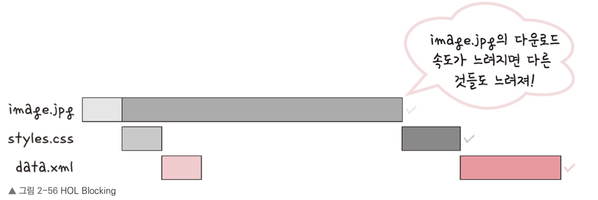

#### 무거운 헤더 구조

- 쿠키 등 많은 메타데이터가 들어 있고 압축되지 않아 무거움

### 2.5.3 HTTP/2

- SPDY 프로토콜에서 파생
- **HTTP/1.x 보다 지연 시간을 줄이고 응답 시간을 더 빠르게 할 수 있으며, 멀티플렉싱, 헤더 압축, 서버 푸시, 요청의 우선순위 처리를 지원하는 프로토콜**

#### 멀티플렉싱

- 여러 개의 스트림을 사용하여 송수신한다는 것
- 특정 스트림의 패킷이 손실되었다고 하더라도 해당 스트림에만 영향을 미치고 나머지 스트림은 멀쩡하게 동작

    <pre>
    <b>스트림 (stream)</b>
    시간이 지남에 따라 사용할 수 있게 되는 일련의 데이터 요소를 가리키는 데이터 흐름
    </pre>

- 병렬적인 스트림(stream) 들을 통해 데이터 서빙하며, 스트림 내 데이터들도 쪼개져 있음

  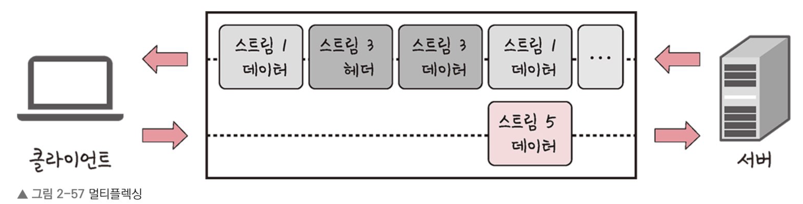

- 애플리케이션에서 받은 메시지들은 **독립된 프레임으로 조각내서 서로 송수신한 이후 다시 조립하여 데이터를 주고 받음**

  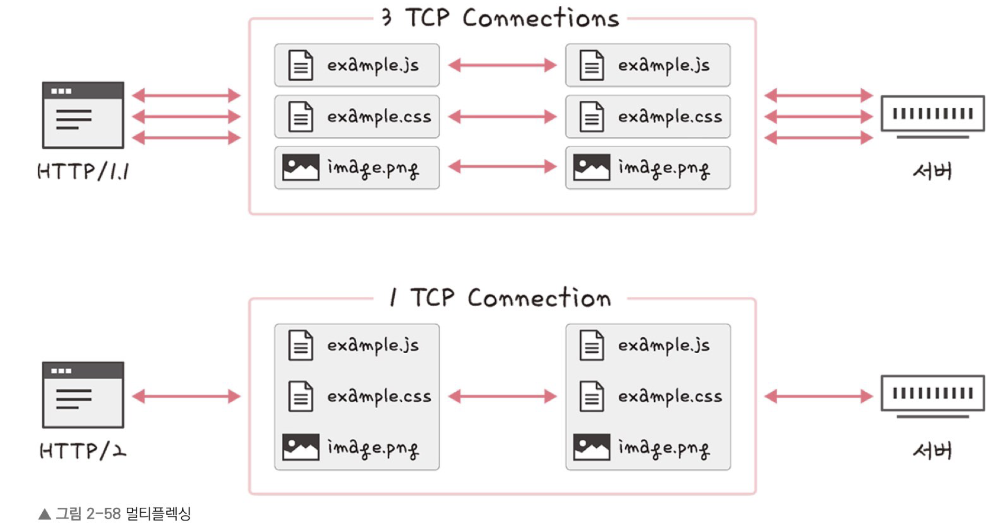

- 단일 연결을 사용하여 병렬로 여러 요청을 받을 수 있고 응답을 줄 수 있음 ⇒ **HOL Blocking 해결**

#### 헤더 압축

- **허프만 코딩 압축 알고리즘**을 사용하는 HPACK 압축 형식으로 헤더 압축 ⇒ **무거운 헤더 구조 해결**
- **허프만 코딩 (Huffman Coding)**
    - 문자 단위로 쪼개 빈도수를 세어 빈도가 높은 정보는 적은 비트 수를 사용하여 표현하고, 빈도가 낮은 정보는 비트 수를 많이 사용하여 표현해 전체 데이터 표현에 필요한 비트 양을 줄이는 원칙

#### 서버 푸시

- 클라이언트 요청 없이 서버가 바로 리소스 푸시

  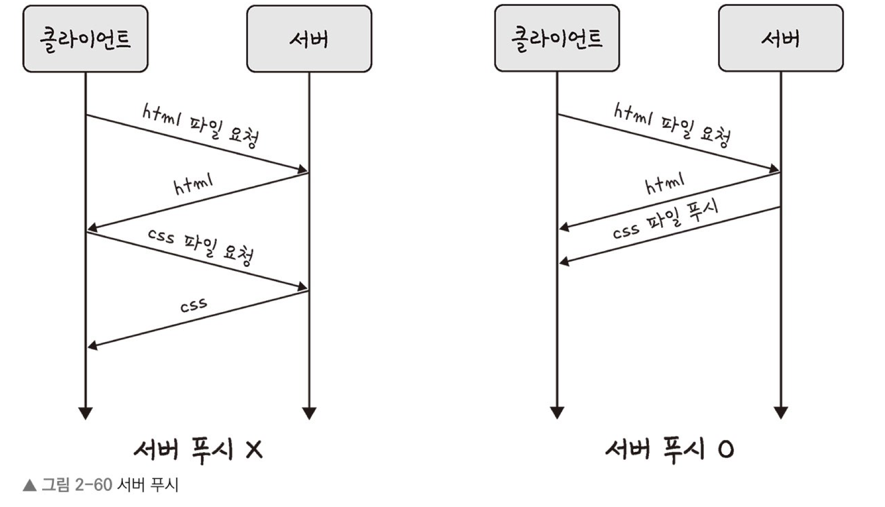

### 2.5.4 HTTPS

- **애플리케이션 계층과 전송 계층 사이에 신뢰 계층인 SSL/TLS 계층을 넣은 신뢰할 수 있는 HTTP 요청**
- HTTPS를 통해 **통신을 암호화**함
- HTTP/2는 HTTPS 위에서 동작함

#### SSL/TLS (Secure Socket Layer / Transport Layer Security Protocol)

- SSL 1.0부터 시작해서 SSL 2.0, SSL3.0, TLS 1.0, TLS 1.3까지 버전이 올라가며 마지막으로 TLS로 명칭이 변경되었음

  ⇒ 이를 합쳐 SSL/TLS라고 많이 부름

- **전송 계층에서 보안을 제공하는 프로토콜**
- 제 3자가 메시지를 도청하거나 변조하지 못하도록 함
- 공격자가 서버인 척하며 사용자 정보를 가로채는 **네트워크 상의 “인터셉터”를 방지할 수 있음**
- **보안 세션 기반으로 데이터 암호화**
- **보안 세션이 만들어질 때 인증 메커니즘, 키 교환 알고리즘, 해싱 알고리즘이 사용됨**
- **TLS 1.3**은 사용자가 이전에 방문한 사이트 **재방문 시** SSL/TLS에서 보안 세션을 만들 때 걸리는 통신을 하지 않아도 됨

  ⇒ **0-RTT**

**보안 세션**

- 보안이 시작되고 끝나는 동안 유지되는 세션

    <pre>
    <b>세션</b>
    운영체제가 어떠한 사용자로부터 자신의 자산 이용을 허락하는 일정한 기간

    </pre>

- TLS 핸드셰이크

  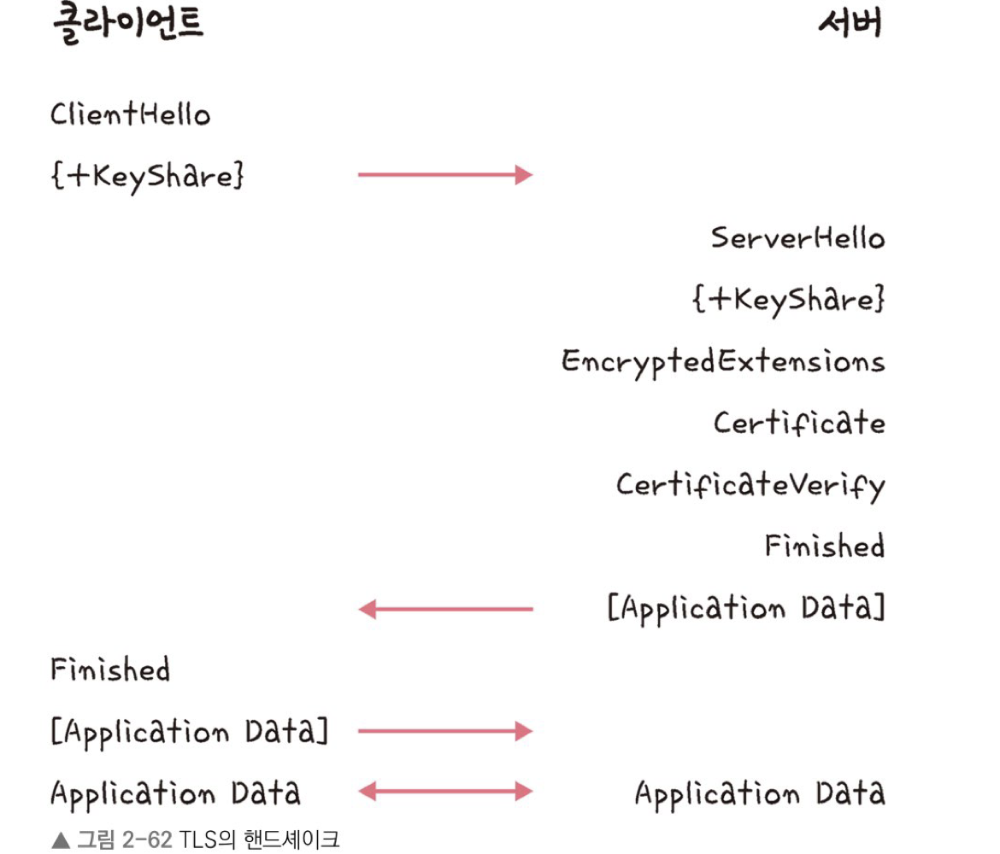

    1. 클라이언트에서 사이퍼 슈트(cypher suites)를 서버에 전달하면 서버는 받은 사이퍼 슈트의 암호화 알고리즘 리스트를 제공할 수 있는지 확인
    2. 제공할 수 있다면 인증서 메커니즘 시작
    3. 해싱 알고리즘 등으로 암호화된 데이터 송수신 시작
- **사이퍼 슈트 (cyper suites)**
    - **프로토콜, AEAD 사이퍼 모드, 해싱 알고리즘이 나열된 규약**
    - 5개 존재
        - TLS_AES_128_GCM_SHA256
        - TLS_AES_256_GCM_SHA384
        - TLS_CHACHA20_POLY1305_SHA256
        - TLS_AES_128_CCM_SHA256
        - TLS_AES_128_CCM_8_SHA256
- **AEAD 사이퍼 모드**
    - AEAD : Authenticated Encryption with Associated Data
    - **데이터 암호화 알고리즘**
    - AES_128_GCM 등이 있음

**인증 메커니즘**

- **CA (Certificate Authorities)에서 발급한 인증서 기반**
- 공개키를 클라이언트에 제공하고 신뢰할 수 있는 서버임을 보장
- 인증서는 **서비스 정보, 공개키, 지문, 디지털 서명 등**으로 이루어짐
- **CA 발급 과정**
    - CA 인증서를 발급 받으려면 자신의 사이트 정보와 공개키를 CA에 제출해야 함

**암호화 알고리즘**

- 키 교환 암호화 알고리즘은 디피-헬만(Diffie-Hellman) 방식을 근간으로 만들어짐

  e.g. 대수곡선 기반 ECDHE, 모듈식 기반 DHE

- **디피-헬만 키 교환 암호화 알고리즘**
    - 암호키를 교환하는 하나의 방법
    - y = g^x mod p
    - 공개 값을 공유하고 각자의 비밀 값과 혼합한 후 혼합 값 공유 → 각자의 비밀 값과 다시 혼합 ⇒ 공통의 암호키 생성

      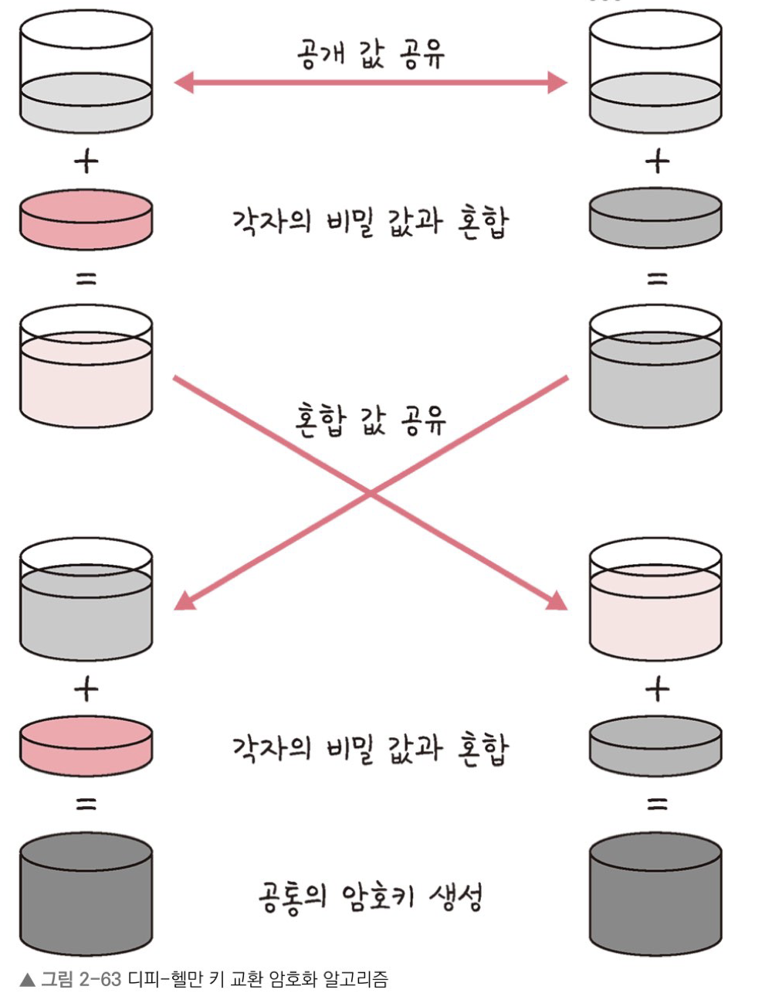

**해싱 알고리즘**

- 데이터를 추정하기 힘든 더 작고 섞여 있는 조각으로 만드는 알고리즘
- **SHA-256 알고리즘**
    - **해시 함수의 결괏값이 256비트인 알고리즘**
    - 전처리된 메시지를 기반으로 해시를 반환

#### SEO에도 도움이 되는 HTTPS

- 구글은 SSL 인증서를 강조해왔고, 사이트 내 모든 요소가 동일하다면 **HTTPS 서비스를 하는 사이트가 그렇지 않은 사이트보다 SEO 순위가 높을 것이라고 공식적으로 밝힘**
- **SEO ( Search Enging Optimization)**
    - 검색 엔진 최적화
    - 검색 결과 상단에 웹 페이지를 노출시켜 많은 사람이 볼 수 있도록 최적화하는 방법
    - **캐노니컬 설정, 메타 설정, 페이지 설정, 사이트맵 관리** 등이 있음

#### HTTPS 구축 방법

1. 직접 CA에서 구매한 인증키를 기반으로 HTTPS 서비스 구축
2. 서버 앞단의 HTTPS를 제공하는 로드밸런서 구축
3. 서버 앞단에 HTTPS를 제공하는 CDN 구축

### 2.5.5 HTTP/3

- **UDP 기반 QUIC 계층 위에서 돌아감**
- **QUIC (Quick UDP Internet Connection)**
    - UDP 기반 응답 속도를 개선하고 TCP 기반 다중화와 신뢰성 있는 전송이 가능한 차세대 HTTP 프로토콜
    - 구글이 설계하였으며 2013년 공개 발표 후 IETF에서 기술 표준화
    - QUIC 특징

    | 특징 | 설명 |
    | --- | --- |
    | 0-RTT | - 알려진 서버에 대한 연결은 0-RTT로 설정 - 새로운 암호화 키 교환 또는 버전 협상의 경우에만 설정 시간 증가 - 암호화 및 전송 핸드셰이크를 결합하여 설정 시간 단축 |
    | 스트림 멀티플렉싱 | - UDP를 통해 QUIC 스트림을 다중화하여 HOL Blocking 문제 극복 - QUIC 패킷 손실은 해당 패킷의 스트림만 차단 |
    | 흐름 제어 | - 수신자는 발신자가 스트림당 보낼 수 있는 총 바이트 수로 지정 |
    | 혼잡 제어 | - 커널 공간이 아닌 사용자 공간에 존재 - 알고리즘 업데이트를 더 빠르게 수행 - CUBIC 및 BBR 알고리즘 통합 (* CUBIC, BBR은 혼잡 제어 알고리즘) |
    | 연결 마이그레이션 | - 클라이언트 IP 주소 변경 시에도 연결 유지 - Wi-Fi와 셀룰러 간 전환 시 연결 유지 |

- **장점**
    - 멀티플렉싱을 가짐
    - **초기 연결 설정 시 지연 시간 감소**

#### 초기 연결 설정 시 지연 시간 감소

- **QUIC은 TCP를 사용하지 않기 때문에** 통신을 시작할 때 번거로은 **3-웨이 핸드셰이크 과정을 거치지 않아도 됨**

  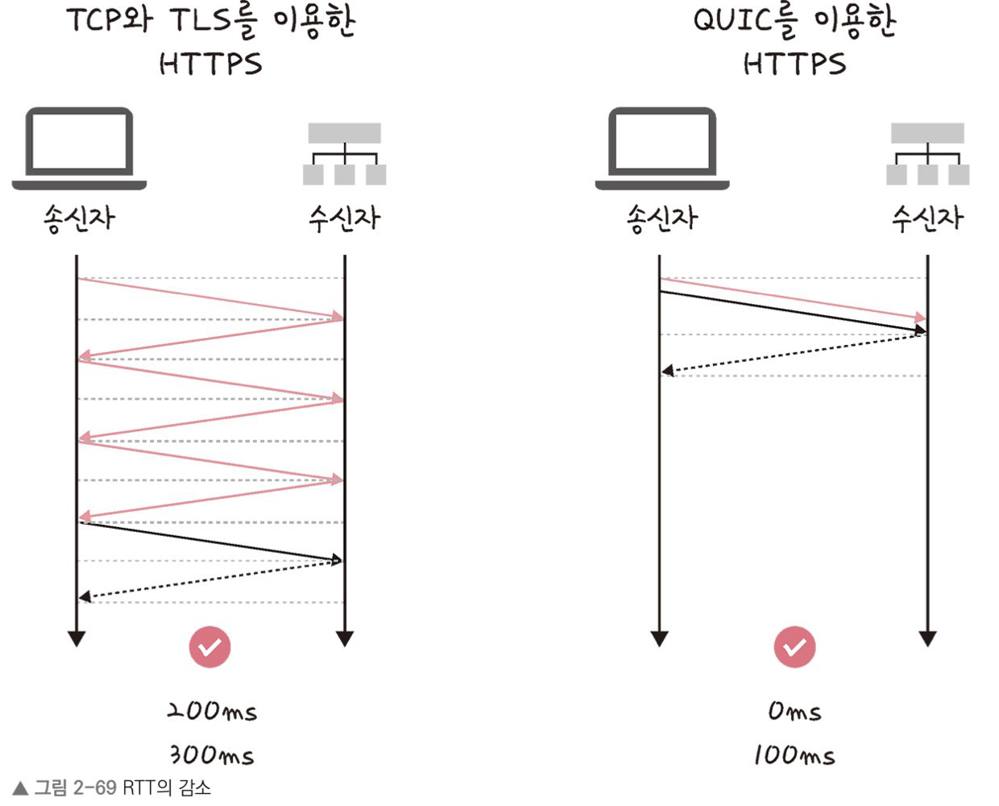

- 첫 연결 설정에 **1-RTT**만 소요
- 순방향 오류 수정 메커니즘이 적용되어 열악한 네트워크 환경에서도 낮은 패킷 손실률 자랑

## 참고

- 면접을 위한 CS 전공지식 노트
- [https://marades.tistory.com/15](https://marades.tistory.com/15)
- [https://programmingtilseungho.tistory.com/entry/OSI-7계층-TCPIP-4계층-비교?category=1058195](https://programmingtilseungho.tistory.com/entry/OSI-7%EA%B3%84%EC%B8%B5-TCPIP-4%EA%B3%84%EC%B8%B5-%EB%B9%84%EA%B5%90?category=1058195)
- [https://mangkyu.tistory.com/15](https://mangkyu.tistory.com/15)
- [https://halfmoon.tistory.com/288](https://halfmoon.tistory.com/288)
- [https://www.juniper.net/kr/ko/research-topics/what-is-qos.html](https://www.juniper.net/kr/ko/research-topics/what-is-qos.html)
- [https://ko.wikipedia.org/wiki/IPsec](https://ko.wikipedia.org/wiki/IPsec)
- [https://ko.wikipedia.org/wiki/플러그_앤_플레이](https://ko.wikipedia.org/wiki/%ED%94%8C%EB%9F%AC%EA%B7%B8_%EC%95%A4_%ED%94%8C%EB%A0%88%EC%9D%B4)
- [http://blog.skby.net/quic-quick-udp-internet-connection/](http://blog.skby.net/quic-quick-udp-internet-connection/)