# CHAPTER 3. 운영체제

## SECTION 3.1 운영체제와 컴퓨터

### 3.1.1 운영체제의 역할과 구조

#### 운영체제 역할

1. **CPU 스케줄링과 프로세스 관리**
    - CPU 소유권을 어떤 프로세스에 할당할지, 프로세스의 생성과 삭제, 자원 할당 및 반환 관리
2. **메모리 관리**
    - 한정된 메모리를 어떤 프로세스에 얼만큼 할당해야 하는지 관리
3. **디스크 파일 관리**
    - 디스크 파일을 어떠한 방법으로 보관할지 관리
4. **I/O 디바이스 관리**
    - I/O 디바이스들과 컴퓨터 간에 데이터를 주고받는 것을 관리

#### 운영체제 구조

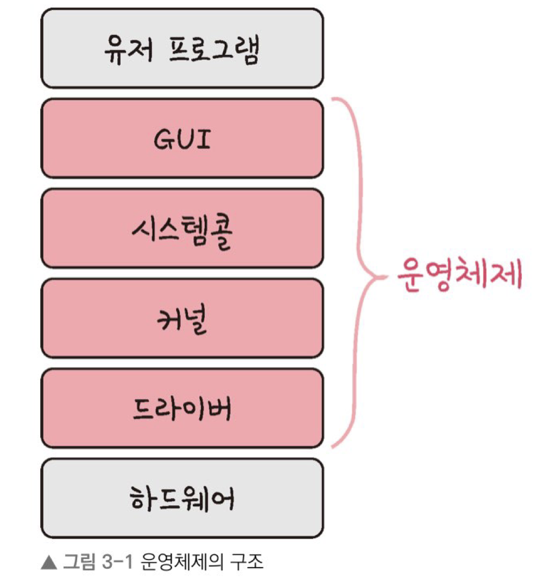

- GUI, 시스템콜, 커널, 드라이버 부분이 바로 운영체제를 지칭
- GUI가 없고 CUI만 있는 리눅스 서버도 있음

<pre>
<b>GUI</b>
- 사용자가 전자장치와 상호 작용할 수 있도록 하는 사용자 인터페이스의 한 형태
- 단순 명령어 창이 아닌 아이콘을 마우스로 클릭하는 단순한 동작으로 컴퓨터와 상호 작용 할 수 있도록 해줌
<b>드라이버</b>
- 하드웨어를 제어하기 위한 소프트웨어
<b>CUI</b>
- 그래픽이 아닌 명령어로 처리하는 인터페이스
</pre>

#### 시스템콜

- **운영체제가 커널에 접근하기 위한 인터페이스**
- 유저 프로그램이 운영체제의 서비스를 받기 위해 커널 함수를 호출할 때 사용
- **프로세스나 스레드에서 운영체제로 어떠한 요청을 할 때 시스템콜이라는 인터페이스와 커널을 거쳐 운영체제에 전달됨**

  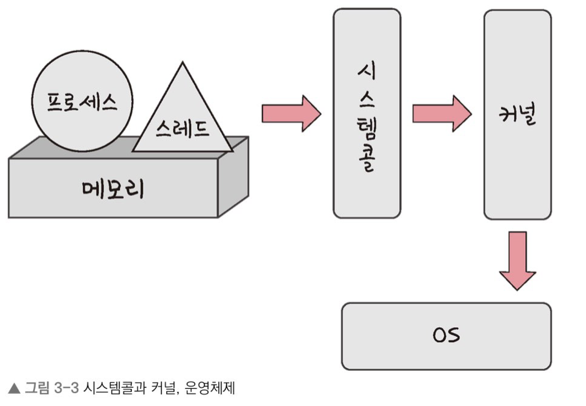

- 시스템콜은 하나의 추상화 계층
- **장점**
    - 네트워크 통신이나 데이터베이스와 같은 **낮은 단계의 영역 처리에 대한 부분을 많이 신경 쓰지 않고 프로그램을 구현할 수 있음**
- **modebit**
    - 1 또는 0의 값을 가지는 플래그 변수
    - 시스템콜이 작동될 때 modebit을 참고해서 유저 모드와 커널 모드 구분
        - 0 : 커널 모드
        - 1 : 유저 모드

  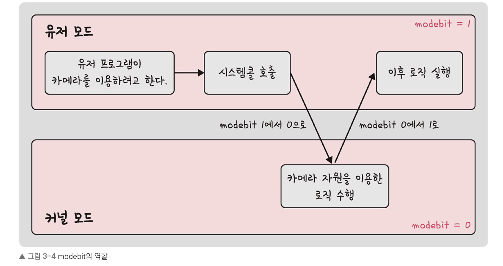


### 3.1.2 컴퓨터 요소

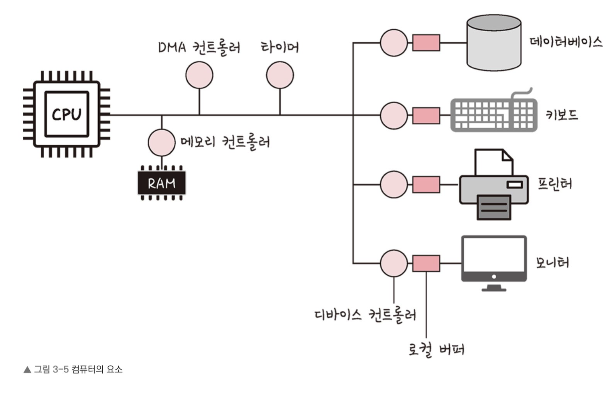

#### CPU (Central Processing Unit)

- **산술논리연산장치, 제어장치, 레지스터로 구성**되어 있는 컴퓨터 장치
- 인터럽트에 의해 단순히 **메모리에 존재하는 명령어를 해석해서 실행**
- 관리자 역할을 하는 운영체제의 커널이 프로그램을 메모리에 올려 프로세스로 만들면 일꾼인 CPU가 이를 처리함

#### 제어장치 (CU, Control Unit)

- 프로세스 조작을 지시하는 CPU의 한 부품
- 입출력장치 간 통신을 제어하고 명령어들을 읽고 해석하며 데이터 처리를 위한 순서 결정

#### 레지스터

- CPU 안에 있는 매우 빠른 임시기억장치
- CPU와 직접 연결되어 있음
- 연산 속도가 메모리보다 수십 배에서 수백 배까지 빠름

#### 산술논리연산장치 (ALU, Arithmetic Logic Unit)

- 산술 연산과 논리 연산을 계산하는 디지털 회로

#### CPU의 연산 처리

- CPU에서 제어장치, 레지스터, 산술논리연산장치를 통해 연산하는 예는 아래와 같음

  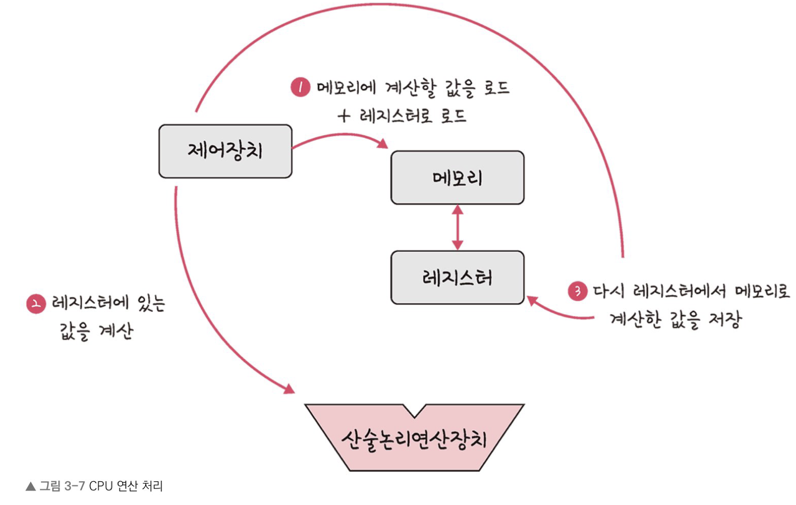

    1. 제어장치가 **메모리 및 레지스터에 계산할 값 로드**
    2. 제어장치가 **레지스터에 있는 값**을 계산하라고 산술논리연산장치에 명령
    3. 제어장치가 **계산된 값을 다시 “레지스터에서 메모리로” 계산한 값 저장**

#### 인터럽트

- **어떤 신호가 들어왔을 때 CPU를 잠깐 정지시키는 것**
- 인터럽트가 발생되면 인터럽트 핸들러 함수가 모여 있는 인터럽트 벡터로 가서 인터럽트 핸들러 함수가 실행됨
- 인터럽트 간 우선순위가 존재하며, **우선순위에 따라 실행됨**
- **하드웨어 인터럽트**
    - IO 디바이스에서 발생하는 인터럽트
- **소프트웨어 인터럽트**
    - 트랩(trap) 이라고도 함
    - 프로세스 오류 등으로 프로세스가 시스템콜을 호출할 때 발생

#### DMA 컨트롤러

- I/O 디바이스가 메모리에 직접 접근할 수 있도록 하는 하드웨어 장치
- CPU 부하를 막아주며 CPU 일을 부담하는 보조 일꾼
- 하나의 작업을 CPU와 DMA 컨트롤러가 동시에 하는 것 방지

#### 메모리 (Memory)

- 전자회로에서 **데이터나 상태, 명령어 등을 기록하는 장치**
- **RAM (Ramdom Access Memory) 을 보통 메모리라고도 함**
- CPU는 계산을 담당하고 메모리는 기억을 담당

#### 타이머 (Timer)

- 몇 초 안에 작업이 끝나야 한다는 것을 정하고 **특정 프로그램에서 시간 제한을 다는 역할**

#### 디바이스 컨트롤러 (Device controller)

- 컴퓨터와 연결되어 있는 IO 디바이스들의 작은 CPU

## SECTION 3.2 메모리

### 3.2.1 메모리 계층

메모리 계층은 **레지스터, 캐시, 메모리, 저장장치**로 구성되어 있음


|  | 레지스터 | 캐시 | 주기억장치 | 보조기억장치 |
| --- | --- | --- | --- | --- |
| 메모리 | 휘발성 | 휘발성 | 휘발성 | 비휘발성 |
| 속도 | 가장 빠름 | 속도 빠름 | 속도 빠름 | 속도 낮음 |
| 용량 | 가장 적음 | 적음 | 보통 | 많음 |
| 비고 | CPU 안에 있는 작은 메모리 | L1, L2 캐시를 지칭함
(참고로, L3 캐시도 있음) | RAM | HDD, SDD |

#### 캐시 (Cache)

- **데이터를 미리 복사해 놓는 임시 저장소**
- 빠른 장치와 느린 장치에서 속도 차이에 따른 병목 현상을 줄이기 위한 메모리
- **캐시 계층**
    - 속도 차이를 해결하기 위해 계층과 계층 사이에 있는 계층
    - **데이터베이스의 캐싱 계층**

      데이터베이스 시스템을 구축할 때도 메인 데이터베이스 위에 **레디스 데이터베이스 계층**을 **캐싱 계층**으로 둬서 성능을 향상시킴

      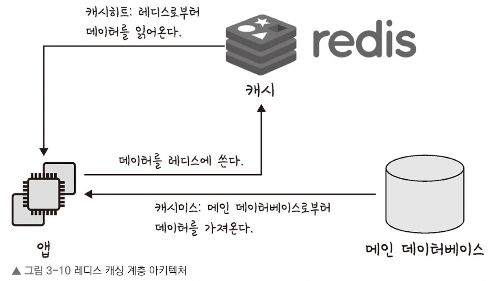

- **지역성의 원리**
    - 캐시를 직접 설정할 때는, 자주 사용하는 데이터를 기반으로 설정
    - **자주 사용하는 데이터 근거** : 시간 지역성, 공간 지역성
    - **시간 지역성** : 최근 사용한 데이터에 다시 접근하려는 특성
    - **공간 지역성** : 최근 접근한 데이터를 이루고 있는 공간이나 그 가까운 공간에 접근하는 특성

    ```jsx
    let arr = Array.from({length : 10}, () => 0); 
    for (let i = 0; i < 10; i += 1) { // 시간 지역성 특성 - 최근 사용한 데이터 특성
    	arr[i] = i; // 공간 지역성 특성 - 최근 데이터가 접근한 공간
    }
    ```


#### 캐시히트와 캐시미스

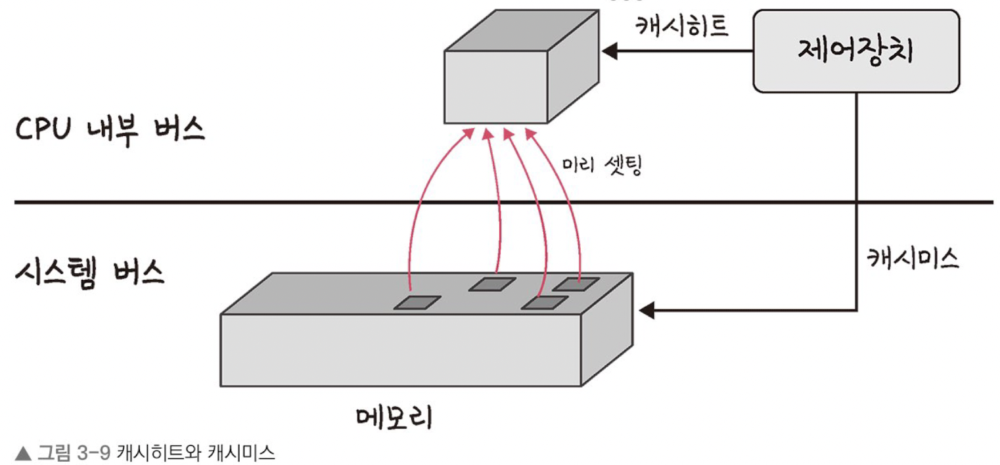

- **캐시히트**
    - **캐시에서 원하는 데이터를 찾은 것**
    - CPU 내부 버스를 기반으로 작동하기 때문에 빠름
- **캐시미스**
    - **해당 데이터가 캐시에 없다면 주 메모리로 가서 데이터를 찾아오는 것**
    - 시스템 버시를 기반으로 작동하기 때문에 느림
- **캐시매핑**
    - **캐시가 히트되기 위해 매핑하는 방법**
    - CPU의 레지스터와 주 메모리(RAM) 간에 데이터를 주고받을 때를 기반으로 설명

  | 이름                              | 설명                                                                               |
  |---------------------------------|----------------------------------------------------------------------------------|
  | 직접 매핑 (Directed Mapping)        | - 메모리가 1~100이 있고 캐시가 1~10이 있다면 1:1~10, 2:1~20 이런 식으로 매핑<br/>- 처리가 빠르지만 충돌 발생이 잦음 |
  | 연관 매핑 (Associative Mapping)      | - 순서를 일치하지 않고 관련 있는 캐시와 메모리 매핑<br/>- 충돌이 적지만 모든 블록을 탐색해야 해서 속도가 느림 |
  | 집합 연관 매핑 (Set Associative Mapping)       | - 직접 매핑과 연관 매핑을 합쳐 놓은 것<br/>- 순서는 일치시키지만 집합을 둬서 저장<br/>- 블록화되어 있어 검색은 좀 더 효율적 |

#### 웹 브라우저의 캐시

|  | 쿠키                           | 로컬 스토리지 | 세션 스토리지 |
| --- |------------------------------| --- | --- |
| 저장 방식 | 만료기한 있는 키-값 저장소              | 만료기한 없는 키-값 저장소 | 만료기한 없는 키-값 저장소 |
| 용량 | 4KB                          | 10MB | 5MB |
| 브라우저 | HTML4 / HTML5                | HTML5 | HTML5 |
| 저장 범위 | 도메인                          | 도메인 | 탭 |
| 저장 위치 | 클라이언ㅌ, 서버                    | 서버 | 서버 |
| 데이터 영구 | 유효기간 존재<br/>(클라이언트나 서버에서 설정) | 삭제하지 않는 한 영구적 | 탭을 닫을 시 삭제 |
| 데이터 범위 | 모든 윈도우                       | 모든 윈도우 | 같은 탭 |
| 매 요청 시 전송 여부 | O                            | X | X |

**쿠키 vs. 세션**

|  | 쿠키 | 세션 |
| --- | --- | --- |
| 저장 위치 | 클라이언트 | 서버 |
| 저장 형식 | text | object |
| 만료 시점 | 쿠키 저장 시 설정 | 브라우저 종료 시 삭제 |
| 사용 자원 (리소스) | 클라이언트 리소스 | 서버 리소스 |
| 용량 | 총 300개 | 서버가 허용하는 만큼 |
| 속도 | 상대적으로 빠름 | 상대적으로 느림 |
| 보안 | 상대적으로 안좋음 | 상대적으로 좋음 |

### 3.2.2 메모리 관리

#### 가상 메모리

- 컴퓨터가 실제로 이용 가능한 메모리 자원을 추상화하여 이를 사용하는 사용자들에게 매우 큰 메모리로 보이게 만드는 것

  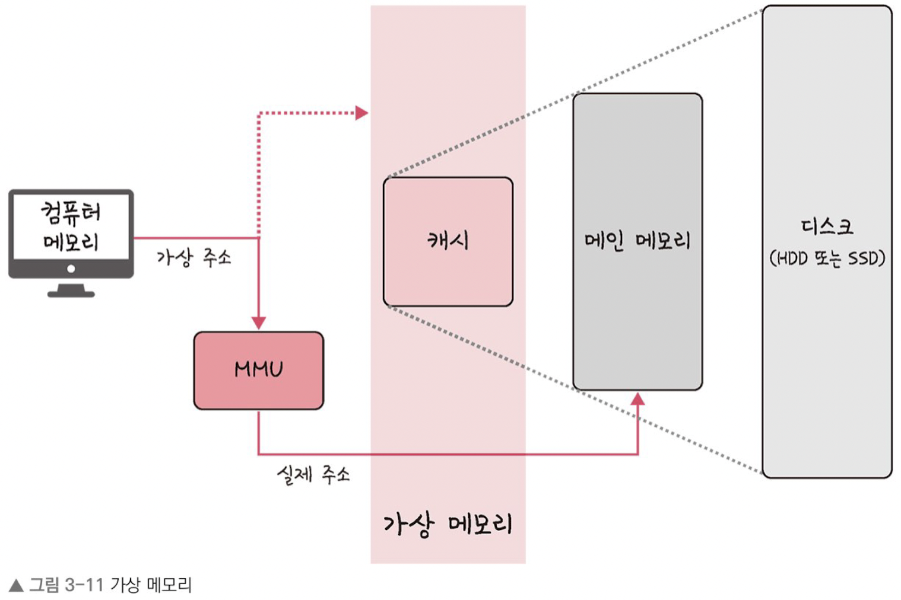

    - **가상 주소 (Logical Address) :** 가상적으로 주어진 주소
        - 메모리관리장치(MMU)에 의해 실제 주소로 변환됨
    - **실제 주소 (Physical Address) :** 실제 메모리상에 있는 주소
- 가상 메모리는 가상 주소와 실제 주소가 매핑되어 있고 프로세스의 주소 정보가 들어 있는 **페이지 테이블**로 관리됨
- 속도 향상을 위해 TLB를 사용함

    <pre>
    <b>TLB</b>
    - 메모리와 CPU 사이에 있는 주소 변환을 위한 캐시
    - 페이지 테이블에 있는 리스트를 보관하며 CPU가 페이지 테이블까지 가지 않도록 해 속도를 향상 시킬 수 있는 캐시 계층
    </pre>


**스와핑 (Swapping)**

- 메모리에서 당장 사용하지 않는 영역을 하드디스크로 옮기고 하드디스크 일부분을 마치 메모리처럼 불러와 쓰는 것
- 페이지 폴트가 일어나지 않는 것처럼 만들어 줌

**페이지 폴트 (Page Fault)**

- 프로세스의 주소 공간에는 존재하지만 지금 이 컴퓨터의 RAM에는 없는 데이터에 접근했을 경우 발생

  e.g. 가상 메모리에는 존재하지만 실제 메모리인 RAM에는 현재 없는 데이터나 코드에 접근할 경우

- **페이지 폴트와 스와핑 과정**
    1. CPU는 물리 메모리를 확인하여 해당 페이지가 없으면 트랩(소프트웨어 인터럽트)을 발생해 운영체제에 알림
    2. 운영체제는 CPU의 동작을 잠시 멈춤
    3. 운영체제는 페이지 테이블을 확인하여 가상 메모리에 페이지가 존재하는지 확인

       → 없으면 프로세스 중단하고 현재 물리 메모리에 비어 있는 프레임이 있는지 찾음

       → 물리 메모리에도 없으면 스와핑 발동

    4. 비어 있는 프레임에 해당 페이지 로드 → 페이지 테이블 최신화
    5. 중단되었던 CPU 다시 시작

    <pre>
    <b>페이지 (page)</b>
    - 가상 메모리를 사용하는 최소 크기 단위
    <b>프레임 (frame)</b>
    - 실제 메모리를 사용하는 최소 크기 단위
    </pre>


#### 스레싱 (Thrashing)

- 메모리의 페이지 폴트율이 높은 것
- 컴퓨터의 심각한 성능 저하를 초래
- 메모리에 너무 많은 프로세스가 동시에 올라가게 되면 스와핑이 많이 일어나서 발생함

  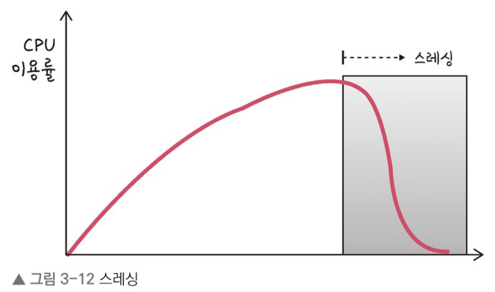

- **해결 방법**
    - 메모리 늘리기
    - HDD를 사용하는 경우 SDD로 변경
    - **작업 세트**
    - **PFF**

**작업 세트 (Working Set)**

- 지역성을 통해 결정된 페이지 집합을 만들어서 미리 메모리에 로드하는 것
- 탐색 비용 및 스와핑 감소

**PFF (Page Fault Frequency)**

- 상한선과 하한선을 만들어 페이지 폴트 빈도를 조절하는 방법
- 상한선에 도달하면 프레임을 늘리고, 하한선에 도달하면 프레임을 줄이는 방식

#### 메모리 할당

**연속 할당**

- 메모리에 **연속적으로** 공간을 할당하는 것
- **고정 분할 방식 (Fixed Partition Allocation)**
    - 메모리를 미리 나누어 관리하는 방식
    - 내부 단편화 발생
- **가변 분할 방식 (Variable Partition Allocation)**
    - 매 시점 프로그램의 크기에 맞게 동적으로 메모리 나눠서 사용
    - 내부 단편화는 발생하지 않고 외부 단편화는 발생할 수 있음
    - **종류**

        | 이름 | 설명 |
        | --- | --- |
        | 최초 적합 | 위쪽이나 아래쪽부터 시작해서 홀을 찾으면 바로 할당 |
        | 최적 적합 | 프로세스의 크기 이상인 공간 중 가장 작은 홀부터 할당 |
        | 최악 적합 | 프로세서의 크기와 가장 많이 차이가 나는 홀에 할당 |

        <pre>
        <b>홀 (hole)</b>
        - 할당할 수 있는 비어 있는 메모리 공간
        </pre>

- **내부 단편화 (Internal Framemtation)**
    - 메모리를 나눈 크기보다 프로그램이 작아서 들어가지 못하는 공간이 많이 발생하는 현상
    - 주기억장치 내 사용자 영역 > 실행 프로그램

  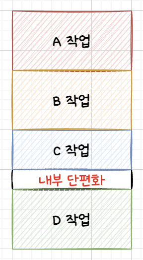

- **외부 단편화 (External Framentation)**
    - 메모리를 나눈 크기보다 프로그램이 커서 들어가지 못하는 공간이 많이 발생하는 현상
    - 주기억장치 내 사용 영역 < 실행 프로그램

  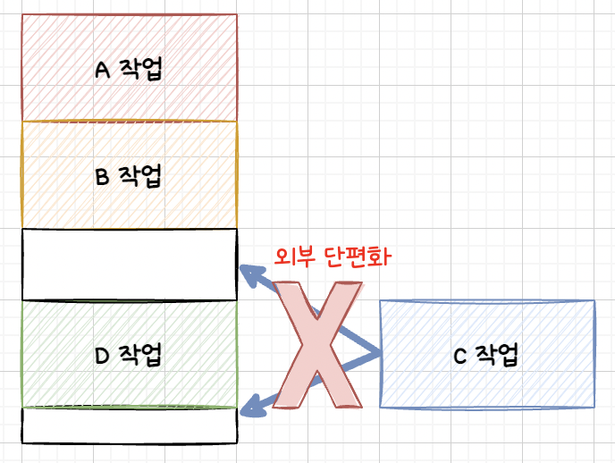


**불연속 할당**

- 메모리를 **연속적으로 할당하지 않는** 페이징 기법
- 메모리를 동일한 크기의 페이지로 나누고 프로그램마다 페이지 테이블을 두어 이를 통해 메모리에 프로그램을 할당하는 방식
- **페이징 (paging)**
    - 동일한 크기의 페이지 단위로 나누어 메모리의 서로 다른 위치에 프로세스 할당
    - 홀의 크기가 균일하지 않는 문제 발생 X
    - 주소 변환이 복잡
- **세그멘테이션 (segmentation)**
    - 의미 단위인 세그먼트(segment)로 나누는 방식
    - 공유와 보안 측면에서 좋음
    - 홀의 크기가 균일하지 않는 문제 발생
- **페이지드 세그멘테이션 (paged segmentation)**
    - 공유나 보안을 의미 단위인 세그먼트로 나눔
    - 물리적 메모리는 페이지로 나눔

#### 페이지 교체 알고리즘

- **오픈라인 알고리즘 (Offline Algorithm)**
    - 먼 미레에 참조되는 페이지와 현재 할당하는 페이지를 바꾸는 알고리즘
    - 가장 좋은 방법
    - **실제로 사용할 수 없는 알고리즘이지만 다른 알고리즘과의 성능 비교에 대한 기준 제공**
- **FIFO (First In First Out)**
    - **가장 먼저 온 페이지를 교체 영역에 가장 먼저 놓는 방법**
- **LRU (Least Recentle Used)**
    - **참조가 가장 오래된 페이지를 바꾸는 방법**
    - 오래된 것을 파악하기 위해 각 페이지마다 계수기, 스택을 두어야 하는 문제점이 있음
- **NRU (Not Usoed Recently)**
    - LRU에서 발전
    - **Clock 알고리즘**이라고도 함
    - **0과 1을 가진 비트를 둠 → 시계 방향으로 돌면서 0을 찾고 0을 찾은 순간 해당 프로세스를 교체하고 1로 변경하는 알고리즘**
        - 0 : 참조되지 않음
        - 1 : 최근에 참조됨
- **LFU (Least Frequently Used)**
    - **가장 참조 횟수가 적은 페이지 교체**

## SECTION 3.3 프로세스와 스레드

<pre>
<b>프로세스 (Process)</b>
- 컴퓨터에서 실행되고 있는 프로그램
- CPU 스케줄링의 대상이 되는 작업 (task)
<b>스레드 (Thread)</b>
- 프로세스 내 작업의 흐름
</pre>

### 3.3.1 프로세스와 컴파일 과정

- **프로그램**
    - 컴파일러가 컴파일 과정을 거쳐 컴퓨터가 이애할 수 있는 기계어로 번역되어 실행할 수 있는 파일이 되는 것
- **프로세스**
    - 프로그램으로부터 인스턴스화된 것
- **프로그램 컴파일 과정**

  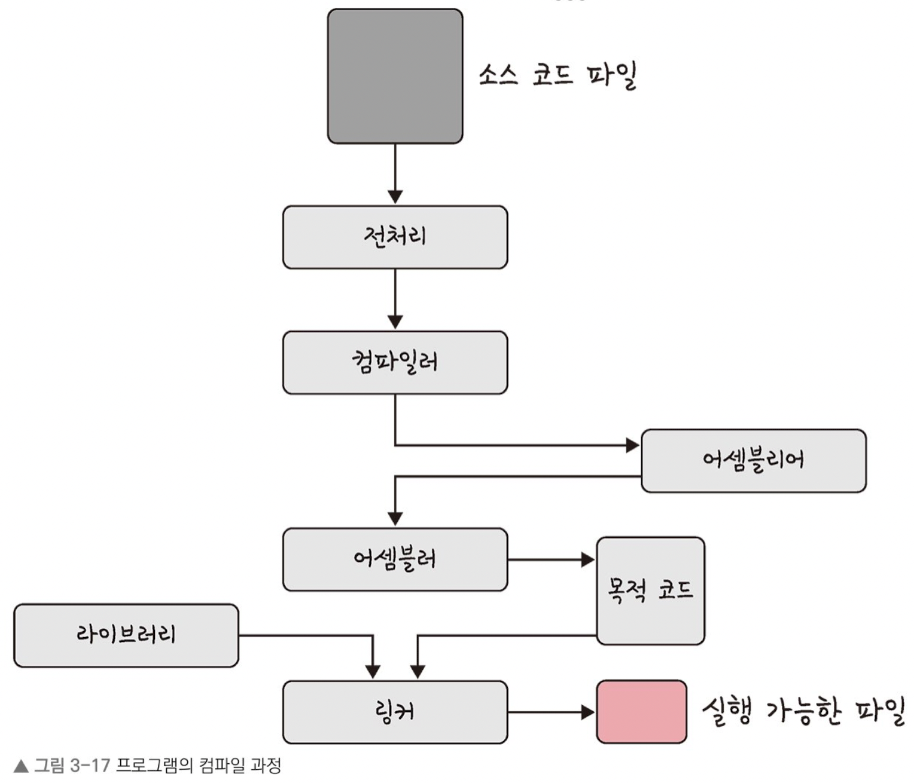

- **전처리**
    - 소스 코드의 주석을 제거하고 헤더 파일을 병함하여 매크로를 치환
- **컴파일러**
    - 오류 처리, 코드 최적화 작업을 하며 어셈블리어로 변환
- **어셈블러**
    - 목적 코드로 변환
- **링커**
    - 라이브러리 함수 또는 다른 파일들과 목적 코드를 결합하여 실행 파일 생성

  |  | 정적 라이브러리 | 동적 라이브러리 |
      | --- | --- | --- |
  | 정의 | 프로그램 빌드 시 라이브러리가 제공하는 모든 코드를 실행 파일에 넣는 방식 | 프로그램 실행 시 필요한 DDL 이라는 함수 정보를 통해 참조하는 방식 |
  | 외부 의존도 | 낮음 | 높음 |
  | 메모리 효율성 | 떨어짐 | 높음 |

### 3.3.2 프로세스 상태

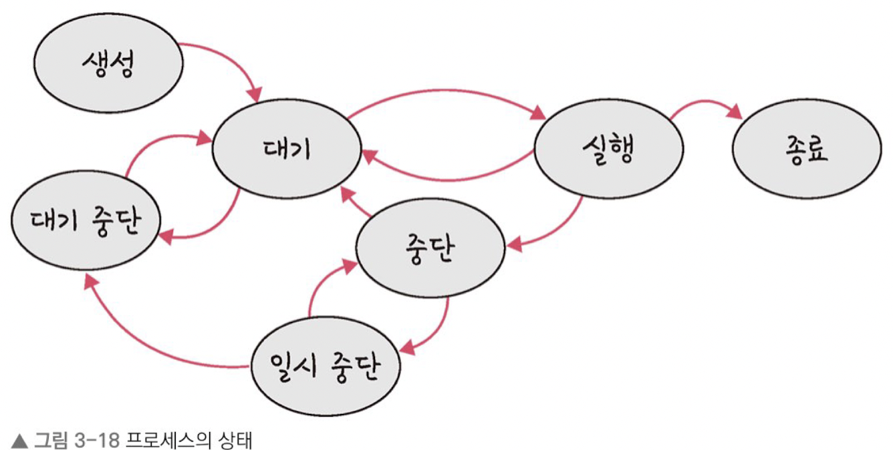

#### 생성 상태 (Create)

- **프로세스가 생성된 상태를 의미**
- fork() 또는 exec() 함수를 통해 생성

    <pre>
    <b>fork()</b>
    - 부모 프로세스의 주소 공간을 그대로 복사하며, 새로운 자식 프로세스를 생성하는 함수
    <b>exec()</b>
    - 새롭게 프로세스를 생성하는 함수
    </pre>

- <b>PCB(Process Control Block)</b>가 할당됨

#### 대기 상태 (Ready)

- 메모리 공간이 충분하면 메모리를 할당받고 아니면 아닌 상태로 대기
- **CPU 스케줄러로부터 CPU 소유권이 넘어오기를 기다리는 상태**

#### 대기 중단 상태 (Ready Suspened)

- **메모리 부족으로 일시 중단된 상태**

#### 실행 상태 (Running)

- **CPU 소유권과 메모리를 할당받고 인스트럭션을 수행 중인 상태**

    <pre>
    <b>인스트럭션 (Instruction)</b>
    - 컴퓨터 구조의 명령어 집합 내의 프로세스 명령
    - 컴퓨터가 어느 정보를 가지고 어떠한 처리를 하는가를 나타냄
    </pre>


#### 중단 상태 (Blocked)

- **어떤 이벤트가 발생한 후 기다리며 프로세스가 차단된 상태**

#### 일시 중단 상태 (Blocked Suspended)

- 대기 중단과 유사
- **중단된 상태에서 프로세스가 실행되려고 했지만 메모리 부족으로 일시 중단된 상태**

#### 종료 상태 (Terminated)

- **메모리와 CPU 소유권을 모두 놓고 가는 상태**
- 자연스럽게 종료되는 것도 있지만, 부모 프로세스가 자식 프로세스를 강제로 종료시키는 비자발적 종료도 있음

### 3.3.3 프로세스의 메모리 구조

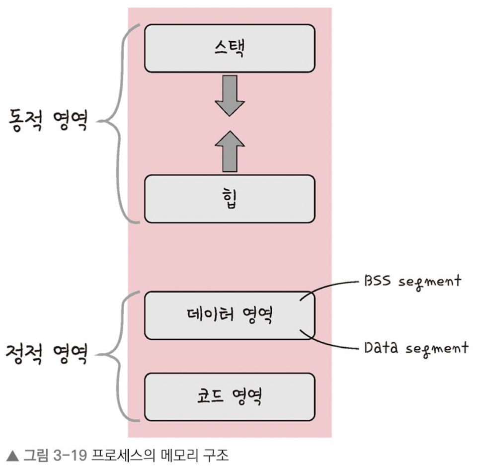

#### 스택 (Stack)

- **지역변수, 매개변수, 함수 저장**
- 컴파일 시 크기 결정
- 스택 영역화 힙 영역은 겹치면 안되기 때문에 사이에 빈 공간이 있음

#### 힙 (Heap)

- **동적 할당할 때 사용됨**
- 런타임 시 크기가 결정됨
- e.g. 벡터 같은 동적 배열

#### 데이터 영역 (BSS Segment, Data Segment)

- **전역변수, 정적변수가 저장됨**
- 정적인 특징을 갖는 프로그램이 종료되면 사라지는 변수가 들어 있는 영역
- BSS 영역 : 초기화되지 않는 변수가 0으로 초기화되어 저장
- Data 영역 : 0이 아닌 다른 값으로 할당된 변수들이 저장

#### 코드 영역 (Code Segment)

- **프로그램에 내장되어 있는 소스코드가 들어가는 영역**
- 수정 블가능한 기계어로 저장되어 있음

### 3.3.4 PCB (Process Control Block, 프로세스 제어 블록)

- **운영체제에서 프로세스에 대한 메타데이터를 저장한 데이터**
- 프로세스가 생성되면 운영체제는 해당 PCB 생성
- 프로세스의 중요한 정보를 포함하고 있기 때문에 일반 사용자가 접근하지 못하도록 커널 스택의 가장 앞부분에서 관리
- 스택, 힙 등의 구조를 기반으로 메모리가 할당되며, 이 프로세스의 메타데이터들이 PCB에 저장되어 관리됨

    <pre>
    <b>메타데이터</b>
    - 데이터에 관한 구조화된 데이터이자 데이터를 설명하는 작은 데이터
    </pre>


#### PCB 구조

- 프로세스 스케줄링 상태
    - ‘준비’, ‘일시중단' 등 프로세스가 CPU에 대한 소유권을 얻은 이후의 상태
- 프로세스 ID
    - 프로세스 ID, 해당 프로세스의 자식 프로세스 ID
- 프로세스 권한
    - 컴퓨터 자원 또는 I/O 디바이스에 대한 권한 정보
- 프로그램 카운터
    - 프로세스에서 실행해야 할 다음 명령어의 주소에 대한 포인터
- CPU 레지스터
    - 프로세스를 실행하기 위해 저장해야 할 레지스터 정보
- CPU 스케줄링 정보
    - CPU 스케주러에 의해 중단된ㄴ 시간 등에 대한 정보
- 계정 정보
    - 프로세스 실행에 사용된 CPU 사용량, 실행한 유저 정보
- I/O 상태 정보
    - 프로세스에 할당된 I/O 디바이스 목록

#### 컨텍스트 스위칭 (Context Switching)

- **PCB를 교환하는 과정**
- **한 프로세스에 의해 할당된 시간이 끝나거나 인터럽트에 의해 발생**
- **싱글코어**를 기준으로 설명

  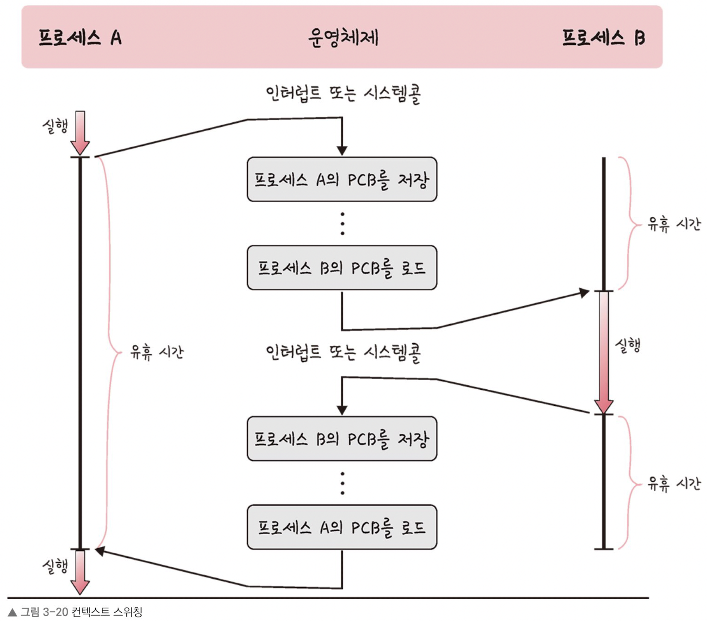

- 비용 : 캐시미스
    - 컨텍스트 스위칭이 일어날 때 프로세스가 가지고 있는 메모리 주소가 그대로 있으면 잘못된 주소 변환이 생기므로 캐시 클리어 과정을 겪게 되고 이 때문에 캐시 미스가 발생함
- 스레드에서의 컨텍스트 스위칭
    - 컨텍스트 스위칭은 스레드에서도 일어남
    - 비용이 더 적고 시간도 더 적게 걸림

### 3.3.5 멀티프로세싱

- **여러 개의 프로세스, 즉 멀티프로세스를 통해 동시에 두 가지 이상의 일을 수행할 수 있는 것**
- 하나 이상의 일을 병렬로 처리
- 신뢰성이 높음

#### 웹 브라우저

- 웹 브라우저는 **멀티프로세스 구조**를 가지고 있음

  

- 브라우저 프로세스
    - 주소 표시줄, 북마크 막대, 뒤로 가기 버튼, 앞으로 가기 버튼 등을 담당하며 네트워크 요청이나 파일 접근 같은 권한을 담당함
- 렌더러 프로세스
    - 웹 사이트가 보이는 부분의 모든 것을 제어함
- 플러그인 프로세스
    - 웹 사이트가 사용하는 플러그인을 제어함
- GPU 프로세스
    - GPU를 이용해서 화면을 그리는 부분을 제어함

#### IPC (Inter Process Communication)

- **프로세스끼리 데이터를 주고받고 공유 데이터를 관리하는 메커니즘**
- e.g. 클라이언트는 데이터를 요청하고 서버는 클라이언트에 응답하는 것
- **공유 메모리 (Shared Memory)**
    - 여러 프로세스에 동일한 메모리 블록에 대한 접근 권한이 부여되어 프로세스가 서로 통신할 수 있도록 공유 버퍼를 생성하는 것
    - 데이터 복사 오버헤드가 발생하지 않아 **가장 빠름**
    - 같은 메모리 영역을 여러 프로세스가 공유하기 때문에 **동기화가 필요함**
    - 하드웨어 관점에서 공유 메모리는 RAM을 가리키기도 함
- **파일**
    - **디스크에 저장된 데이터 또는 파일 서버에서 제공한 데이터**
    - 파일을 기반으로 프로세스 간 통신을 함
- **소켓**
    - 동일한 컴퓨터의 다른 프로세스나 네트워크의 다른 컴퓨터로 네트워크 인터페이스를 통해 전송하는 데이터
    - **TCP, UDP**
- **익명 파이프 (Unamed Pipe)**

  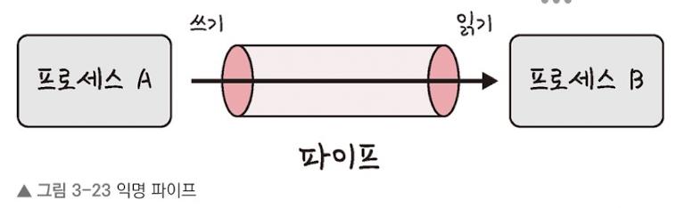

    - **프로세스 간에 FIFO 방식으로 읽히는 임시 공간인 파이프를 기반으로 데이터를 주고 받으며,단방향 방힉 읽기 전용, 쓰기 전용 파이프를 만들어서 작동하는 방식**
    - 부모, 자식 프로세스 간에만 사용할 수 있음
- **명명된 파이프 (Named Pipe)**
    - **파이프 서버와 하나 이상의 파이프 클라이언트 간의 통신을 위한 명명된 단방향 또는 이중 파이프**
    - 클라이언트/서버 통신을 위한 별도의 파이프 제공
    - **여러 파이프를 동시에 사용할 수 있음**
    - 컴퓨터의 프로세스끼리 또는 다른 네트워크상의 컴퓨터와 통신 가능
    - **보통 서버용 파이프와 클라이언트 파이프로 구분해서 작동하며 하나의 인스턴스를 열거나 여러 개의 인스턴스를 기반으로 통신함**

      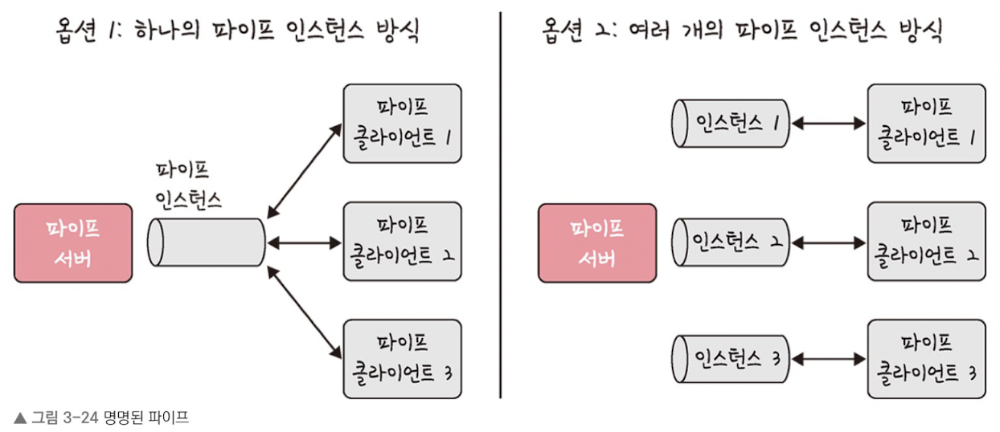

- **메시지 큐**

  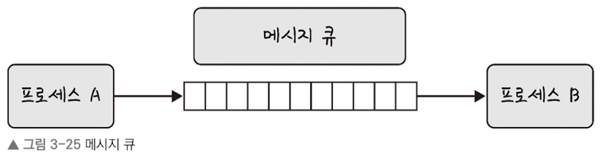

    - **메시지를 큐 데이터 구조 형태로 관리하는 것**
    - 커널에서 전역적으로 관리
    - 사용 방법이 매우 직관적이고 간단
    - 코드 수정 없이 단지 몇 줄의 코드 추가로 간단하게 메시지 큐에 접근할 수 있음
    - **공유 메모리 사용 시 발생하는 동기화로 인해 기능 구현이 복잡해지는 문제에 대한 대안으로 사용하기도 함**

### 3.3.6 스레드와 멀티스레딩

#### 스레드

- **프로세스의 실행 가능한 가장 작은 단위**
- **프로세스는 여러 스레드를 가질 수 있음**

  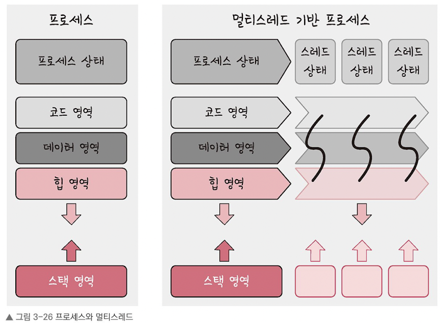

- 코드, 데이터, 스택, 힙을 각각 생성하는 프로세스와 달리 스레드는 코드, 데이터, 힙을 스레드끼리 공유함

#### 멀티스레딩

- **프로세스 내 작업을 여러 개의 스레드, 멀티스레드로 처리하는 기법**
- 스레드끼리 서로 자원을 공유하기 때문에 **효율성이 높음**
- **동시성**에도 큰 장점이 있음
- **한 스레드에 문제가 생기면 다른 스레드에 영향을 끼쳐 스레드로 이루어져 있는 프로세스에 영향을 줄 수 있는 단점**이 있음

<pre>
<b>동시성</b>
- 서로 독립적인 작업들을 작은 단위로 나누고 동시에 실행되는 것처럼 보여주는 것
</pre>

### 3.3.7 공유 자원과 임계 영역

#### 공유 자원 (Shared Resource)

- **시스템 안에서 각 프로세스, 스레드가 함께 접근할 수 있는 모니터, 프린터, 메모리, 파일, 데이터 등의 자원이나 변수 등을 의미**
- **경쟁 상태 (Race Confition)**
    - **공유 자원을 두 개 이상의 프로세스가 동시에 읽거나 쓰는 상황**

  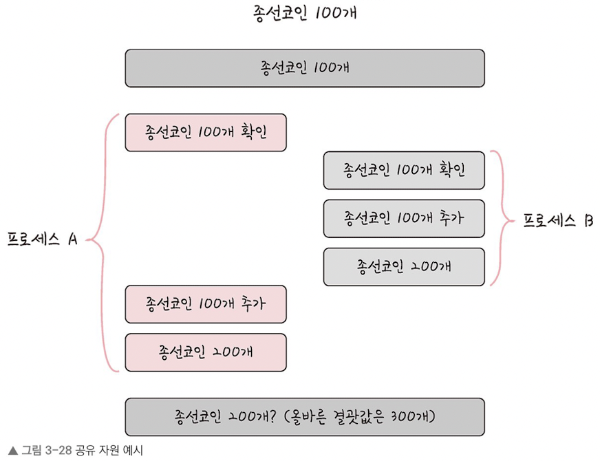

    - 프로세스 A와 프로세스 B가 동시에 접근하여 타이밍이 서로 꼬여 정상 결괏값은 300인데 200이 출력됨 ⇒ **두 프로세스의 경쟁 상태로 인해 비정상적인 결괏값을 출력함**

#### 임계 영역 (Critical Section)

- **둘 이상의 프로세스, 스레드가 공유 자원에 접근할 때 순서 등의 이유로 결과가 달라지는 코드 영역**
- 임계 영역을 해결하기 위한 방법 : **뮤텍스, 세마포어, 모니터**
    - 모두 **상호 배제, 한정 대기, 융퉁성**이란 조건 만족

        <pre>
        <b>상호 배제</b>
        - 한 프로세스가 임계 영역에 들어갔을 때 다른 프로세스는 들어갈 수 없음
        <b>한정 대기</b>
        - 특정 프로세스가 영원히 임계 영역에 들어가지 못하면 안 됨
        <b>융튱성</b>
        - 한 프로세스가 다른 프로세스의 일을 방해해서는 안 됨
        </pre>

    - 토대가 되는 메커니즘은 **잠금(lock)**

**뮤텍스 (Mutex)**

- **프로세스나 스레드가 공유 자원을 lock()을 통해 잠금 설정하고 사용한 후 unlock()을 통해 잠금 해제하는 객체**

  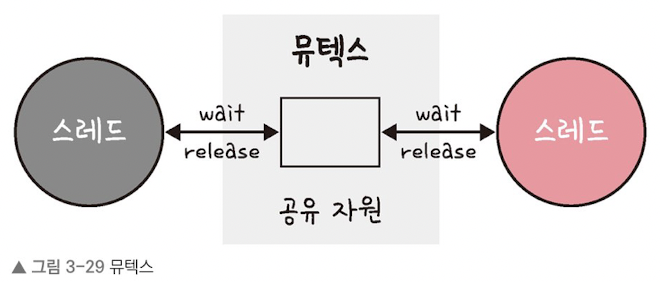

- 잠금 또는 잠금 해제라는 상태만 가짐
- 잠금 설정 시 다른 프로세스나 스레드는 잠긴 코드 영역에 접근할 수 없음

**세마포어 (Semaphore)**

- 일반화된 뮤텍스
- 간단한 정수 값과 두 가지 함수 wait 및 signal로 공유 자원에 대한 접근 철
    - wait() : 자신의 차례가 올 때까지 기다리는 함수
    - signal() : 다음 프로세스로 순서를 넘겨주는 함수
- **프로세스나 스레드가 공유 자원에 접근하면 세마포어에서 wait() 작업을 수행하고 프로세스나 스레드가 공유 자원을 해제하면 세마포어에서 signal() 작업을 수행함**

  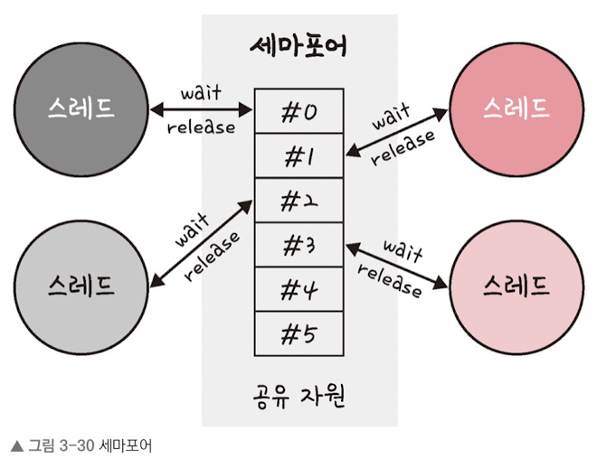

- 프로세스나 스레드가 세마포어 값을 수정할 때 다른 프로세스나 스레드는 동시에 세마포어 값을 수정할 수 없음
- **바이너리 세마포어**
    - **0과 1의 두 가지 값만 가질 수 있는 세마포어**
    - 뮤텍스와의 차이
        - 뮤텍스는 잠금 기반으로 상호 배제가 일어나는 잠금 메커니즘
        - 세마포어는 신호를 기반으로 상호 배제가 일어나는 신호 메커니즘
- **카운팅 세마포어**
    - **여러 개의 값을 가질 수 있는 세마포어**
    - 여러 자원에 대한 접근을 제어하는 데 사용

**모니터**

- **둘 이상의 스레드나 프로세스가 공유 자원에 안전하게 접근할 수 있도록 공유 자원을 숨기고 해당 접근에 대한 인터페이스만 제공**

  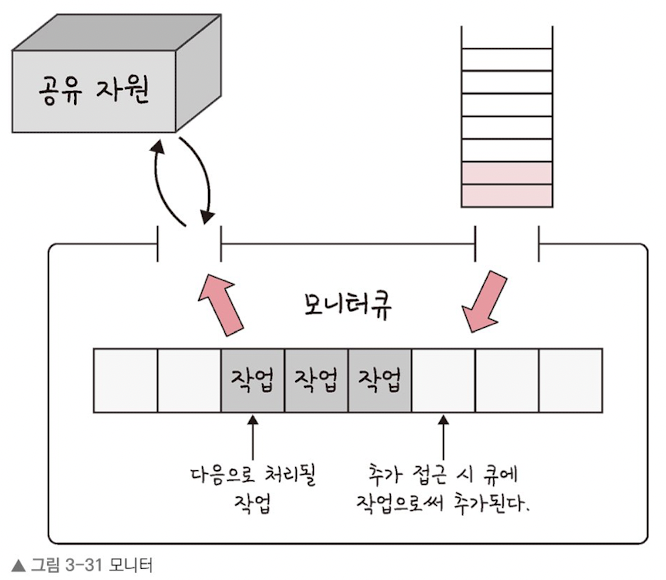

- 모니터큐를 통해 공유 자원에 대한 작업들을 순차적으로 처리
- 세마포어보다 구현하기 쉬우며 상호 배제는 자동임
    - 세마포어에서는 상호 배제를 명시적으로 구현해야 함

### 3.3.8 교착 상태 (Deadlock)

- **두 개 이상의 프로세스들이 서로 가진 자원을 기다리며 중단된 상태**

#### 교착 상태 원인

- **상호 배제**
    - 한 프로세스가 자원을 독점하고 있으며 다른 프로세스들은 접근이 불가능함
- **점유 대기**
    - 특정 프로세스가 점유한 자원을 다른 프로세스가 요청하는 상태
- **비선점**
    - 다른 프로세스의 자원을 강제적으로 가져올 수 없음
- **환형 대기**
    - 프로세스 A와 B가 서로의 자원을 요구하는 상황

#### 교착 상태의 해결 방법

1. 자원을 할당할 때 애초에 조건이 성립되지 않도록 설계
2. 교착 상태 가능성이 없을 때만 자원 할당되며, 프로세스당 요청할 자원들이 최대치를 통해 자원 할당 가능 여부를 파악하는 은행원 알고리즘 사용
3. 교착 상태가 발생하면 사이클이 있는지 찾아보고 이와 관련된 프로세스를 한 개씩 지움
4. 교착 상태는 매우 드물게 일어나 처리 비용이 더 커서 교착 상태가 발생하면 사용자가 작업을 종료함

<pre>
<b>은행원 알고리즘</b>
- 총 자원의 양과 현재 할당한 자원의 양을 기준으로 안정 또는 불안정 상태로 나누고 안정 상태로 가도록 자원을 할당하는 알고리즘
</pre>

## SECTION 3.4 CPU 스케줄링 알고리즘

- **CPU 스케줄링 알고리즘에 따라 프로세스에서 해야하는 일을 스레드 단위로 CPU에 할당**

  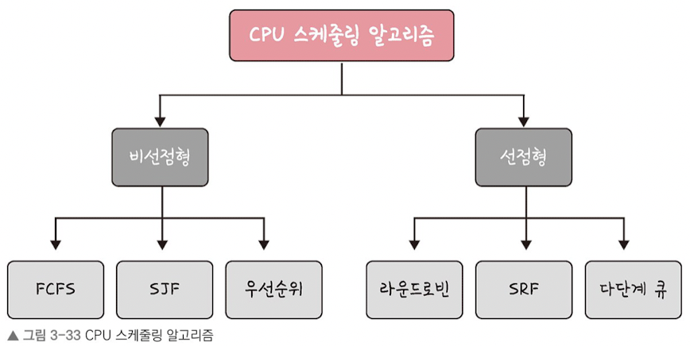


### 3.4.1 비선점형 방식 (non-preemptive)

- **프로세스가 스스로 CPU 소유권을 포기하는 방식**
- 강제로 프로세스를 중지하지 않음
- **컨텍스트 스위칭으로 인한 부하가 적음**

#### FCFS (First Come, First Served)

- **가장 먼저 온 것을 가장 먼저 처리하는 알고리즘**
- **준비 큐에서 오래 기다리는 현상(convoy effect)이 발생함**

#### SJF (Shortest Job First)

- **실행 시간이 가장 짧은 프로세스를 가장 먼저 실행하는 알고리즘**
- **긴 시간을 가진 프로세스가 실행되지 않는 현상(starvation)**이 일어남
- **평균 대기 시간이 가장 짧음**
- 실제로는 과거 실행했떤 시간을 토대로 실행 시간을 추측해서 사용

#### 우선순위

- **오래된 작업일수록 우선순위를 높이는 방법**
- **SJF 스케줄링의 단점을 보완한 알고리즘**

### 3.4.2 선점형 방식 (preemptive)

- 현대 운영체제가 쓰는 방식
- **지금 사용하고 있는 프로세스를 알고리즘에 의해 중단시켜 버리고 강제로 다른 프로세스에 CPU 소유권을 할당하는 방식**

#### 라운드 로빈 (RR, Round Robin)

- 우선순위 스케줄링의 일종
- **각 프로세스는 동일한 할당 시간을 주고 그 시간 안에 끝나지 않으면 다시 준비 큐(Ready Queue) 뒤로 가는 알고리즘**
- **할당 시간이 너무 크면 FCFS가 되고 짧으면 컨텍스트 스위칭이 잦아서 오버헤드 즉, 비용이 커짐**
- **전체 작업 시간은 길어지지만 평균 응답 시간은 짧아진다는 특징이 있음**
- **로드밸런서에서 트래픽 분산 알고리즘**으로도 사용

#### SRF

- **중간에 더 짧은 작업이 들어오면 수행하던 프로세스를 중지하고 해당 프로세스를 수행하는 알고리즘**

#### 다단계 큐

- **우선순위에 따른 준비 큐를 여러 개 사용**
- **큐마다 라운드 로빈이나 FCFS 등 다른 스케줄링 알고리즘 적용**
- **스케줄링 부담은 적지만 유연성이 떨어짐**

## 참고

- 면접을 위한 CS 전공지식 노트
- [https://seoramyeon.tistory.com/71](https://seoramyeon.tistory.com/71)
- [https://fz7948.tistory.com/54](https://fz7948.tistory.com/54)
- [https://hahahoho5915.tistory.com/32](https://hahahoho5915.tistory.com/32)
- [https://chelseashin.tistory.com/41](https://chelseashin.tistory.com/41)
- [https://ko.wikipedia.org/wiki/인스트럭션](https://ko.wikipedia.org/wiki/%EC%9D%B8%EC%8A%A4%ED%8A%B8%EB%9F%AD%EC%85%98)
- [https://toycode.tistory.com/entry/인스트럭션instruction](https://toycode.tistory.com/entry/%EC%9D%B8%EC%8A%A4%ED%8A%B8%EB%9F%AD%EC%85%98instruction)