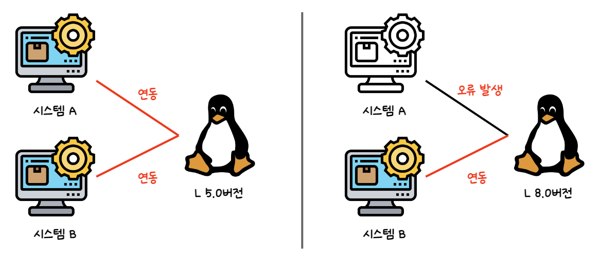

## 1. 도커란 무엇인가?

### 도커란?

- 데이터 또는 프로그램을 격리시키는 기능을 제공하는 소프트웨어
- 데이터나 프로그램을 독립된 환경으로 격리한 공간을 컨테이너라고 한다.
- 도커 엔진을 설치하면 컨테이너를 생성하거나 구동시킬 수 있다.
- 컨테이너를 생성할 때는 이미지라고 부르는, 필요한 프로그램과 라이브러리 및 소스를 설치하여 만든 파일 필요하다.
- 하나의 도커에 여러 개의 컨테이너 생성 가능하다.
- 리눅스 운영체제를 사용하는 것을 전제로 만들어졌다.
    - 윈도우나 macOS 환경에서 도커를 구동하는 경우, 내부적으로 리눅스를 사용한다.
    - 컨테이너에서 동작시킬 프로그램도 리눅스용 프로그램이다.

### 데이터나 프로그램을 독립된 환경에 격리해야 하는 이유

- 격리되지 않은 경우, 한 서버에 여러 프로그램이 함께 동작하며 서로에게 영향을 미치게 된다
    - 예를 들어, 시스템 A는 L 5.0 버전이어야만 동작하도록 만들어졌는데 시스템 B를 위해 L 8.0으로 버전 업데이트를 하는 경우,

      시스템 A는 동작하지 않게 될 것이다.

    - 시스템 A와 시스템 B가 같은 디렉터리를 사용하게 될 경우 설정 파일이 섞이거나 설정에 충돌이 발생할 수도 있다.

### 프로그램의 격리란?

- 도커 컨테이너는 완전히 독립된 환경이므로 여러 컨테이너에서 같은 프로그램을 실행할 수 있다.
    - 버전이 동일해도 상관없다.

## 2. 서버와 도커

### 서버란

- 어떤 서비스(service)를 제공(serve)하는 것을 의미
- 기능적 의미의 서버와 물리적 컴퓨터로서의 서버로 구분할 수 있다.

  

- 서버의 운영체제로는 주로 리눅스가 사용된다.

  

### 기능적 의미의 서버

- 서버의 기능은 소프트웨어가 제공하며, 소프트웨어를 설치함으로써 서버는 기능을 갖게 된다.
- 기능적 서버 종류

| 서버의 종류    | 설명                                                                                                          |
|:----------|:------------------------------------------------------------------------------------------------------------|
| 웹 서버      | 웹 사이트의 기능을 제공하는 서버 대표적인 소프트웨어 : 아파치, Nginx, IIS                                                         |
| 메일 서버     | 메일 송수신을 담당하는 SMTP 서버와 클라이언트에 메일을 전달하는 POP 서버 대표적인 소프트웨어 : Sendmail, Postfix, Dovecot                    |
| 데이터베이스 서버 | 데이터를 저장하거나 검색하는 데이터베이스 기능을 제공하는 서버 대표적인 소프트웨어 : MySQL, PostgreSQL, MariaDB, SQL Server, Oracle Database |
| 파일 서버     | 파일을 저장하고 다른 사람과 공유하기 위한 서버 대표적인 소프트웨어 : Samba                                                           |
| DNS 서버    | IP와 도메인을 연결해주는 DNS 기능을 제공하는 서버                                                                              |
| DHCP 서버   | IP 주소를 자동으로 할당하는 기능을 제공하는 서버                                                                                |
| FTP 서버    | FTP 프로토콜을 사용해 파일 송수신 기능을 제공하는 서버                                                                            |
| 프록시 서버    | 통신을 중계하는 역할을 맡는 서버                                                                                          |
| 인증 서버     | 사용자 인증을 위한 서버  대표적인 소프트웨어 : OpenLDAP, Active Directory                                                  |

### 컨테이너의 자유로운 이동

- 컨테이너는 격리된 공간에서 동작하기 때문에, 하나의 물리 서버에 두 개의 웹 서버를 올리는 등 여러 서버를 구축할 수 있다.
- 도커를 이용하면 컨테이너 환경을 자유롭게 이동할 수 있다.
  