# 4. 컨테이너를 실행해보자

## 1. 도커 엔진 시작/종료

여기서는 macOS를 기준으로 설명한다. 다른 환경이 궁금하다면 책을 참고하도록 하자.

참고로, 컨테이너를 실행 중이 아니라면 컴퓨터의 리소스를 거의 차지 하지 않으므로 종료하지 않아도 문제가 되지 않는다.

1. 도커 엔진 시작하기
    - 파인더 → ‘애플리케이션’ 폴더 → Docker.app 더블 클릭
    - cmd + space → docker 검색 → Docker.app 클릭
    - Launchpad 클릭 → Docker.app 더블 클릭
2. 도커 엔진 종료

   화면 우측 상단에 위치한 상태 막대에서 도커 모양 클릭 → 메뉴에서 Quit Docker Desktop 선택

3. 자동 실행 설정

   도커 설정 클릭 → General > Start Docker Desktop when you log in 체크

   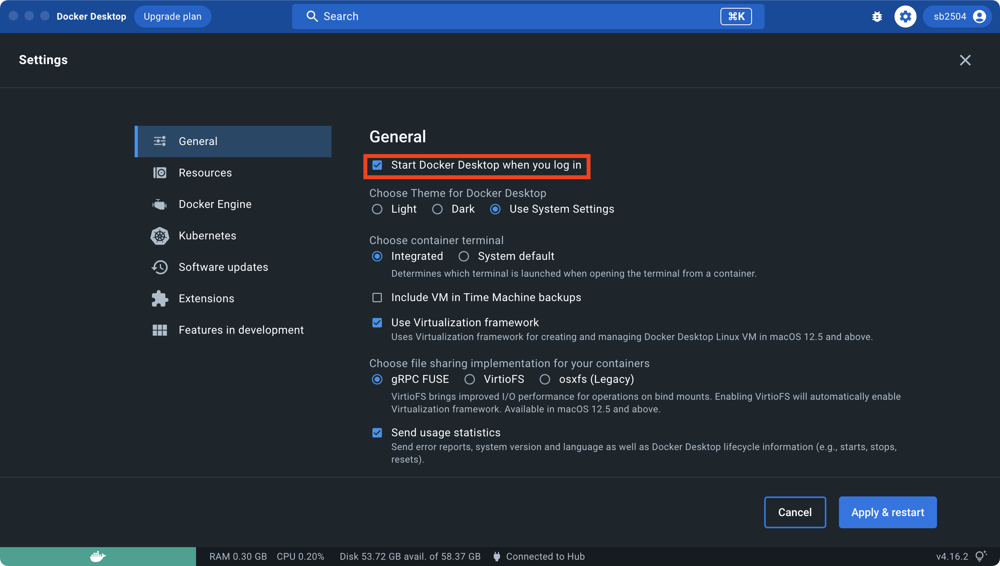

## 2. 컨테이너의 기본적인 사용 방법

### 컨테이너 사용 기본 명령어

- 컨테이너를 다루는 모든 명령어는 ‘docker’ 명령어로 시작한다.

    ```bash
    docker ~
    ```

- docker 명령 뒤로 **‘무엇을’**, **‘어떻게’**, **‘대상’** 순으로 지정한다.

  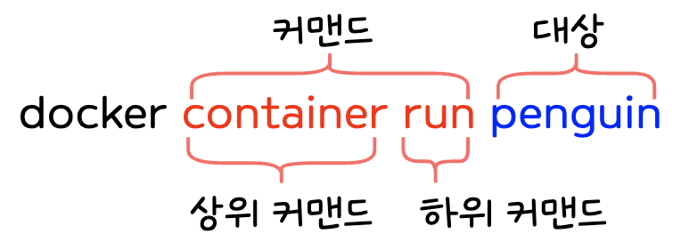

- container와 같이 상위 커맨드의 종류는 **12종류** 뿐이다.
- 이 외에도 **‘옵션’과 ‘인자’라는 추가 정보**가 붙는다.

  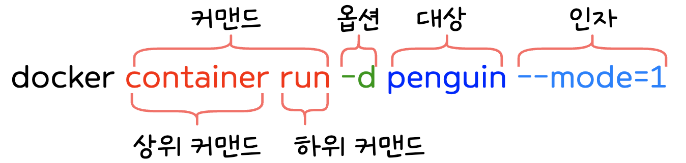

    - 옵션은 커맨드에 세세한 설정을 지정하는 용도로 쓰인다.
    - 인자는 대상에 전달할 값을 지정한다. 문자 코드 또는 포트 번호 등을 전달할 수 있다.

### 대표적인 명령어

- 컨테이너 조작 관련 커맨드 (상위 커맨드 container)

| 하위 커맨드 | 내용                                                                                                                       | 생략 가능 여부        | 주요 옵션                    |
|--------|--------------------------------------------------------------------------------------------------------------------------|-----------------|--------------------------|
| start  | 컨테이너 실행                                                                                                                  | O               | -i                       |
| stop   | 컨테이너 정지                                                                                                                  | O               | 거의 사용하지 않음               |
| create | 도커 이미지로부터 컨테이너 생성                                                                                                        | O               | --name -e -p -v          |
| run    | 도커 이미지를 내려 받고 컨테이너를 생성해 실행<br/>( docker image pull, docker container create, doker container start 세 명령어를 하나로 합친 것과 같음 ) | O               | --name -e -p -v -d -i -t |
| rm     | 정지 상태의 컨테이너 삭제                                                                                                           | O               | -f -v                    |
| exec   | 실행 중인 컨테이너 속 프로그램 실행                                                                                                     | O               | -i -t                    |
| ls     | 컨테이너 목록 출력                                                                                                               | 생략형 : docker ps | -a                       |
| cp     | 도커 컨테이너와 도커 호스트 간 파일 복사                                                                                                  | O               | 거의 사용하지 않음               |\
| commit | 도커 컨테이너를 이미지로 변환                                                                                                         | O               | 거의 사용하지 않음               |

- 이미지 조작 관련 커맨드 (상위 커맨드 image)

| 하위 커맨드 | 내용                         | 생략 가능 여부         | 주요 옵션      |
|--------|----------------------------|------------------|------------|
| pull   | 도커 허브 등 리포지토리에서 이미지를 내려 받음 | O                | 거의 사용하지 않음 |
| rm     | 도커 이미지 삭제                  | 생략형 : docker rmi | 거의 사용하지 않음 |
| ls     | 내려 받은 이미지 목록 출력            | X                | 거의 사용하지 않음 |
| build  | 도커 이미지 생성                  | O                | -t         |

- 볼륨 조작 관련 커맨드 (상위 커맨드 volumne)

| 하위 커맨드  | 내용                   | 생략 가능 여부 | 주요 옵션      |
|---------|----------------------|----------|------------|
| create  | 볼륨 생성                | X        | --name     |
| inspect | 볼륨 상세 정보 출력          | X        | 거의 사용하지 않음 |
| ls      | 볼륨 목록 출력             | X        | -a         |
| prune   | 현재 마운트되지 않은 볼륨 모두 삭제 | X        | 거의 사용하지 않음 |
| rm      | 지정한 볼륨 삭제            | X        | 거의 사용하지 않음 |

- 네트워크 조작 관련 커맨드 (상위 커맨드 network)

| 하위 커맨드     | 내용                          | 생략 가능 여부 | 주요 옵션      |
|------------|-----------------------------|----------|------------|
| connect    | 컨테이너를 도커 네트워크에 연결           | X        | 거의 사용하지 않음 |
| disconnect | 컨테이너의 도커 네트워크 연결 해제         | X        | 거의 사용하지 않음 |
| create     | 도커 네트워크 생성                  | X        | 거의 사용하지 않음 |
| inspect    | 도커 네트워크 상세 정보 출력            | X        | 거의 사용하지 않음 |
| ls         | 도커 네트워크 목록 출력               | X        | 거의 사용하지 않음 |
| prune      | 현재 컨테이너가 접속하지 않은 네트워크 모두 삭제 | X        | 거의 사용하지 않음 |
| rm         | 지정한 네트워크 삭제                 | X        | 거의 사용하지 않음 |

- 그 밖의 상위 커맨드

| 상위 커맨드     | 내용                                                           |
|------------|--------------------------------------------------------------|
| checkpoint | 현재 상태를 일시적으로 저장한 후, 나중에 해당 지점의 상태로 되돌릴 수 있다. (현재 기준, 실험적 기능) |
| node       | 도커 스웜의 노드 관리 기능                                              |
| plugin     | 플러그인을 관리하는 기능                                                |
| secret     | 도커 스웜의 비밀값 정보를 관리하는 기능                                       |
| service    | 도커 스웜의 서비스를 관리하는 기능                                          |
| stack      | 도커 스웜 또는 쿠버네티스에서 여러 개의 서비스를 합쳐 구성한 스택 관리 기능                  |
| swarm      | 도커 스웜 관리 기능                                                  |
| system     | 도커 엔진 정보 확인 기능                                               |

- 단독으로 쓰익는 커맨드

| 단독 커맨드  | 내용                   | 주요 옵션      |
|---------|----------------------|------------|
| login   | 도커 레지스트리 로그인         | -u -p      |
| logout  | 도커 레지스트리 로그 아웃       | 거의 사용하지 않음 |
| search  | 도커 레지스트리 검색          | 거의 사용하지 않음 |
| version | 도커 엔진 및 명령행 도구 버전 출력 | 거의 사용하지 않음 |

## 3. 컨테이너의 생성과 삭제, 실행, 정지

### docker run 커맨드

컨테이너를 실행할 때는 `docker run` 또는 `docker container run` 커맨드를 사용한다.

이 커맨드는 도커 컨테이너를 생성하고 실행하는 기능을 한다. 만약, 이미지가 필요한데 없다면, 이미지를 내려받는 기능도 겸한다.

즉, `docker run`은 컨테이너를 생성하는 docker create (docker container create), 컨테이너를 실행하는 docker start (docker container start),
이미지를 내려받는 docker pull (docker image pull) 커맨드를 한 번에 실행하는 것이다.

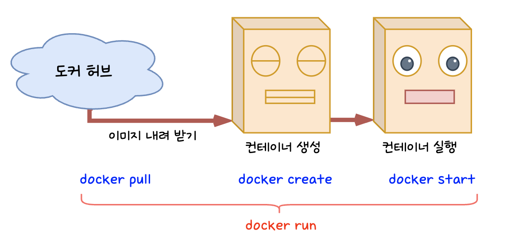

- 커맨드 형식

  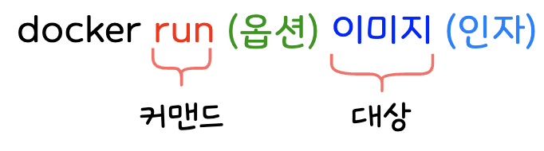

- 주요 옵션

| 옵션 형식                 | 내용                  |
|-----------------------|---------------------|
| -- name 컨테이너_이름       | 컨테이너 이름을 지정함        |
| -p 호스트_포트번호:컨테이너_포트번호 | 포트 번호를 지정함          |
| -v 호스트_디스크:컨테이너_디렉터리  | 볼륨을 마운트함            |
| --net=네트워크_이름         | 컨테이너를 네트워크에 연결함     |
| -e 환경변수_이름=값          | 환경변수를 설정함           |
| -d                    | 백그라운드로 실행함          |
| -i                    | 컨테이너에 터미널(키보드)을 연결함 |
| -t                    | 특수 키를 사용 가능하도록 함    |
| -help                 | 사용 방법 안내 메시지를 출력함   |

-p는 --publish, -v는 --volume, -e는 --env, -d는 --detach, -i는 --interactive, -t는 --tty의 생략형이다.

### docker stop, docker rm 커맨드

컨테이너를 폐기하려면 먼저 컨테이너를 정지시켜야 한다. **동작 중인 컨테이너를 그대로 삭제할 수 없기 때문이다.**

컨테이너를 정지시키려면 `docker stop` 또는 `docker container stop` 커맨드를 사용하고, 컨테이너를 삭제할 때는 `docker rm` 또는 `docker container rm` 커맨드를
사용한다.

- 정지 커맨드 형식

  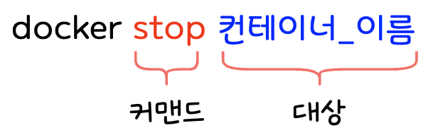

- 삭제 커맨드 형식

  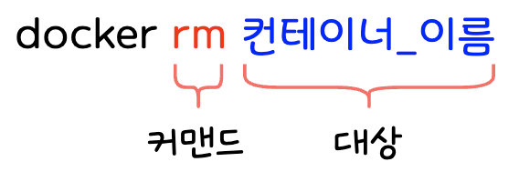

**(참고) 컨테이너의 생애주기**

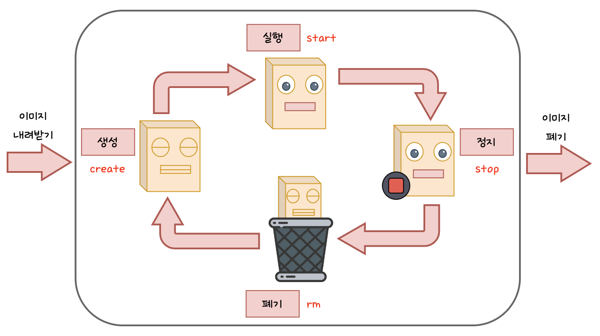

### docker ps 커맨드

컨테이너의 목록을 출력할 때는 `docker ps` 또는 `docker container ls` 커맨드를 사용한다.

- 커맨드 형식

  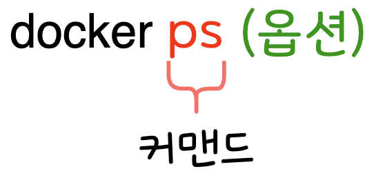

- 명령어 실행 시 출력되는 컨테이너 목록의 주요 항목

| 항목           | 내용                                                                                   |
|--------------|--------------------------------------------------------------------------------------|
| CONTAINER ID | 컨테이너 식별자. 무작위 문자열이 할당되며, 본래 64글자이나 12글자만 출력함                                         |
| IMAGE        | 컨테이너를 만들 때 사용한 이미지 이름                                                                |
| COMMAND      | 컨테이너 실행 시 실행하도록 설정된 프로그램 이름 (크게 신경쓰지 않아도 됨)                                          |
| CREATED      | 컨테이너 생성 후 경과된 시간                                                                     |
| STATUS       | 컨테이너의 현재 상태. 실행 중이면 Up, 종료된 상태면 Exited가 출력됨                                          |
| PORTS        | 컨테이너에 할당된 포트 번호. ‘호스트 포트 번호 → 컨테이너 포트 번호’ 형식으로 출력됨. 포트 번호가 동일하면 컨테이너 포트 번호는 출력되지 않음. |
| NAMES        | 컨테이너 이름                                                                              |

## 4. 컨테이너의 통신

### 컨테이너와 통신하려면

웹 브라우저를 통해 컨테이너에 접근하려면, **“포트”**를 설정해 외부와 접속하기 위한 설정을 한다.

좀 더 자세히 설명하자면, 실행 중인 웹 서버(호스트)의 포트와 컨테이너의 포트를 -p 옵션으로 연결하면, 외부에서 컨테이너로의 접속이 가능하다.

실행 중인 웹 서버가 8080번 포트를 사용한다면, 아파치를 컨테이너에 접속하기 위해 이 8080번 포트를 컨테이너의 80번 포트에 연결하는 방식이다.

```bash
-p 호스트_포트_번호:컨테이너_포트_번호

# 실제 연결 방법
-p 8080:80
```

컨테이너를 사용하면 여러 개의 웹 서버를 함께 실행할 수도 있기 때문에, 이러한 경우는 호스트 포트 번호를 다르게 설정하여 구분해야 한다.

컨테이너A에는 호스트 포트를 8080, 컨테이너 B에는 호스트 포트 8081과 같이 겹치지 않도록 설정해야 요청을 구분할 수 있다.

만약, 여러 컨테이너로 연결되는 포트를 같게 설정하고 싶다면, 리버스 프록시로 서버 이름을 통해 구별하도록 구성하면 된다.

참고로, 컨테이너 포트는 동일해도 괜찮다.

### 실습 - 아파치 포트 연결 테스트

```bash
# 백그라운드 실행, 호스트 8080번 포트를 컨테이너 80번 포트에 포워딩
# http://localhost:8080/ 으로 접속하면 아파치 초기 화면이 연결됨
docker run --name apachetest -d -p 8080:80 httpd
```

## 5. 컨테이너 생성에 익숙해지기

### 리눅스 운영체제가 담긴 컨테이너

| 이미지 이름  | 컨테이너의 내용 | 컨테이너 실행에 주로 사용되는 옵션 및 인자                        |
|---------|----------|-------------------------------------------------|
| ubuntu  | 우분투      | -d 없이 -it 옵션만 사용. 인자로는 /bin/bash 등 셸 명령어를 지정한다. |
| centos  | CentOS   | -d 없이 -it 옵션만 사용. 인자로는 /bin/bash 등 셸 명령어를 지정한다. |
| debian  | 데비안      | -d 없이 -it 옵션만 사용. 인자로는 /bin/bash 등 셸 명령어를 지정한다. |
| fedora  | 페도라      | -d 없이 -it 옵션만 사용. 인자로는 /bin/bash 등 셸 명령어를 지정한다. |
| busybox | BizyBox  | -d 없이 -it 옵션만 사용. 인자로는 /bin/bash 등 셸 명령어를 지정한다. |
| alpine  | 알파인 리눅스  | -d 없이 -it 옵션만 사용. 인자로는 /bin/bash 등 셸 명령어를 지정한다. |

### 웹 서버/데이터베이스 서버용 컨테이너

| 이미지 이름   | 컨테이너의 내용   | 컨테이너 실행에 주로 사용되는 옵션 및 인자                               |
|----------|------------|--------------------------------------------------------|
| httpd    | Apache     | -d로 백그라운드 실행. -p로 포트 번호 지정                             |
| nginx    | Nginx      | -d로 백그라운드 실행. -p로 포트 번호 지정                             |
| mysql    | MySQL      | -d를 사용. 실행 시 -e MYSQL_ROOT_PASSWORD와 같이 루트 패스워드를 지정    |
| postgres | PostgreSQL | -d를 사용. 실행 시 -e POSTGRES_ROOT_PASSWORD와 같이 루트 패스워드를 지정 |
| mariadb  | MariaDB    | -d를 사용. 실행 시 -e MYSQL_ROOT_PASSWORD와 같이 루트 패스워드를 지정    |

### 프로그램 실행을 위한 런타임과 그 외 소프트웨어

| 이미지 이름    | 컨테이너의 내용   | 컨테이너 실행에 주로 사용되는 옵션 및 인자                                                                      |
|-----------|------------|-----------------------------------------------------------------------------------------------|
| openjdk   | 자바 런타임     | -d를 사용하지 않고, 인자로 java 명령 등을 지정해 도구 형태로 사용한다.                                                  |
| python    | 파이썬 런타임    | -d를 사용하지 않고, 인자로 python 명령 등을 지정해 도구 형태로 사용한다.                                                |
| php       | PHP 런타임    | 웹 서버가 포함된 것과 실행 명령만 포함된 것으로 나뉘어 제공한다.                                                         |
| ruby      | 루비 런타임     | 웹 서버가 포함된 것과 실행 명령만 포함된 것으로 나뉘어 제공한다.                                                         |
| perl      | 펄 런타임      | -d를 사용하지 않고, 인자로 perl 명령 등을 지정해 도구 형태로 사용한다.                                                  |
| gcc       | C/C++ 컴파일러 | -d를 사용하지 않고, 인자로 gcc 명령 등을 지정해 도구 형태로 사용한다.                                                   |
| node      | Node.js    | -d를 사용하지 않고, 인자로 app 명령 등을 지정해 도구 형태로 사용한다.                                                   |
| registry  | 도커 레지스트리   | -d 옵션을 사용해 백그라운드로 실행하며, -p 옵션으로 포트를 지정한다.                                                     |
| wordpress | WordPress  | -d 옵션을 사용해 백그라운드로 실행하며, -p 옵션으로 포트를 지정한다. MySQL 또는 MariaDB가 필요하다. 접속에 필요한 패스워드는 -e 옵션으로 지정한다. |
| nextclode | NextCloud  | -d 옵션을 사용해 백그라운드로 실행하며, -p 옵션으로 포트를 지정한다.                                                     |
| redmine   | Redmine    | -d 옵션을 사용해 백그라운드로 실행하며, -p 옵션으로 포트를 지정한다. PostgreSQL 또는 MySQL이 필요하다.                          |

## 6. 이미지 삭제

컨테이너를 삭제해도 이미지는 그대로 남아 쌓이기 때문에, 이미지 삭제가 필요하다.

### docker image rm

이미지를 삭제할 때는 이미지 ID 또는 이미지 이름을 지정하며, `docker image rm` 커맨드를 사용한다.

- 커맨드 형식

  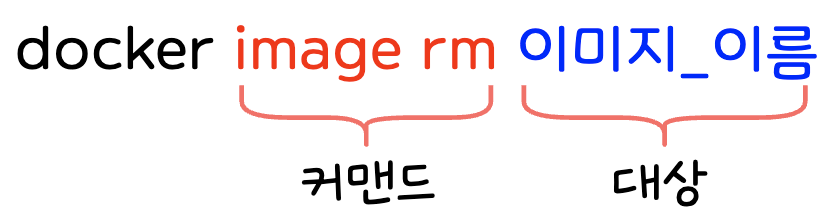

- 여러 개의 이미지를 지정하는 경우

  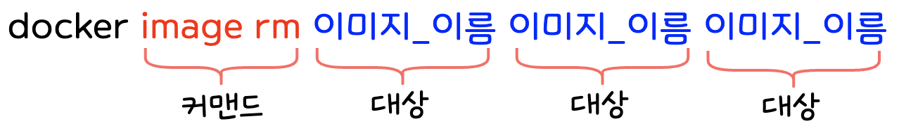

### docker image ls

이미지를 삭제하려면 이미지 ID 또는 이미지 이름을 알아야 하는 데, 이 때 사용하는 것이 `docker image ls` 커맨드이다.

- 커맨드 입력 시 표출되는 이미지 목록의 주요 항목

| 항목         | 내용                                                   |
|------------|------------------------------------------------------|
| REPOSITORY | 이미지 이름                                               |
| TAG        | 버전 정보. 이미지를 내려받을 때 따로 지정하지 않으면 lastest (최신 버전)을 받는다. |
| IMAGE ID   | 이미지 식별자. 본래 64글자이나 앞에서부터 12글자만 출력한다.                 |
| CREATED    | 이미지 생성 후 경과된 시간                                      |
| SIZE       | 이미지의 전체 용량                                           |

> 본 게시글은 [그림과 실습으로 배우는 도커 & 쿠버네티스](https://product.kyobobook.co.kr/detail/S000001766500) 도서를 참고하여 작성되었습니다.
> 상세한 내용이 궁금하시다면 책을 읽어보실 것을 추천해 드립니다.
