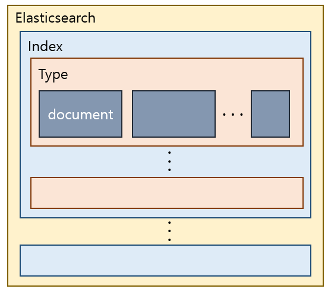
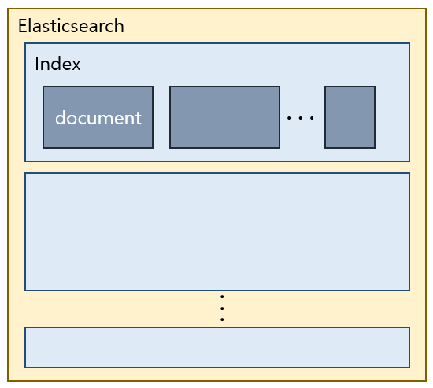

# 01. Elasticsearch 설치 및 CRUD

## 01. Elasticsearch 설치
Elasticsearch는 아래 링크에서 다운로드 받아 설치하면 된다.

👉 [Elasticsearch 설치 링크](https://www.elastic.co/kr/downloads/elasticsearch)

현 시점 (2023.03.22) 최신 버전은 `8.6.2`이며, Apache License 2.0의 오픈소스를 이용하길 바라면 `7.10.2` 버전을 설치하길 바란다. 참고로, 7.11 버전부터는 라이센스가 변경되었다.

참고로, 7.x 버전부터는 자바 가상 머신이 엘라스틱서치 내에 내장되어 있어서 별도로 설치할 필요가 없으나, 로그스태시를 이용하려는 경우 자바 가상 머신이 필요하다. 지원 버전에 대한 자세한 정보는 아래 링크를 통해 확인할 수 있다.

👉 [지원 버전 확인하러 가기](https://www.elastic.co/kr/support/matrix#matrix_compatibility)

### Windows 환경에 Elasticsearch 설치하기

Windows의 경우는 다음과 같은 과정으로 설치할 수 있다.

**Windows zip 파일 다운로드 → 압축 풀기 → `bin` 폴더로 이동 → `elasticsearch.bat` 실행**

설치가 완료되면 http://localhost:9200/ 에서 클러스터 이름과 버전 정보를 확인할 수 있다.

## 02. Elasticsearch 기본 개념
### Elastic 저장 구조
|7.0 버전 이전|7.0 버전 이후|
|---|---|
|||

### RDB와 저장 구조 비교
|Elasticsearch|RDB|
|:---|:---|
|Index|Database|
|Type (7.0버전부터 사라진 개념)|Table|
|Document|Row|
|Field|Column|
|Mapping|Schema|

### RDB와 쿼리 비교
|CRUD|Elasticsearch|RDB|
|:---|:---|:---|
|Read|GET|Select|
|Create|PUT|Insert|
|Update|POST|Update|
|Delete|DELETE|Delete|

## 03. Elasticsearch 데이터 입력, 조회, 삭제 (GET, POST, PUT, DELETE)
### Index 생성하기
Index를 생성하기 위해서는 `PUT` 명령어를 사용해서 아래와 같은 형식으로 명령어를 입력하면 된다. 여기서 `index name`은 생성하려는 index 이름이다.
```shell
curl -X PUT {elasticsearch address}/{index name}
# e.g.
curl -X PUT http://localhost:9200/classes
```
생성이 완료되면 아래와 같은 문구가 출력된다.
```shell
{"acknowledged":true,"shards_acknowledged":true,"index":"classes"}
```

### Index 조회하기
Index를 조회하기 위해서는 `GET` 명령어를 사용해서 아래와 같은 형식으로 명령어를 입력하면 된다. 여기서 `index name`은 조회하려는 index 이름이다.
```shell
curl -X GET {elasticsearch address}/{index name}
# e.g.
curl -X GET http://localhost:9200/classes
```

결과값을 JSON 형식에 맞춰서 보고 싶다면 끝에 `?pretty`를 추가하면 된다.
```shell
curl -X GET http://localhost:9200/classes?pretty
```

### Index 삭제하기
Index를 삭제하기 위해서는 `DELETE` 명령어를 사용해서 아래와 같은 형식으로 명령어를 입력하면 된다. 여기서 `index name`은 삭제하려는 index 이름이다.
```shell
curl -X DELETE {elasticsearch address}/{index name}
# e.g.
curl -X DELETE http://localhost:9200/classes
```
삭제가 완료되면 아래와 같은 문구가 출력된다.
```shell
{"acknowledged":true}
```
### Document URL 변화
글 초반 저장 구조에서 볼 수 있듯 7.0 버전부터는 Document Type에 대한 개념이 사라졌으며, Elasticsearch는 단일 도큐먼트별로 고유한 URL을 갖는다. 도큐먼트에 접근하는 URL은 아래와 같은 구조로 되어 있다.
```
{elasticsearch address}/{index name}/_doc/{document id}
```
참고로, 6.x 버전까지는 Document Type이라는 개념이 존재했기에 URL 구조가 달랐으며, 강의는 5.1.1 버전을 사용하고 있다. 6.x 버전까지 URL 구조는 아래와 같았다.
```
{elasticsearch address}/{index name}/{document type}/{document id}
```

### Document 생성하기
아래 명령어를 이용해 document를 생성해보자. 여기서부터 `?pretty`를 붙여 명령어을 실행할 예정이기에, 예제 URL에 `?pretty`가 붙어있다.

참고로, -H를 통해 Header 값을 주지 않으면 **406 에러**가 발생하니 반드시 넣어주어야 한다.

```shell
curl -X PUT {elasticsearch address}/{index name}/_doc/{document id} -H'Content-Type:application/json' -d '{{body 내용}}'
# e.g.
curl -X PUT http://localhost:9200/classes/_doc/1?pretty -H'Content-Type:application/json' -d '{"file":"Algorithm","professor":"John"}'
```
생성이 완료되면 다음과 같은 결과를 볼 수 있다.
```json
{
  "_index" : "classes",
  "_type" : "_doc",
  "_id" : "1",
  "_version" : 1,
  "result" : "created",
  "_shards" : {
    "total" : 2,
    "successful" : 1,
    "failed" : 0
  },
  "_seq_no" : 0,
  "_primary_term" : 1
}
```

매번 URL에 직접 body를 입력하는 것은 굉장히 번거롭고 실수를 하기 쉽다. 다행히도 json 파일을 통해 document를 생성할 수 있으며, 아래와 같은 명령어를 사용하면 된다.
```shell
curl -X PUT {elasticsearch address}/{index name}/_doc/{document id} -H'Content-Type:application/json' -d @{파일명}.json
#e.g.
curl -X PUT http://localhost:9200/classes/_doc/2?pretty -H'Content-Type:application/json' -d @oneclass.json
```
파일의 내용은 다음과 같다.
```json
{
    "title" : "Machine Learning",
    "Professor" : "Herry",
    "major" : "Computer Science"
}
```

실수로 document가 덮어씌워지는 것을 막고 싶다면 `_doc` 대신 `_create`를 사용하면 된다. `_create`는 **새로운 document 생성만을 허용**한다.
```shell
curl -X PUT {elasticsearch address}/{index name}/_create/{document id} -H'Content-Type:application/json' -d '{{body 내용}}'
```
참고로, PUT이 아닌 POST를 통해서도 document를 생성할 수 있다. POST를 통해 생성할 때는 아래와 같이 document id를 기입하지 않으며, id는 랜덤한 값으로 생성된다.
```shell
curl -X POST {elasticsearch address}/{index name}/_doc -H'Content-Type:application/json' -d '{body 내용}'
```

### Document 조회하기
Document 조회 명령은 Index와 유사하다.
```shell
curl -X GET {elasticsearch address}/{index name}/_doc/{document id}
# e.g.
curl -X GET http://localhost:9200/classes/_doc/1?pretty
```
위에서 생성했던 document id 1과 2의 내용을 조회해보자!
```json
// document id 1 조회 결과
{
  "_index" : "classes",
  "_type" : "_doc",
  "_id" : "1",
  "_version" : 1,
  "_seq_no" : 0,
  "_primary_term" : 1,
  "found" : true,
  "_source" : {
    "file" : "Algorithm",
    "professor" : "John"
  }
}
// document id 2 조회 결과
{
  "_index" : "classes",
  "_type" : "_doc",
  "_id" : "2",
  "_version" : 1,
  "_seq_no" : 1,
  "_primary_term" : 1,
  "found" : true,
  "_source" : {
    "title" : "Machine Learning",
    "Professor" : "Herry",
    "major" : "Computer Science"
  }
}
```

### Document 수정하기
Index를 수정하는 방법은 다음과 같이 두 가지이다.
1. PUT을 사용한 모든 내용 덮어쓰기
2. POST를 사용해 원하는 필드 내용 변경하기

먼저, 첫번째 방법을 사용해 이전에 생성한 `oneclass.json` 내용으로 document id 1번의 내용을 덮어써보자.
```shell
curl -X PUT http://localhost:9200/classes/_doc/1?pretty -H'Content-Type:application/json' -d @oneclass.json
```
`GET`을 통해 내용을 확인해보면 `oneclass.json` 파일 내용으로 덮어씌워진 것을 확인할 수 있으며, `_version` 이 1에서 2로 변경된 것을 확인할 수 있다.
```json
{
  "_index" : "classes",
  "_type" : "_doc",
  "_id" : "1",
  "_version" : 2,
  "_seq_no" : 2,
  "_primary_term" : 1,
  "found" : true,
  "_source" : {
    "title" : "Machine Learning",
    "Professor" : "Herry",
    "major" : "Computer Science"
  }
}
```

이번에는 `POST`를 사용하는 방법에 대해 알아보려고 한다. 이 방법은 `_doc`이 아닌 `_update`를 사용하며, 원하는 특정 필드만 변경할 수 있다. document id 1번의 내용 중 professor를 John으로 변경해보자.
```shell
curl -X POST {elasticsearch address}/{index name}/_update/{document id} -H'Content-Type:application/json' -d '{"doc": {업데이트할 내용}}'
# e.g.
curl -X POST http://localhost:9200/classes/_update/1?pretty -H'Content-Type:application/json' -d '{"doc":{"Professor":"John"}}'
```
`GET`을 통해 확인해보면 professor가 변경된 것을 확인할 수 있다.
```json
{
  "_index" : "classes",
  "_type" : "_doc",
  "_id" : "1",
  "_version" : 3,
  "_seq_no" : 3,
  "_primary_term" : 1,
  "found" : true,
  "_source" : {
    "title" : "Machine Learning",
    "Professor" : "John",
    "major" : "Computer Science"
  }
}
```

### Document 삭제하기
Document를 삭제하는 방법은 Index를 삭제하는 방법과 유사하다.
```shell
curl -X DELETE {elasticsearch address}/{index name}/_doc/{document id}
# e.g.
curl -X DELETE http://localhost:9200/classes/_doc/1?pretty
```
예제를 실행했을 때, document id 1번인 Document가 정상적으로 삭제되면 아래과 같은 문구를 확인할 수 있다.
```json
{
  "_index" : "classes",
  "_type" : "_doc",
  "_id" : "1",
  "_version" : 4,
  "result" : "deleted",
  "_shards" : {
    "total" : 2,
    "successful" : 1,
    "failed" : 0
  },
  "_seq_no" : 4,
  "_primary_term" : 1
}

```

> 본 게시글은 [ELK 스택 (ElasticSearch, Logstash, Kibana) 으로 데이터 분석](https://www.inflearn.com/course/elk-%EC%8A%A4%ED%83%9D-%EB%8D%B0%EC%9D%B4%ED%84%B0-%EB%B6%84%EC%84%9D/dashboard) 강의를 참고하여 작성되었습니다.
>
>
> 상세한 내용이 궁금하시다면 강의 수강을 추천해 드립니다.
>

- 추가로 참고 링크
  - https://noransaja.tistory.com/10
  - https://velog.io/@broccoliindb/elasticsearch-index-%EC%83%9D%EC%84%B1-%EC%82%AD%EC%A0%9C-%EC%88%98%EC%A0%95-%EB%85%B8%EB%A6%AC-%ED%86%A0%ED%81%B0-%EC%84%A4%EC%A0%95
  - https://esbook.kimjmin.net/04-data/4.2-crud