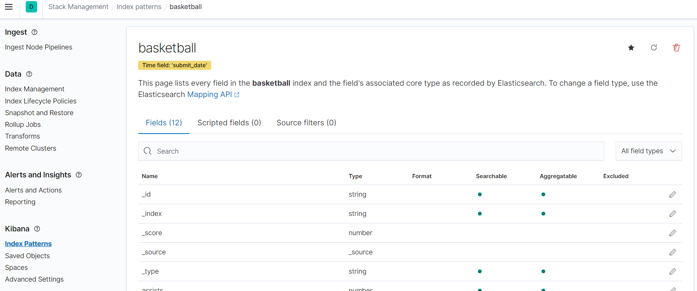

# 04. Kibana

### 실습환경
- Windows 10
- Elasticsearch 7.10.2
- Kibana 7.10.2
- Git Bash

## Kibana 설치
Kibana는 아래 링크에서 다운로드 받아 설치하면 된다.

👉 [Kibana 설치 링크](https://www.elastic.co/kr/downloads/kibana)

Windows의 경우는 다음과 같은 과정으로 설치할 수 있다.

****Windows zip 파일 다운로드 → 압축 풀기 → `config` 폴더로 이동 → `kibana.yml` 아래와 같이 수정 → `bin` 폴더로 이동 → `kibana.bat` 실행**

`kibana.yaml`은 아래와 같이 `server.port`, `server.host`, `elasticsearch.hosts` 에 대한 주석만 풀어주면 된다.

```yaml
# Kibana is served by a back end server. This setting specifies the port to use.
server.port: 5601

# Specifies the address to which the Kibana server will bind. IP addresses and host names are both valid values.
# The default is 'localhost', which usually means remote machines will not be able to connect.
# To allow connections from remote users, set this parameter to a non-loopback address.
server.host: "localhost"

# ... 중간 내용 생략

# The URLs of the Elasticsearch instances to use for all your queries.
elasticsearch.hosts: ["http://localhost:9200"]

```

실행이 완료되면 `http://localhost:5601`로 접속해보자. Kibana가 정상적으로 실행되었다면 아래와 같은 화면을 볼 수 있다. **반드시 Kibana는 Elasticsearch를 실행한 다음 실행해야 한다.**


해당 페이지에서 `Add data`를 누르면 Kibana에 데이터를 추가하는 페이지로 이동하고, `Explore on my own`을 누르면 Home으로 이동한다.


## Kibana Management

### 실습 전 준비 사항

이번 실습에서는 새로운 `basketball` 인덱스를 활용할 예정입니다. 위 실습을 진행했다면, 기존의 `basketball` 인덱스를 제거한 다음 진행하길 바랍니다.

```bash
curl -X DELETE http://localhost:9200/basketball
```

### 실습 데이터 구성하기

Document를 저장할 `basketball` 인덱스를 먼저 생성합니다.

```bash
curl -X PUT http://localhost:9200/basketball
```

그 다음 [basketball_mapping.json](https://github.com/Kim-SuBin/TIL/blob/main/practice/analyze-data-with-elk-stack/basketball_mapping.json) 파일을 생성한 인덱스에 Mapping 합니다.


```bash
curl -X PUT 'http://localhost:9200/basketball/record/_mapping?include_type_name=true&pretty' -d @basketball_mapping.json -H 'Content-Type: application/json'
```

마지막으로 [bulk_basketball.json](https://github.com/Kim-SuBin/TIL/blob/main/practice/analyze-data-with-elk-stack/bulk_basketball.json)을 Bulk 합니다.

```bash
curl -X POST http://localhost:9200/_bulk?pretty --data-binary @bulk_basketball.json -H 'Content-Type: application/json'
```

참고로 `bulk_basketball.json`을 통해 실습을 진행하실 예정이라면, `submit_date`를 가까운 시일로 수정하시길 바랍니다.

### Index Pattern 생성하기
Kibana 화면 좌측 상단의 햄버거바를 누르면 아래와 같이 메뉴가 보이며, 이 중 `Management > Stack Management`를 클릭한다.


이동한 페이지에서 `Index Patterns`를 클릭하면 아래와 같은 페이지를 볼 수 있다.


인덱스 패턴을 생성하기 위해 `Create index pattern`을 클릭해보자. 그러면 그동안 실습을 진행하면서 생성된 인덱스가 존재할텐데, 여기서 `basketball`을 `Index pattern name`으로 입력한다.


`Next step` 버튼을 눌러 이동한 다음 페이지에서 `Time field`를 `submit_date`로 설정하고 `Create index pattern`을 클릭한다.


그러면 다음과 같이 basketball 인덱스가 Kibana에서 표시되는 것을 확인할 수 있다.


## Kibana Discover

이제 메뉴에서 `Kibana > Discover`로 이동해보자. 그러면 아래와 같이 아무것도 표시되지 않은 것을 알 수 있다.


그 이유는 `bulk_basketball.json`로 Bulk하여 추가한 데이터의 날짜가 최근 1시간이 아니기 때문입니다. (실습 진행 날짜  : 2023년 04월 14일)

다음과 같이 날짜 설정을 열어서 `Last 90 Days` 로 변경합니다.


그러면 아래와 같이 차트가 표시되는 것을 확인할 수 있습니다.


### 필터 설정

`+Add filter` 를 눌러 다음과 같이 필터에 대해 설정할 수 있습니다.


필터를 설정하고 `Save` 를 클릭하면, 다음과 같이 설정한대로 필터된 결과가 표출됩니다.


### 필드 선택 및 정렬

이번에는 특정 필드에 대해서만 보는 방법을 살펴보겠습니다. 위의 내용과 같이 대시보드 내에 필터 설정을 했다면 `x` 를 눌러 필터를 없앤 다음 진행해주세요!

`Available fields` 영역에 있는 필드 중 선택하려는 필드에 마우스를 올리면 `+` 모양이 표출되는 것을 확인할 수 있습니다.


이 `+` 버튼을 클릭하면 필드가 `Selected fileds` 영역으로 이동되고, 화면에 선택한 필드에 대해서면 표출되는 것을 확인할 수 있습니다.


여기서 정렬을 하는 방법을 살펴보겠습니다. 아래와 같이 Time 옆의 삼각형 위에 마우스를 올려보면 `Sort ~` 라는 문구를 확인할 수 있습니다. 이 버튼을 클릭해 정렬을 오름차순/내림차순으로 설정하거나 아예 정렬을 해제할 수 있습니다. 현재는 `Time`을 기준으로 내림차순 정렬이 되어 있습니다.


`points` 를 먼저 내림차순으로 정렬한 다음, `Time` 에 대한 정렬을 해지하도록 하겠습니다. 그러면 아래와 같이 화면에 표출됩니다.


참고로,**Time에 대한 정렬은 default로 설정** 되어 있기 때문에 정렬 설정을 없애려면 다른 필드에 정렬을 추가해야 합니다.

## Kibana Visualize

이번에는 `Kibana Visualize`에 대해 알아보겠습니다. `Visualize`는 Elasticsearch에 저장된 데이터를 다양한 방식으로 보여주는 역할을 합니다. 

먼저, 메뉴에서 다음과 같이 `Visualize`를 선택해줍니다.


그러면 현재는 만들어 둔 `Visualize`가 없기 때문에 다음과 같은 화면이 표출됩니다.


여기서 `Create new visualization`을 클릭하면 아래와 같이 여러 Visualization Type이 표출됩니다. 여기서 원하는 타입을 선택하면 됩니다.


### Vertical Bar

여러 타입 중 `Vertical Bar`를 선택하면 다음과 같이 `source` 선택 화면이 뜹니다. 여기서 현재 실습 진행 중인 `basketball`을 선택합니다.


그러면 아래와 같이 기본 화면이 뜹니다.


각 선수별로 평균 점수가 얼마인지 확인하려면, Y축과 X축 설정을 변경하면 됩니다. 먼저 아래와 같이 Metrics에서 Y축 설정을 변경해줍니다.


그 다음 X축 설정을 아래와 같이 변경해주고 `Update`를 눌러줍니다.


그러면 아래와 같이 설정이 반영되어 그래프가 변경된 것을 확인할 수 있습니다.


우측 상단의 `Save`를 선택하면 생성한 그래프를 저장할 수 있습니다.

### Pie

이번에는 `Pie`를 생성해보도록 하겠습니다. `Vesualization Type` 중 `Pie`를 선택하면 다음과 같은 기본 화면을 볼 수 있습니다.


팀별 점수를 `Pie`로 확인하는 방법을 알아보겠습니다. 먼저 Metrics를 다음과 같이 설정해줍니다.


그 다음 아래와 같이 Buckets의 Field를 team으로 설정하고, `Update`를 눌러줍니다.


그러면 다음과 같이 `Pie` 차트가 변경된 것을 확인할 수 있습니다.


### Maps

이번에는 `Maps`를 생성해보도록 하겠습니다. 여기서는 `classes` 인덱스와 데이터를 활용할 예정입니다. 존재하지 않다면 다음 과정을 진행해주세요.

먼저 인덱스를 생성합니다.

``` bash
curl -X PUT http://localhost:9200/classes
```

그 다음, `classesRating_mapping.json`을 인덱스에 Mapping 합니다.

```bash
curl -X PUT 'http://localhost:9200/classes/class/_mapping?include_type_name=true&pretty' -H 'Content-Type:application/json' -d @classesRating_mapping.json
```

그 후, 데이터를 Bulk 합니다.

``` bash
curl -X POST http://localhost:9200/_bulk?pretty  --data-binary @classes.json -H 'Content-Type:application/json'
```

이제 데이터 준비가 완료되었으니, `Kibana Management`의 `Index Pattern`에서 `classes`에 대한 패턴을 생성합니다. 생성 방식은 위에서 진행한 `basketball`과 동일합니다.

모든 준비가 끝났으니 이제 `Maps`을 생성해보도록 하겠습니다. `Maps`를 선택하면 `source` 설정 화면이 나오지 않고 바로 지도가 나옵니다.


`Add layer`를 클릭하여 표출하려는 데이터를 설정해봅시다. 여러 데이터 설정 중 `Elasticsearch`에서 `Documents`를 선택합니다.


그 다음, `school_location` 필드를 선택하고 `Add layer`를 클릭합니다.


만약 지도에 아무것도 표시되지 않는다면, 데이터의 `submit_date`를 확인하고 날짜 설정을 변경해주면 됩니다. 여기서는 데이터가 2020년이어서 `Last 3 years`로 변경했습니다.


## Kibana Dashboard

이번에는 `Kibana Dashboard`를 생성하는 방법을 확인해보겠습니다. 먼저, 메뉴에서 `Dashbard`를 선택해주세요. 


그 다음 아래와 같이 표출되는 화면에서 `Create new dashboard`를 클릭합니다.


그러면 다음과 같이 화면이 표시되는데, 이전에 진행한 `Kibana Visualize` 실습에서 만든 차트와 같이 **이미 생성한 차트**를 추가하려면 `Add an existing`을 클릭합니다.


그러면 이전 실습에서 저장한 차트들이 존재하는 것을 확인할 수 있습니다.


원하는대로 선택하여 대시보드를 구성하면 됩니다. 저는 아래와 같이 구성해보았습니다. 각 차트 사이즈는 차트별 우측 하단에 있는 `⨼`을 클릭한 상태로 드래그하면 변경할 수 있습니다.


> 본 게시글은 [ELK 스택 (ElasticSearch, Logstash, Kibana) 으로 데이터 분석](https://www.inflearn.com/course/elk-%EC%8A%A4%ED%83%9D-%EB%8D%B0%EC%9D%B4%ED%84%B0-%EB%B6%84%EC%84%9D/dashboard) 강의를 참고하여 작성되었습니다.
>
>
> 상세한 내용이 궁금하시다면 강의 수강을 추천해 드립니다.
>
