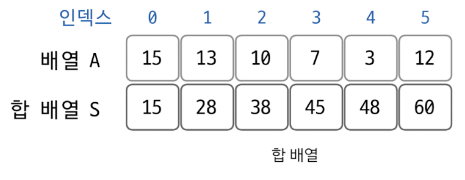

# 03. 자료구조

## 3.1. 배열과 리스트

### 배열

배열은 **메모리의 연속 공간에 값이 채워져 있는 형태의 자료구조** 입니다.


배열의 특징은 다음과 같습니다.

1. 인덱스를 사용하여 값에 바로 접근할 수 있다.
2. 새로운 값을 삽입하거나 특정 인덱스에 있는 값을 삭제하기 어렵다. 값을 삽입하거나 삭제하려면, 해당 인덱스 주변에 있는 값을 이동시키는 과정이 필요하다.
3. 배열의 크기는 선언할 때 지정할 수 있으며, 한 번 선언하면 크기를 늘리거나 줄일 수 없다.
4. 구조가 간단하므로 코딩 테스트에서 많이 사용한다.

### 리스트

리스트는  **값과 포인터를 묶은 노드라는 것을 포인터로 연결한 자료구조** 입니다.


리스트의 특징은 다음과 같습니다.

1. 인덱스가 없으므로 값에 접근하려면 Head 포인터부터 순서대로 접근해야 한다. ➡️ 값에 접근하는 속도가 느리다.
2. 포인터로 연결되어 있으므로 데이터를 삽입하거나 삭제하는 연산 속도가 빠르다.
3. 선언할 때 크기를 별도로 저장하지 않아도 된다. ➡️ 리스트 크기는 정해져 있지 않으며, 크기가 변하기 쉬운 데이터를 다룰 때 적절하다.

## 3.2. 구간 합

### 구간 합의 핵심 이론
구간 합 알고리즘을 이용하려면 먼저 합 배열을 구해야 합니다.
배열 A가 있을 때, 합 배열 S는 다음과 같이 정의합니다.



```markdown
S[i] = A[0] + A[1] + A[2] + ... + A[i - 1] + A[i] // A[0]부터 A[i]까지의 합
```

A[i]부터 A[j]까지의 배열 합을 합 배열 없이 구하는 경우, 최악의 경우는 O(N)입니다.
이런 경우, 합 배열을 사용하면 O(1) 안에 답을 구할 수 있습니다.

합 배열은 다음과 같은 간단한 공식으로 만들 수 있습니다.

```markdown
S[i] = S[i - 1] + A[i]
```

이렇게 구현된 합 배열을 이용하여 구간 합을 다음과 같은 공식으로 구할 수 있습니다.

```markdown
S[j] - S[i - 1] // i 에서 j까지의 구간합
```

예를 들어, 배열 A의 A[2]부터 A[5]의 구간 합을 합 배열을 통해 구하고자 한다면, S[5] - S[1]을 하면 됩니다.


```markdown
S[5] - S[1] = A[2] + A[3] + A[4] + A[5]
```

## 3.3. 투 포인터

투 포인터는 2개의 포인터로 알고리즘의 시간 복잡도를 최적화합니다.
책에 나오는 여러 문제 중 하나인 [BOJ 1940. 주몽](https://www.acmicpc.net/problem/1940) 문제를 예로 들어 알고리즘에 대해 살펴보도록 하겠습니다.

### 문제 분석하기
최대 15,000개의 재료 N이 주어지며, 여기서 두 재료의 고유한 번호를 합쳐서 M이 되어야합니다.
여기서 N의 크기로 보아 O(nlogn) 시간 복잡도 알고리즘을 사용하여도 문제가 없어보이며,
정렬 알고리즘의 시간 복잡도는 일반적으로 O(nlogn)이므로 정렬을 사용해도 괜찮습니다.
입력 받은 N개의 재룟값을 정렬한 다음 양쪽 끝의 위치를 투 포인터로 지정하여 문제를 풀어나가도록 하겠습니다.

### 풀이 살펴보기
1. 재료 데이터를 배열 A에 저장한 후 오름차순 정렬을 합니다.
2. 투 포인터 right, left를 양쪽 끝에 위치시킨 후, 문제에 맞게 포인터 이동 원칙을 세워 탐색을 수행합니다.
   - A[i] + A[j] < M : left++;
   - A[i] + A[j] > M : right--;
   - A[i] + A[j] == M : left++; right--; count++;
   - A[i]
3. 2단계를 right와 left가 만날 때까지 반복합니다.
   
    주어진 재료가 [1, 2, 3, 4, 5, 7]이고 M이 9일 때, 아래와 같은 과정이 반복 수행 됩니다.

    

4. 반복문이 끝나면 count를 출력합니다.

### 코드 작성하기
```java
public class Main {
    public static void main(String[] args) {
        Scanner sc = new Scanner(System.in);

        int material = sc.nextInt();
        int armor = sc.nextInt();
        int[] materials = new int[material];

        for (int i = 0; i < material; i++) {
            materials[i] = sc.nextInt();
        }
        
         // 풀이 호출하여 출력
        System.out.println(solution(material, armor, materials));
    }

    
    // 실제 풀이 부분
    private static int solution(int material, int armor, int[] materials) {
        int count = 0;
        int left = 0;
        int right = material - 1;

        Arrays.sort(materials);

        while (left < right) {
            int sum = materials[left] + materials[right];
            if (sum < armor) {
                left++;
            } else if (sum > armor) {
                right--;
            } else (sum == armor) {
                left++;
                right--;
                count++;
            }
        }


        return count;
    }
}
```

## 3.4. 슬라이딩 윈도우
슬라이딩 윈도우 알고리즘은 2개의 포인터로 범위를 지정한 다음, **범위를 유지한 채로 이동**하여 문제를 해결합니다.
투 포인터 알고리즘과 매우 비슷하며, 이번에도 책에 나오는 여러 문제 중 하나인 []()를 예로 들어 알고리즘에 대해 살펴보도록 하겠습니다.

### 문제 분석하기

### 풀이 살펴보기

### 코드 작성하기

## 3.5. 스택과 큐


> 본 게시글은 [Do it! 알고리즘 코딩 테스트 - 자바편](https://product.kyobobook.co.kr/detail/S000001818060) 도서를 참고하여 작성되었습니다.
>
> 여기서는 책에 나온 알고리즘 모든 문제 각각에 대해 자세히 다루지 않습니다.
>
> 개념에 대한 상세한 내용과 알고리즘 문제 및 상세한 풀이가 궁금하시다면 책을 읽어보시길 추천드립니다.