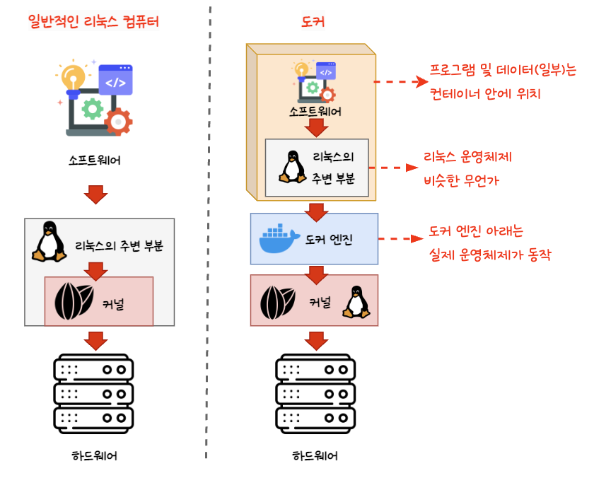
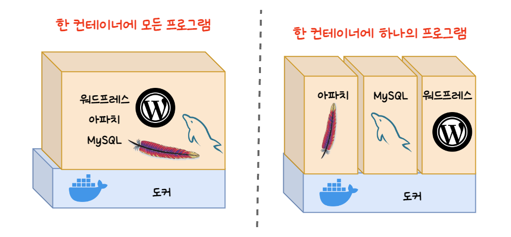
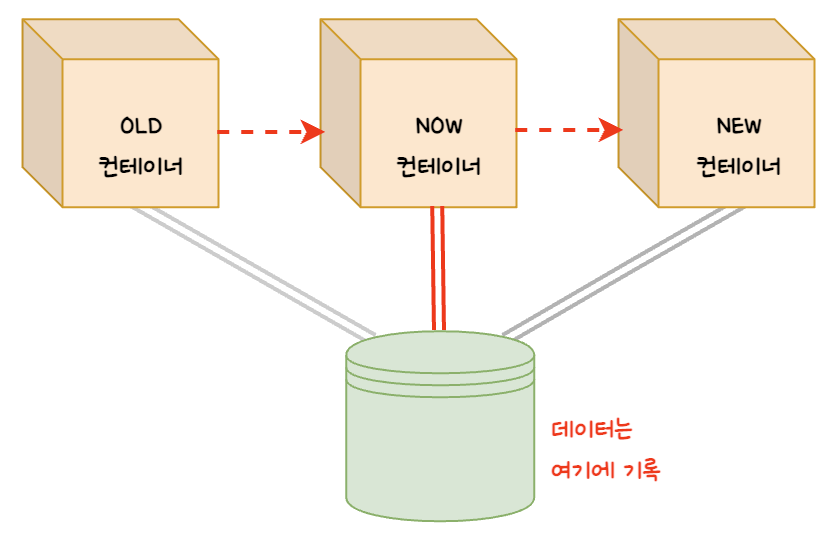
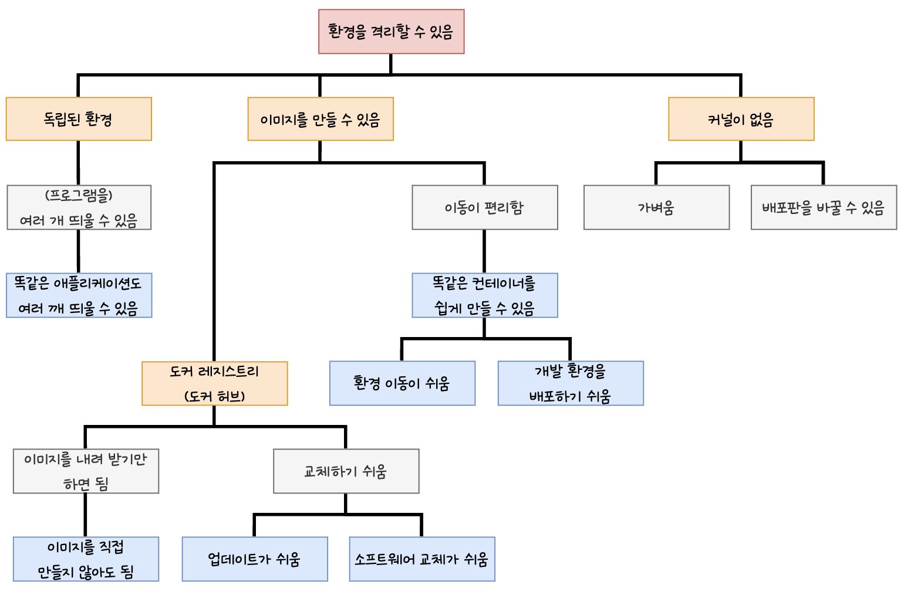

# 2. 도커의 동작 원리

## 1. 도커의 동작 원리

- 운영체제 위에 도커 엔진이 동작하고 그 위에서 컨테이너가 동작한다.
    - 운영체제는 소프트웨어나 프로그램의 명령을 하드웨어에 전달하는 역할을 한다
    - 운영체제는 커널과 그 외 주변 부분으로 구성된다.
- 모든 컨테이너에는 **리눅스 운영체제 비슷한 무언가**가 들어 있다.
    - 컨테이너가 완전히 분리되어 있어 밑바탕이 되는 리눅스 운영체제의 주변 부분은 컨테이너 속 프로그램의 명령을 전달받을 수 없다.

      따라서 컨테이너 속 ( 리눅스 운영체제 비슷한 무언가인 ) 운영체제 주변 부분을 통해 프로그램의 명령을 전달받고 이를 밑바탕이 되는 커널로 전달하는 구조로 되어 있다.

- 리눅스 운영체제의 주변 부분만 컨테이너에 들어가 있고 커널은 밑바탕에 있는 것을 빌려 쓰는 형태이기 때문에 도커는 가볍다.
    - 도커는 리눅스 컴퓨터에너 독립된 격리 환경을 만드는 것이며, 리눅스에서만 동작하고, 컨테이너에서 동작할 프로그램도 리눅스용 프로그램이다.

## 2. 도커 허브와 이미지, 그리고 컨테이너

### 이미지와 컨테이너

- 이미지는 컨테이너를 만드는 데 사용되며, 컨테이너를 통해 이미지를 만들 수도 있다.
- 이미지 하나로 동일한 컨테이너를 여러 개 생성할 수 있다.
- 컨테이너로부터 만든 이미지를 이용하면 다른 환경에서 원래의 컨테이너를 복원할 수 있다.

### 도커 허브

- 도커 허브는 공식적으로 운영되는 도커 레지스트리(도커 이미지를 배포하는 서비스)의 이름이다.
    - 공개된 컨테이너 이미지가 모여있는 곳이다.
- 도커 허브는 운영체제(비슷한 것)만 들어있는 이미지부터 여러 소프트웨어가 함께 포함된 이미지까지 다양하게 제공된다.

### 안전한 컨테이너 이미지 고르는 법

1. 공식 이미지를 사용한다.
2. 커스텀 이미지를 직접 만들어 사용한다.

### 다양한 형태로 조합이 가능한 컨테이너

- 도커를 사용할 때의 원칙 중 하나로, **“한 컨테이너에 한 프로그램”**이라는 것이 있다.
    - 하나의 프로그램만 담긴 컨테이너를 사용하면, 보안 및 유지 관리 측면에서 유리하기 때문에 많이 쓰이는 정책이다.
- 그렇지만 하나의 컨테이너에 여러 프로그램도 넣을 수도 있다.

## 3. 도커 컨테이너의 생애 주기와 데이터 저장

### 도커 컨테이너의 생애 주기

- 컨테이너는 쓰고 버리는 일회용품 같은 것이다
    - 하나의 컨테이너를 계속 업데이트 하기 보다는, 새로운 버전이 나오면 새로운 컨테이너로 변경하고 기존의 컨테이너는 제거한다.
- 컨테이너를 만들고, 실행하고, 종료하고 폐기하는 일련의 과정을 **컨테이너의 생명주기**라고 부른다.

### 데이터 저장

- 컨테이너를 폐기하면 컨테이너 내에 저장된 파일은 사라진다.

  이런 일을 방지하기 위해 보통 **도커가 설치된 물리적 서버(호스트)의 디스크를 마운트**해 데이터를 저장한다.

    - 마운트 : 디스크를 연결해 데이터를 기록할 수 있도록 한 상태
- 데이터를 외부에 저장하면 다른 컨테이너와 데이터를 공유할 수 있어 매우 편리하다.

## 4. 도커의 장점과 단점

### 도커의 구조와 성질

- 핵심이 되는 성질은 “환경을 격리할 수 있다”는 점
    1. 독립된 환경 제공
    2. 이미지 생성 가능
    3. 컨테이너에 커널을 포함시킬 필요 X

### 장점

1. 한 대의 물리 서버에 여러 대의 서버를 띄울 수 있다.
2. 서버 관리가 용이하다.
3. 명령어만 익히면 되기 때문에 서버 고수가 아니더라도 다루기 쉽다.

### 단점

1. 리눅스용 소프트웨어만 지원한다.
2. 물리 서버 한 대에 여러 대의 서버를 띄우는 형태이기 때문에 호스트 서버에 문제가 생기면 모든 컨테이너에 영향을 미친다.
3. 컨테이너를 하나 밖에 사용하지 않을 때 도커 엔진이 단순한 오버헤드에 지나지 않는다.

### 도커의 주 용도

1. 팀원 모두에게 동일한 개발 환경 제공
2. 격리된 환경을 이용해 새로운 버전 테스트
3. 동일 서버가 여러 대 필요한 경우 활용

> 본 게시글은 [그림과 실습으로 배우는 도커 & 쿠버네티스](https://product.kyobobook.co.kr/detail/S000001766500) 도서를 참고하여 작성되었습니다.
> 상세한 내용이 궁금하시다면 책을 읽어보실 것을 추천해 드립니다.