# 3. 도커를 사용해보자

## 1. 도커를 사용하려면

### 도커 설치 환경

- 도커는 기본적으로 리눅스 용이지만, 윈도우와 macOS에서도 사용할 수 있다.
- 도커를 사용하려면 도커 엔진이라는 소프트웨어를 설치해야 한다.
    - 도커 공식 홈페이지 가기 👉 [https://www.docker.com/](https://www.docker.com/)
    - 도커 구독료

      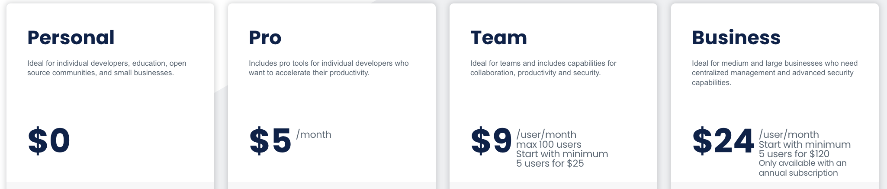

- 설치 환경에 따라 설치하는 방법이 다르지만, 명령어는 공통적으로 사용한다.

### 도커 환경을 구축하는 세 가지 방법

1. 리눅스 컴퓨터에서 도커 사용하기
2. 가상 머신이나 렌탈 환경에서 도커를 설치하고 윈도우나 macOS를 통해 사용하기
3. 윈도우용/macOS용 도커 사용하기

**여기서는 3번 방법에 대해서 간략하게만 설명하려 한다. 더 자세한 내용이나 다른 방법은 책에 정리되어 있으니 궁금하면 책을 참고하도록 하자 😊😊**

### 윈도우용/macOS용 도커 사용하기

- 윈도우와 macOS에서는 리눅스 운영체제가 들어있는 패키지를 사용하며, 책에서는 이 패키지를 합쳐 **도커 데스크톱**이라고 부른다.

  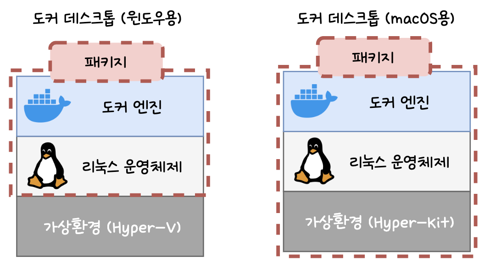

- 윈도우나 macOS는 사용자에게 보이지 않는 **가상의 리눅스 환경**을 만들고 이 환경에서 도커 엔진을 구동하는 구조이다.
- 도커 데스크톱을 사용하면, 사용자가 **가상화 환경이나 리눅스 운영체제에 신경쓰지 않고** 도커를 사용할 수 있다.
- 도커 데스트톱 내의 리눅스 운영체제는 **도커가 전용으로 사용하는 숨겨진 운영체제**이며, 도커 데스크톱 삭제 시 해당 리눅스 운영체제도 함께 삭제된다.
- **윈도우용/macOS용 도커 데스크톱을 사용하기 위해 필요한 것**
    - 사용 조건을 만족하는 윈도우 또는 macOS
- **주의할 점**
    - 평소 가상화 소프트웨어를 사용했다면 윈도우와 가상화 소프트웨어를 모두 최신 버전으로 업데이트 해야 한다.

### 윈도우 버전의 사용 조건

- 운영체제 요구 사항
    - 윈도우 10 64비트 버전 : 프로, 엔터프라이즈, 에듀케이션 중 Build 16229 이후 버전
    - 윈도우 10 64비트 버전 : 홈 에디션일 경우 WSL2를 사용 가능 (2004 버전 이후)
    - Hyper-V 및 Containers 활성화
- 하드웨어 요구사항
    - CPU : SLAT 기능을 지원하는 64비트 프로세서
    - 메모리 : 4GB 이상
    - BIOS에서 virtualization 활성화

### macOS 버전의 사용 조건

- 2010년  이후 발매된 모델
- macOS 10.13 이후 버전
- 메모리 : 4GB 이상

### 리눅스 버전의 사용 조건

- CentOS 7, 우분투 16.04, 데비안 9, 페도라 30 이후 버전
- 리눅스 커널 : 3.10 이후 버전
- iptables : 1.4 이후 버전
- Git : 1.7 이후 버전
- XZ Utils : 4.9 이후 버전
- procp와 cgroups 계층 준수

## 2. 도커 설치

### 도커 설치

여기서는 macOS(M1)를 기준으로 설치 방법을 제공합니다. 다른 환경에서의 설치 방법이 궁금하시다면 책을 참고해주세요.

- 윈도우나 macOS는 일반적인 소프트웨어 설치처럼 **대화창의 지시에 따라 마우스 클릭**을 하면 된다.
- 리눅스는 **명령을 직접 키보드로 입력**하여 설치하면 된다.
- 먼저 [docker docs](https://docs.docker.com/desktop/install/mac-install/)에 접속하여 도커 데스크톱을 다운로드 받는다.

  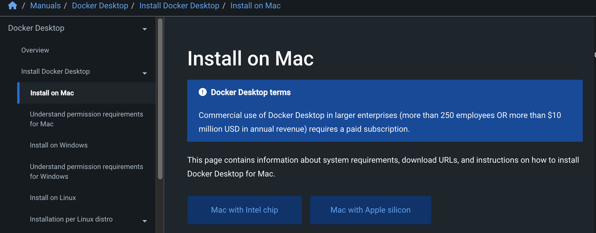

- 그 다음 app을 Applications로 옮긴다.

  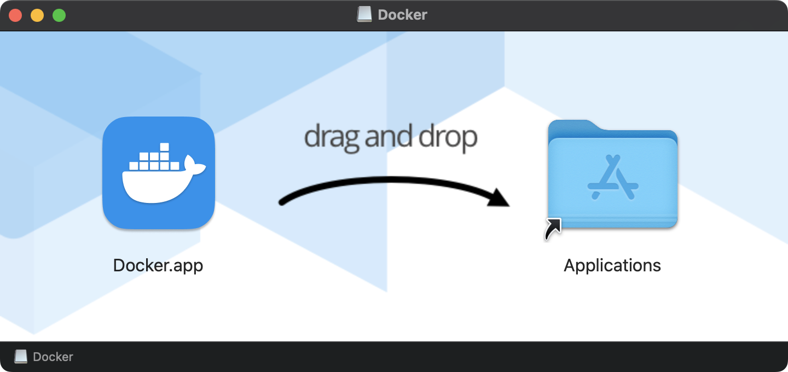

  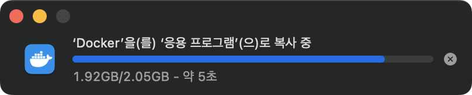

- 그 다음 Launchpad 를 열면 아래와 같이 도커 데스크톱이 설치된 것을 확인할 수 있다.

  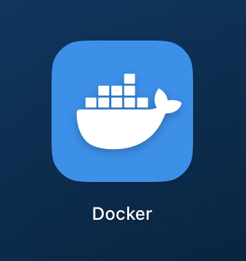

- Launchpad의 도커 데스크톱을 클릭하면, 아래와 같이 실행 여부를 묻는 대화창이 나타난다. 열기를 눌러주면 도커 데스크톱이 실행된다.

  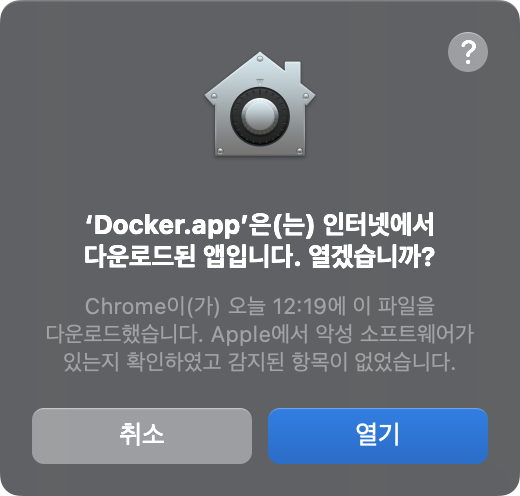

- 그 다음 구독료에 대한 정책을 알려준다. 개인적으로 사용하시는 사람은 personal use 이기 때문에 free이므로, Accpet를 눌러주면 된다.

  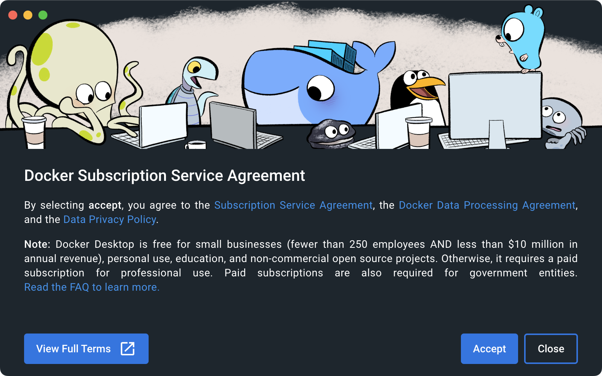

  Accpet를 누르면, 사용자명과 패스워드 입력창이 뜬다. 현재 사용 중은 mac의 사용자명과 패스워드를 입력하면 된다.

- 그러면 아래와 같이 tutorial 에 대해 시작할 것인지 여부가 뜨는데, 여기서는 Skip 했다. 궁금하면 직접 확인해보도록 하자.

  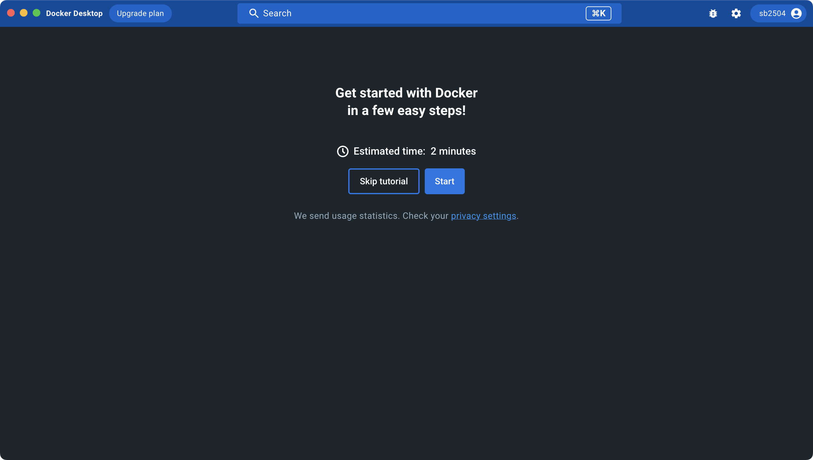

### 도커 데스크톱 화면 확인

책에서는 windows를 기준으로 설명하지만 여기서는 macOS 도커 데스크톱을 기준으로 설명하겠다.

- **Containers** 탭 화면을 클릭하면, 실행 중인 컨테이너 목록을 볼 수 있다.

  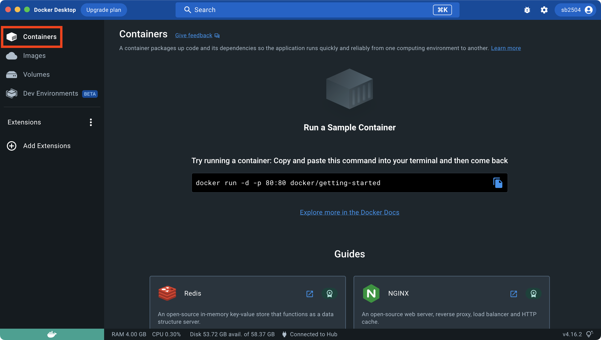

- **Images** 탭을 클릭하면, 내려받은 도커 이미지의 목록을 볼 수 있다.

  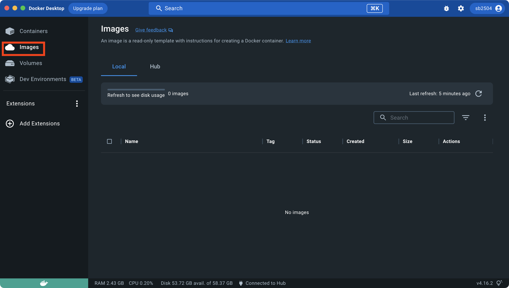

- **화면 아래**의 색상이나 마우스를 올려 도커가 실행 중인지 여부를 확인할 수 있다. 실행 중인 경우 초록색이 뜬다.

  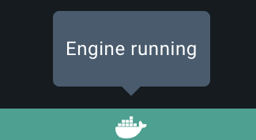

- **Setting**를 클릭하면 Settings 화면이 나타나며, 여기서 도커의 여러 설정을 확인하거나 변경할 수 있다.

  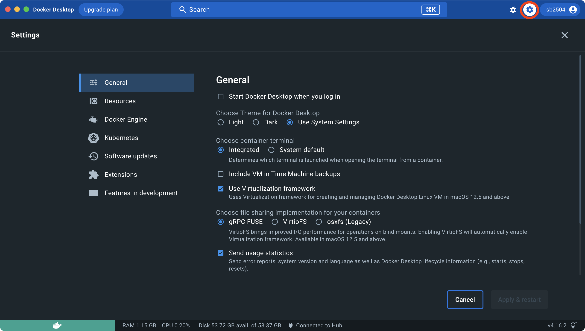

## 3. 도커의 조작 방법과 명령 프롬프트 및 터미널 실행

- 명령 프롬프트와 터미널은 모두 기본 탑재된 소프트웨어 이므로 윈도우는 시작메뉴, macOS는 런치패드에서 실행할 수 있다.
- 명령 프롬프트나 터미널을 종료해도 도커는 종료되지 않는다.

> 본 게시글은 [그림과 실습으로 배우는 도커 & 쿠버네티스](https://product.kyobobook.co.kr/detail/S000001766500) 도서를 참고하여 작성되었습니다.
> 상세한 내용이 궁금하시다면 책을 읽어보실 것을 추천해 드립니다.