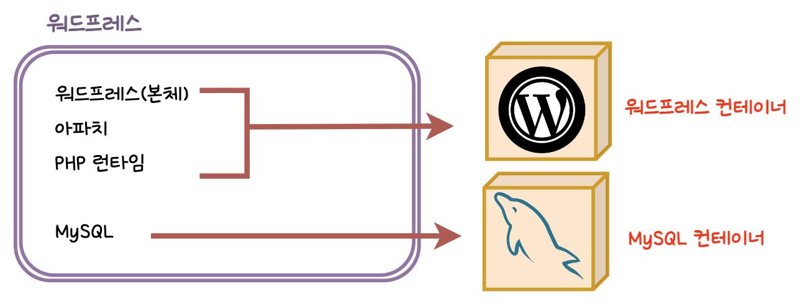

# 5.여러 개의 컨테이너를 연동해 실행해보자

## 1. 워드프레스 구축

### 워드프레스 사이트 구성 및 구축

- 워드프레스는 웹 사이트를 만들기 위한 소프트웨어
- 워드프레스는 MySQL과 MariaDB를 지원함 ⇒ 여기서는 MySQL 사용 예정
- 워드프레스 공식 이미지는 워드프레스 프로그램 본체와 아파치, PHP 런타임을 함께 포함하고 있음
- 워드프레스를 사용하기 위해서는 워드프레스 공식 이미지가 포함된 컨테이너와 MySQL 컨테이너가 필요함



### 도커 네트워크 생성/삭제

- 도커 네트워크를 생성하는 커맨드

    ```bash
    docker network create 네트워크_이름
    ```

- 도커 네트워크를 삭제하는 커맨드

    ```bash
    docker network rm 네트워크_이름
    ```

- 그 외 도커 네트워크 관련 커맨드

| 커맨드        | 내용                             | 생략 가능 여부 | 주요 옵션      |
|------------|--------------------------------|----------|------------|
| connect    | 네트워크에 컨테이너 새로 접속               | X        | 거의 사용하지 않음 |
| disconnect | 네트워크에서 컨테이너 접속을 끊음             | X        | 거의 사용하지 않음 |
| create     | 네트워크 생성                        | X        | 거의 사용하지 않음 |
| inspect    | 네트워크 상세 정보 확인                  | X        | 거의 사용하지 않음 |
| ls         | 네트워크 목록 확인                     | X        | 거의 사용하지 않음 |
| prune      | 현재 아무 컨테이너도 접속하지 않은 네트워크 모두 삭제 | X        | 거의 사용하지 않음 |
| rm         | 지정한 네트워크 삭제                    | X        | 거의 사용하지 않음 |

### MySQL 컨테이너 실행 시 필요한 옵션과 인자

- 자주 사용하는 커맨드 예

    ```bash
    docker run --name 컨테이너_이름 -dit --net=네트워크_이름 -e MYSQL_ROOT_PASSWORD=MySQL_루트_패스워드 -e MYSQL_DATABASE=데이터베이스_이름 -e MYSQL_USER=MySQL_사용자이름 -e MYSQL_PASSWORD=MySQL_패스워드 mysql --character-set-server=문자_인코딩 --collation-server=정렬_순서 --default-authentication-plugin=인증_방식
    ```

- 옵션

| 항목              | 옵션                     |
|-----------------|------------------------|
| 네트워크 이름         | --net                  |
| MySQL 컨테이너 이름   | --name                 |
| 실행 옵션           | -dit                   |
| MySQL 루트 패스워드   | -e MYSQL_ROOT_PASSWORD |
| MySQL 데이터베이스 이름 | -e MYSQL_DATABASE      |
| MySQL 사용자 이름    | -e MYSQL_USER          |
| MySQL 패스워드      | -e MYSQL_PASSWORD      |
- 사용된 인자

| 항목     | 인자                               | 값                     | 의미                       |
|--------|----------------------------------|-----------------------|--------------------------|
| 문자 인코딩 | --character-set-server=          | utf8mb4               | 문자 인코딩으로 UTF8 사용         |
| 정렬 순서  | --collation-server=              | utf8mb4_unicode_ci    | 정렬 순서로 UTF8 따름           |
| 인증 방식  | --default-authentication-plugin= | mysql_native_password | 인증 방식을 예전 방식(native)로 변경 |

### 워드프레스 컨테이너 실행 시 필요한 옵션과 인자

- 자주 사용하는 커맨드 예

    ```bash
    docker run --name 컨테이너_이름 -dit --net=네트워크_이름 -p 포트_설정 -e WORDPRESS_DB_HOST=데이터베이스_컨테이너_이름 -e WORDPRESS_DB_NAME=데이터베이스_이름 -e WORDPRESS_DB_USER=데이터베이스_사용자_이름 -e WORDPRESS_DB_PASSWORD=데이터페이스_패스워드 wordpress
    ```

- 옵션

| 항목             | 옵션                       |
|----------------|--------------------------|
| 네트워크 이름        | --net                    |
| 워드프레스 컨테이너 이름  | --name                   |
| 실행 옵션          | -dit                     |
| 포트 번호 설정       | -p                       |
| 데이터베이스 컨테이너 이름 | -e WORDPRESS_DB_HOST     |
| 데이터베이스 이름      | -e WORDPRESS_DB_NAME     |
| 데이터베이스 사용자 이름  | -e WORDPRESS_DB_USER     |
| 데이터베이스 패스워드    | -e WORDPRESS_DB_PASSWORD |

이후 내용은 실습과 관련된 내용이므로 생략한다. 자세한 내용이 궁금하다면 책을 참고하기 바란다.

참고로, 리눅스 + 웹 서버 + 프로그래밍 언어 런타임 + 데이터베이스 조합을 많이 쓰며, 워드프레스 구축 과정에서 사용한 명령어는 다른 DB나 NGINX에서도 유사하게 사용된다.

> 본 게시글은 [그림과 실습으로 배우는 도커 & 쿠버네티스](https://product.kyobobook.co.kr/detail/S000001766500) 도서를 참고하여 작성되었습니다.
> 상세한 내용이 궁금하시다면 책을 읽어보실 것을 추천해 드립니다.
>