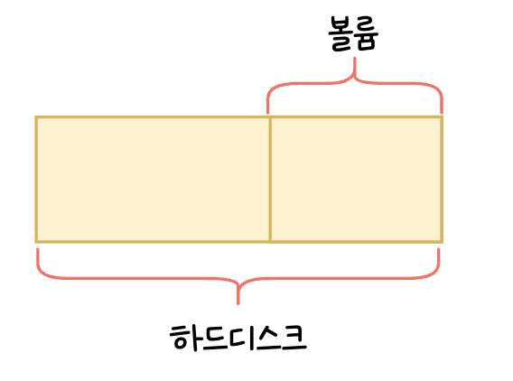
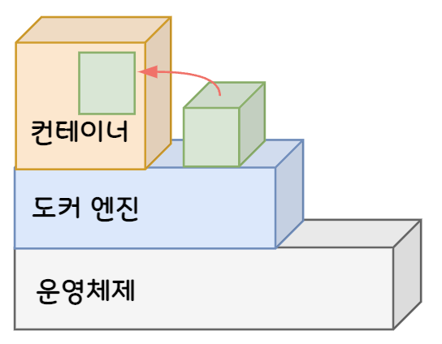
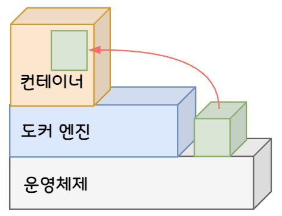
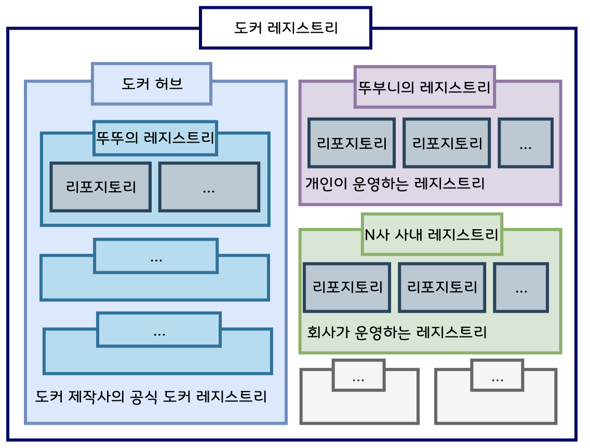

# 6. 실전에 활용 가능한 컨테이너 사용법을 익히자

## 1. 컨테이너와 호스트 간에 파일 복사하기

### 파일 복사

- 컨테이너 → 호스트, 호스트 → 컨테이너로 **양방향 모두 가능**
- 호스트 → 컨테이너 파일 복사 커맨드

    ```bash
    docker cp 호스트_경로 컨테이너_이름:컨테이너_경로
    ```

- 컨테이너 → 호스트 파일 복사 커맨드

    ```bash
    docker cp 컨테이너_이름:컨테이너_경로 호스트_경로
    ```


## 2. 볼륨 마운트

- 볼륨 : 스토리지의 한 영역을 분할한 것

  

- 마운트 : **“연결하다”**라는 의미 그대로 대상을 연결해 운영체제 또는 소프트웨어의 관리하에 두는 일을 의미

### 스토리지 마운트 종류

- 볼륨 마운트
    - 도커 엔진이 관리하는 영역 내에 만들어진 볼륨을 컨테이너에 디스크 형태로 마운트하는 방식

      

    - 이름만으로 관리가 가능하므로 다루기 쉬움
    - 직접 조작하기 어려움
    - 임시 목적의 사용이나 자주 쓰이지 않지만 지우면 안 되는 파일을 두는 목적으로 많이 사용
- 바인드 마운트
    - 도커 엔진에서 관리하지 않는 영역의 기존 디렉터리를 컨테이너에 마운트하는 방식

      

    - 디렉터리 속에 파일을 직접 두거나 열어볼 수 있음 (직접 조작 가능)
    - 자주 사용하는 파일을 두는 데 사용
- 차이점


| 항목      | 볼륨 마운트        | 바인드 마운트          |
|---------|---------------|------------------|
| 스토리지 영역 | 볼륨            | 디렉터리 또는 파일       |
| 물리적 위치  | 도커 엔진의 관리 영역  | 어디든지 가능          |
| 마운트 절차  | 볼륨을 생성한 후 마운트 | 기존 파일 또는 폴더를 마운트 |
| 내용 편집   | 도커 컨테이너를 통해서  | 일반적인 파일과 같이      |
| 백업      | 절차 복잡         | 일반적인 파일과 같이      |

⇒ 파일을 직접 편집해야 할 일이 많다면 바인드 마운트를 사용하고, 그렇지 않다면 볼륨 마운트를 사용하면 된다.


### 스토리지 영역을 마운트하는 커맨드

**스토리지 영역을 만드는 방법**

- 바인드 마운트는 원본이 될 디렉터리나 파일을 만든다. 평소 하듯이 폴더를 만들면 되고, 경로는 어디라도 상관없다.
- 볼륨 마운트는 상위 커맨드를 사용해 먼저 볼륨을 생성한다.

    ```bash
    docker volume create 볼륨_이름
    ```

    - 볼륨을 삭제할 때는 아래 커맨드를 사용한다.

        ```bash
        docker volume rm 볼륨_이름
        ```

    - 주요 하위 커맨드


| 커맨드     | 내용                   | 생략형 | 주요 옵션      |
|---------|----------------------|-----|------------|
| create  | 볼륨 생성                | X   | 거의 사용하지 않음 |
| inspect | 볼륨 상세 정보 출력          | X   | 거의 사용하지 않음 |
| ls      | 볼륨 목록 출력             | X   | 거의 사용하지 않음 |
| prune   | 현재 마운트되지 않은 볼륨 모두 삭제 | X   | 거의 사용하지 않음 |
| rm      | 지정한 볼륨 삭제            | X   | 거의 사용하지 않음 |

**스토리지를 마운트하는 커맨드**

- 바인드 마운트 커맨드

    ```bash
    docker run (생략) -v 스토리지_실제_경로:컨테이너_마운트_경로 (생략)
    ```

- 볼륨 마운트 커맨드

    ```bash
    docker run (생략) -v 볼륨_이름:컨테이너_마운트_경로 (생략)
    ```


### 볼륨 백업

- 바인드 마운트는 디렉터리나 파일 복사를 통해 백업
- 볼륨 마운트의 경우, 볼륨 자체를 복사할 수 없기 때문에 압축해서 저장하는 방식으로 백업

    ```bash
    docker run --rm -v 볼륨명:/moto -v 백업_저장_폴더명:/target busybox tar cvzf /sake/ 백업파일이름.tar.gz -C /source .
    ```

  리눅스 운영체제(busybox) 컨테이너를 실행하는데, 이 컨테이너는 실행 후 바로 삭제 예정이기 때문에 --rm 옵션을 추가했다


## 3. 컨테이너로 이미지 만들기

### commit 커맨드로 컨테이너를 이미지로 변환

- 컨테이너를 준비하고 컨테이너를 커맨드를 통해 이미지로 변환하는 방식
- 기존 컨테이너를 복제하거나 이동할 때 편리
- 커맨드

    ```bash
    docker commit 컨테이너_이름 새로운_이미지_이름
    ```


### Dockerfile 스크립트로 이미지 만들기

- Dockerfile 스크립트에 토대가 될 이미지나 실행할 명령어 등을 기재하고 build 하여 이미지 생성
- 커맨드

    ```bash
    docker build -t 생성할_이미지_이름 재료_폴더_경로
    ```

- Dockerfile 스크립트 예

    ```bash
    FROM 이미지_이름
    COPY 원본_경로 대상_경로
    RUN 리눅스_명령어
    ...
    ```

- 주요 Dockerfile 인스트럭션


| 인스트럭션       | 내용                                                       |
|-------------|----------------------------------------------------------|
| FROM        | 토대가 되는 이미지 지정                                            |
| ADD         | 이미지에 파일이나 폴더 추가                                          |
| COPY        | 이미지에 파일이나 폴더 추가                                          |
| RUN         | 이미지를 빌드할 때 실행할 명령어 지정                                    |
| CMD         | 컨테이너를 실행할 때 실행할 명령어 지정                                   |
| ENTRYPOINT  | 컨테이너를 실행할 때 실행할 명령어 강제 지정                                |
| ONBUILD     | 이 이미지를 기반으로 다른 이미지 빌드 시 실행할 명령어 지정                       |
| EXPOSE      | 이미지가 통신에 사용할 포트 명시적 지정                                   |
| VOLUME      | 퍼시스턴시 데이터를 저장할 경로 명시적 지정                                 |
| ENV         | 환경 변수 정의                                                 |
| WORKDIR     | RUN, CMD, ENTRYPOINT, ADD, COPY에 정의된 명령어를 실행할 작업 디렉터리 지정 |
| SHELL       | 빌드 시 사용할 셸 변경                                            |
| LABEL       | 이름이나 버전, 저작자 정보 설정                                       |
| USER        | RUN, CMD, ENTRYPOINT에 정의된 명령어를 실행하는 사용자 또는 그룹 지정         |
| ARG         | docker build 커맨드를 사용할 때 입력받을 수 있는 인자 선언                  |
| STOPSIGNAL  | docker stop 커맨드를 사용할 때 컨테이너 안에서 실행 중인 프로그램에 전달되는 시그널 변경  |
| HEALTHCHECK | 컨테이너 헬스 체크 방법 커스터마이징                                     |

## 4. 컨테이너 개조

### 컨테이너를 개조하는 방법

1. 6-2절, 6-3절에 배운 파일 복사와 마운트를 이용한 방법
2. 컨테이너에서 리눅스 명령어를 실행하는 방법
    - 컨테이너에서 리눅스 명령어를 실행하려면, 명령을 전달해주는 프로그램인 **shell(셸)**이 있어야 함
    - bash를 실행하는 인자인 `bin/bash` 는 컨테이너 속에서 명령어를 실행하는 커맨드인 `docker exec` 커맨드를 사용하너가 `docker run` 커맨드를 함께 사용
    - bash를 사용한 컨테이너 조작이 끝나면 **다시 docker start 커맨드로 컨테이너를 재시작해야 함**
    - 커맨드

        ```bash
        docker exec (옵션) 컨테이너_이름 /bin/bash
        docker run (옵션) 이미지_이름 /bin/bash
        ```

    - bash를 통해 컨테이너 내부를 조작하는 동안에는 도커 명령어 사용 불가
    - 컨테이너 안에서 bash를 사용해 할 일을 마쳤다면 다시 컨테이너에서 나와야 함 ⇒ `exit` 명령어 사용

### 도커 엔진을 통한 명령과 컨테이너 내부에서 실행하는 명령 차이

- **도커 엔진을 통한 명령**
    - 도커 엔진 자체의 시작 또는 종료, 네트워크나 디스크 설정, 실행 중인 컨테이너 목록 확인 등 **컨테이너 전체에 대한 관리 작업**
- **컨테이너 내부에서 실행하는 명령**
    - 컨테이너 속에 새로운 소프트웨어를 추가하거나, 컨테이너 속 소프트웨어의 실행 및 종료, 설정 변경, 컨테이너 안과 밖의 파일 복사 및 이동, 삭제 작업
- **도커와 컨테이너는 별개의 언어 사용**
    - 도커에서 공식적으로 **“특별한 이유가 없다면 데비안 계열을 기반으로 하는 것이 좋다”**고 명확히 방침을 밝히고 있으므로, 대부분의 컨테이너는 데비안 계열임

## 5. 도커 허브 등록 및 로그인

- 컨테이너를 만들기 위해 내려받는 이미지는 **도커 허브**에 저장된 것
- 직접 만든 이미지도 도커 허브에 올릴 수 있으며, 비공개로 사용하는 도커 허브 같은 장소를 만들 수도 있음

### 도커 허브와 레지스트리

- 도커 허브
    - 도커 제작사에서 운영하는 공식 도커 레지스트리
- 도커 레지스트리
    - 이미지를 배포하는 장소
- 레지스트리
    - 이미지를 배포하는 장소
    - 도커 허브는 레지스트리가 여럿 모인 형태
- 리포지토리
    - 레지스트리를 구성하는 단위



### 태그와 이미지 업로드

- 태그
    - 레지스트리에 업로드를 상정한 이미지 이름에 가까움
    - **“레지스트리_주소/리포지토리_이름:버전”** 형식
        - 도커 허브는 레지스트리_주소 대신 **도커 허브 ID**를 사용
- 이미지에 태그를 부여해 복제하는 커맨드

    ```bash
    docker tag 원래_이미지_이름 레지스트리_주소/리포지토리_이름:버전
    ```

- 이미지를 업로드하는 커맨드
    - **docker push** 커맨드를 통해 이미지 업로드

    ```bash
    docker push 레지스트리_주소/리포지토리_이름:버전
    ```


### 레지스트리를 만드는 방법

- 비공개 레지스트리를 만드는 방법
    - 레지스트리용 컨테이너(registry)가 따로 있으므로 이를 사용하면 됨
    - 레지스트리는 포트 5000번 사용

    ```bash
    docker run -d -p 5000:5000 registry
    ```

- 도커 허브 사용
    - 이메일 주소만 있으면 누그든지 도커 허브에 가입할 수 있으며, 요금 플랜을 선택하면 됨

> 본 게시글은 [그림과 실습으로 배우는 도커 & 쿠버네티스](https://product.kyobobook.co.kr/detail/S000001766500) 도서를 참고하여 작성되었습니다.
> 상세한 내용이 궁금하시다면 책을 읽어보실 것을 추천해 드립니다.