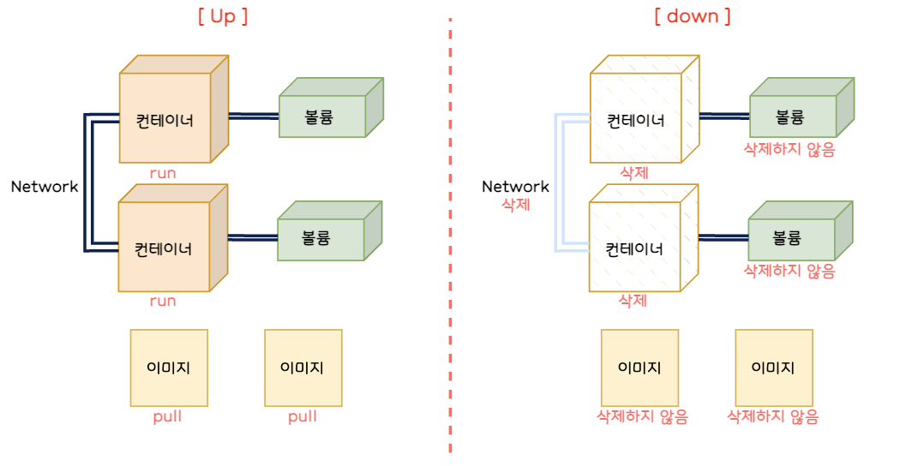

# 7. 도커 컴포즈를 익히자

## 1. 도커 컴포즈란?

- 시스템 구축과 관련된 명령어를 하나의 텍스트 파일(정의 파일)에 기재해 명령어 한 번에 시스템 전체를 실행하고 종료와 폐기까지 한 번에 하도록 도와주는 도구
- YAML 포맷으로 기재
- 정의 파일에는 컨테이너나 볼륨을 “어떠한 설정으로 만들지”에 대해 기재함

### 커맨드



- up 커맨드
    - docker run 커맨드와 비슷
    - 정의 파일에 기재된 내용대로 이미지를 내려받고 컨테이너 생성 및 실행
    - 컨테이너나 볼륨에 대한 정의도 기재할 수 있어 주변 환경을 한꺼번에 생성 가능
- down 커맨드
    - 컨테이너와 네트워크 정지 및 삭제
    - 볼륨과 이미지는 삭제하지 않음
- stop 커맨드
    - 컨테이너와 네트워크 정지 (삭제 X)

### 도커 컴포즈와 Dockerfile 스크립트 차이점

## 2. 도커 컴포즈의 설치 방법

### 도커 컴포즈 설치

- 윈도우나 macOS에서 사용하는 도커 데스크톱은 도커 컴포즈가 함께 설치되기 때문에 따로 설치할 필요가 없음
- 리눅스에서는 도커 컴포즈와 파이썬 3 런타임 및 필요 도구를 설치해야 함

    ```bash
    sudo apt install -y python3 python3-pip
    sudo pip3 install docker-compose
    ```


### 도커 컴포즈 사용법

- 도커 컴포즈를 사용하려면 Dockerfile 스크립트로 이미지를 빌드할 때처럼 호스트 컴퓨터에 폴더를 만들고 이 폴더에 정의 파일을 배치함
- 정의 파일 이름은 미리 정해진 `docker-compose.yml` 이라는 이름을 사용해야 함
- 명령어는 도커 엔진에 전달되기 때문에, 만들어진 컨테이너는 도커 엔진 위에서 동작함
- 정의 파일은 한 폴더에 하나만 존재해야 함
    - 컨테이너 생성에 필요한 이미지 파일이나 HTML 파일도 컴포즈가 사용할 폴더에 함께 둠


## 3. 도커 컴포즈 파일을 작성하는 법

- 정의 파일 (컴포즈 파일)을 그대로 실행하는 역할을 하므로, 컴포즈 파일이 반드시 필요함

### 예제로 살펴보기

- 아파치 컨테이너의 컴포즈 파일 예제

    ```yaml
    version : "3"
    
    services:
    	apachetest:
    		image: httpd
    		ports:
    			8080:80
    		restart: always
    ```

  해당 예제는 아래 명령어를 표현했음

    ```bash
    docker run --name apachetest -d -p 8080:80 httpd
    ```

- 워드프레스 컨테이너의 컴포즈 파일 예제

    ```yaml
    version: "3"
    
    services:
    	wordpresstest:
    		depends_on:
    			- mysqltest
    		image: wordpress
    		networks:
    			- wordpressnet1
    		ports:
    			- 8085:80
    		restart: always
    		environment:
    			WORDPRESS_DB_HOST=mysqlhost
    			WORDPRESS_DB_NAME=wordpressname
    			WORDPRESS_DB_USER=wordpressuser
    			WORDPRESS_DB_PASSWORD=dbpassword
    ```

  해당 예제는 아래 명령어를 표현했음

    ```bash
    docker run --name wordpresstest -dit --net=wordpressnet1 -p 8085:80 -e WORDPRESS_DB_HOST=mysqlhost -e WORDPRESS_DB_NAME=wordpressname -e WORDPRESS_DB_USER=wordpresssuser -e WORDPRESS_DB_PASSWORD=dbpassword wordpress
    ```


⇒ 이처럼 형식만 알면 쉽게 작성 가능함

### 컴포즈 파일(정의 파일) 작성 방법

- 파일 이름
    - -f 옵션을 사용해 파일 이름을 지정하면 다른 이름을 사용해도 되지만, **그렇지 않다면 정해진 이름을 사용해야 함**

| 항목       | 내용                 | 
|----------|--------------------|
| 정의 파일 형식 | YAML 형식            |
 | 파일 이름    | docker-compose.yml |

- 파일 작성 방법
    - 맨 앞에 컴포즈 버전을 적음. 그 뒤로 services, networks, volumes 차례로 기재
        - services는 쉽게 말해 컨테이너에 대한 내용임

        ```yaml
        version: "3" # 버전 기재
        services: # 컨테이너 관련 정보
        networks: # 네트워크 관련 정보
        volumes:  # 볼륨 관련 정보
        ```

    - YAML 형식에서는 공백에 따라 의미가 달라짐

      ⇒ **공백 두 개**로 들여쓰기를 시작했다면, 그 뒤로도 **공백 두 개**씩 들여쓰기 해야 함

    - 이름 뒤에는 반드시 콜론(:)을 붙이며, 콜론 뒤에는 **공백이 하나** 있어야 함
- 파일 작성 요령
    - 첫 줄에 도커 컴포즈 버전 기재
    - 주 항목 services, networks, volumes 아래에 설정 내용 기재
    - 항목 간 상하 관계는 공백을 사용한 들여쓰기로 나타냄
    - 들여쓰기는 같은 수의 배수만큼 공백 사용
    - 이름은 주 항목 아래 들여쓰기 한 다음 기재
    - 컨테이너 설정 내용은 이름 아래 들여쓰기 한 다음 기재
    - 여러 항목을 기재하려면 줄 앞에 “-”를 붙임
    - 이름 뒤에는 콜론(:)을 붙임
    - 콜론 뒤에는 반드시 공백이 와야 함 (바로 줄바꿈 하는 경우 제외)
    - # 뒤의 내용은 주석으로 간주
    - 문자열은 작은따옴표(’) 또는 큰따옴표(”)로 감싸 작성
- 컴포즈 파일의 항목
    - 주항목

| 항목       | 내용      |
|----------|---------|
| services | 컨테이너 정의 |
| networks | 네트워크 정의 |
| volumes  | 볼륨 정의   |

  - 자주 나오는 정의 내용

| 항목          | docker run 커맨드의 해당 옵션 또는 인자 | 내용                  |
|-------------|-----------------------------|---------------------|
| image       | 이미지 인자                      | 사용할 이미지 지정          |
| networks    | --net                       | 접속할 네트워크 지정         |
| volumes     | -v, --mount                 | 스토리지 마운트 설정         |
| ports       | -p                          | 포트 설정               |
| environment | -e                          | 환경변수 설정             |
| depends_on  | 없음                          | 다른 서비스에 대한 의존 관계 정의 |
| restart     | 없음                          | 컨테이너 종료 시 재시작 여부 설정 |

- restart 설정값
             
| 설정값            | 내용                       |
|----------------|--------------------------|
| no             | 재시작하지 않음                 |
| always         | 항상 재시작                   |
| on-failure     | 프로세스가 0 외의 상태로 종료됐다면 재시작 |
| unless-stopped | 종료 시 재시작하지 않음. 그 외에는 재시작 |

- 그 외 정의 항목
        
        
| 항목             | docker run 커맨드의 해당 옵션 또는 인자 | 내용                            |
|----------------|-----------------------------|-------------------------------|
| command        | 커맨드인자                       | 컨테이너 시작 시 기존 커맨드 오버라이드        |
| container_name | --name                      | 실행할 컨테이너의 이름을 명시적으로 지정        |
| dns            | --dns                       | DNS 서버 명시적으로 지정               |
| env_file       | 없음                          | 환경 설정 정보를 기재한 파일 로드           |
| entrypoint     | --entrypoint                | 컨테이너 시작 시 ENTRYPOINT 설정 오버라이드 |
| external_links | --link                      | 외부 링크 설정                      |
| extra_hosts    | --add-host                  | 외부 호스트의 IP 주소 명시적으로 지정        |
| logging        | --log-driver                | 로그 출력 대상 설정                   |
| network_mode   | --network                   | 네트워크 모드 설정                    |

## 4. 도커 컴포즈 실행

- 도커 컴포즈는 `docker-compose` 명령을 사용함

### docker-compose up 커맨드

```bash
docker-compose -f 컴포즈_파일_경로 up 옵션
```

- 옵션 항목


| 옵션                        | 내용                            |
|---------------------------|-------------------------------|
| -d                        | 백그라운드로 실행                     |
| --no-color                | 화면 출력 내용을 흑백으로 함              |
| --no-deps                 | 링크된 서비스를 실행하지 않음              |
| --force-recreate          | 설정 또는 이미지가 변경되지 않더라도 컨테이너 재생성 |
| --no-create               | 컨테이너가 이미 존재할 경우 재생성하지 않음      |
| --no-build                | 이미지가 없어도 이미지를 빌드하지 ㅇ낳음        |
| --build                   | 컨테이너를 실행하기 전 이미지 빌드           |
| --abort-on-container-exit | 컨테이너가 하나라도 종료되면 모든 컨테이너 종료    |
| -t, -timeout              | 컨테이너를 종료할 때 타임아웃 설정. 기본 10초.  |
| --remove-orphans          | 컴포즈 파일에 정의되지 않은 서비스 컨테이너 삭제   |
| --scale                   | 컨테이너 수 변경                     |

### docker-compose down 커맨드

```bash
docker-compose -f 컴포즈_파일_경로 down 옵션
```

- 옵션 항목

| 옵션               | 내용                                                                           |
|------------------|------------------------------------------------------------------------------|
| --rmi 종류         | 삭세 지 이미지도 삭제. 종류를 all로 지정하면 사용했던 모든 이미지가 삭제됨. local로 지정하면 커스텀 태그가 없는 이미지만 삭제 |
| -v, --volumes    | volumes 항목에 기재된 볼륨 삭제. 단, external로 지정된 볼륨은 삭제되지 않음.                         |
| --remove-orphans | 컴포즈 파일에 정의되지 않은 서비스 컨테이너도 삭제                                                 |

### docker-compose stop 커맨드

```bash
docker-compose -f 컴포즈_파일_경로 stop 옵션
```

### 주요 커맨드 목록

> 본 게시글은 [그림과 실습으로 배우는 도커 & 쿠버네티스](https://product.kyobobook.co.kr/detail/S000001766500) 도서를 참고하여 작성되었습니다.
> 상세한 내용이 궁금하시다면 책을 읽어보실 것을 추천해 드립니다.
