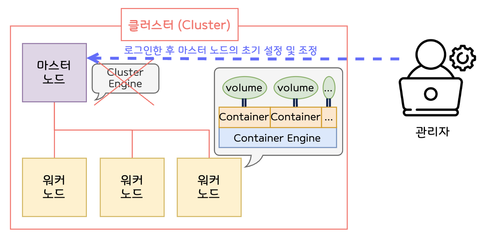
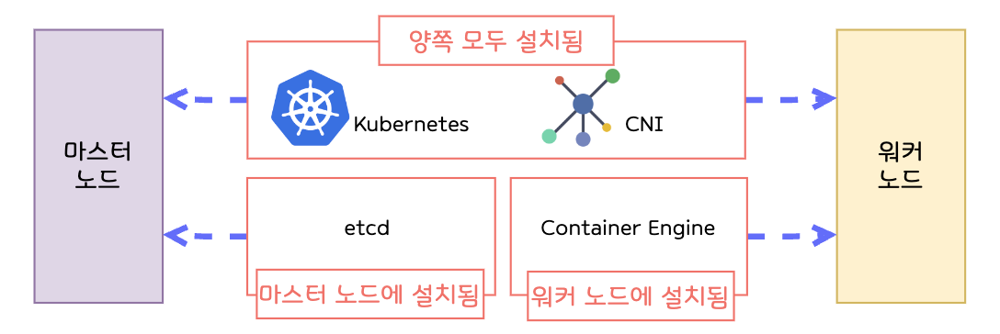
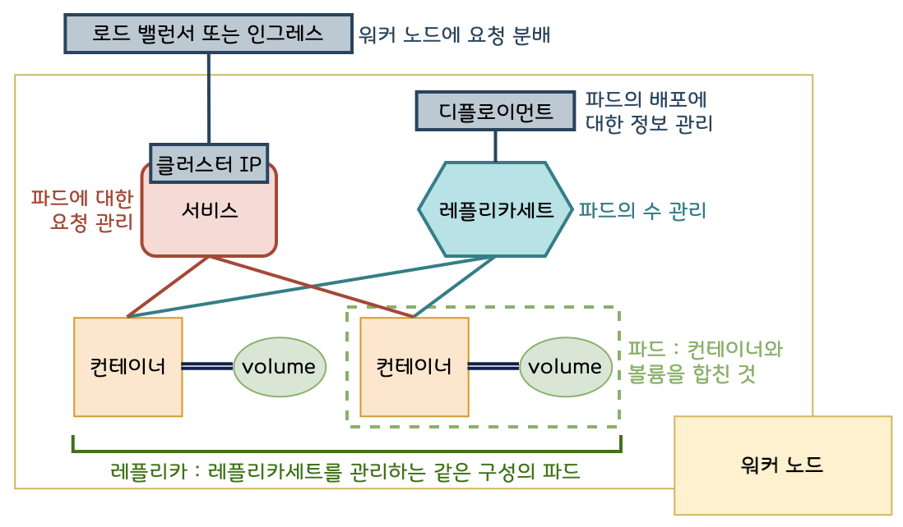

# 08. 쿠버네티스를 익히자

## 1. 쿠버네티스란?

- **컨테이너 오케스트레이션 도구**의 일종
    - 컨테이너 오케스트레이션 : 시스템 전체를 통괄하고 **여러 개의 컨테이너를 관리**하는 일
- k8s라고 줄여쓰기도 함
- 대규모 시스템에 적용되는 경우가 많음
- 여러 대의 컨테이너가 여러 대의 물리적 서버에 걸쳐 실행되는 것을 전제로 함
- **번거로운 컨테이너 생성이나 관리의 수고를 덜어줌**
- **도커 엔진 등의 컨테이너 엔진과는 별개의 소프트웨어**

## 2. 마스터 노드와 워커 노드

### 클러스터 구성 - 마스터 노드와 워커 노드

**마스터 노드**

- 전체적인 제어 담당
- **컨테이너를 실행하지는 않음**
- 워커 노드에서 실행되는 컨테이너를 관리하는 역할

**워커 노드**

- 실제 동작 담당
- **컨테이너가 실제 동작하는 서버**

**클러스터**

- 마스터 노드와 워커 노드로 구성된 일군의 쿠버네티스 시스템
- 사람이 개입하지 않아도 마스터 노드에 설정된 내용에 따라 워커 노드가 관리되며 **자율적으로 동작**

  


### 쿠버네티스 사용하기

- **쿠버네티스를 사용하려면 설치 필요**
    - 쿠버네티스 소프트웨어와 CNI (가상 네트워크 드라이버) 설치 필요
    - 대표적인 CNI 소프트웨어: 플란넬, 칼리코, AWS VPN CNI 등
- 마스터 노드에는 컨테이너 등의 상태를 관리하기 위해 `etcd`라는 데이터베이스가 설치됨
- 마스터 노드를 설정하는 관리자의 컴퓨터에는 `kubectl`을 설치해야 함
    - kubectl을 설치해야 마스터 노드에 로그인해 초기 설정을 진행하거나 추후 조정 가능
- **워커 노드에는 물론 도커 엔진 같은 컨테이너 엔진이 필요함**



### 컨트롤 플레인(제어판)과 워커 노드 구성

- **마스터 노드는 컨트롤 플레인을 통해 워커 노드 관리**
- 컨트롤 플레인
  - etcd 외에는 쿠버네티스에 포함되어 있으므로 추가 설치 필요 X

| 항목                      | 내용                                     |
|-------------------------|----------------------------------------|
| kube-apiserver          | 외부와 통신하는 프로세스, kubectl로부터 명령을 전달받아 실행함 |
| kube-controller-manager | 컨트롤러를 통합 관리, 실행                        |
| kube-scheduler          | 파드를 워커 노드에 할당                          |
| cloud-controler-manager | 클라우드 서비스와 연동해 서비스 생성                   |
| etcd                    | 클러스터 관련 정보 전반을 관리하는 데이터베이스             |
- 워커 노드의 구성


| 항목         | 내용                                                                                                 |
|------------|----------------------------------------------------------------------------------------------------|
| kube-let   | 마스터 노드에 있는 kube-scheduler와 연동하며 워커 노드에 파드를 배치하고 실행함. 실행 중인 파드의 상태를 정기적으로 모니터링하여 kube-scheduler에 통지 |
| kube-proxy | 네트워크 통신 라우팅 메커니즘                                                                                   |

### 쿠버네티스는 항상 “바람직한 상태” 유지

- **쿠버네티스는 자동으로 상태를 유지함**
- 컨테이너를 삭제하고 싶다면 삭제 명령어를 입력하는 것이 아닌 파일에서 **“바람직한 상태”**를 수정해야 함

  컨테이너를 직접 삭제를 하면 쿠버네티스 입장에서는 누가 일부러 컨테이너를 삭제한 것인지, 다른 이유로 컨테이너가 소멸한 것인지 구별할 수 없어 컨테이너를 생성하여 “바람직한 상태”를 유지하려 함

  ⇒ 사람이 개입해서 컨테이너를 삭제하면 안 됨

- (참고) 도커 컴포즈는 옵션을 지정해 수동으로 컨테이너 수를 바꿀 수는 있어도 모니터링 기능이 없어 컨테이너를 만들 때 외에는 관여하지 않음

## 3. 쿠버네티스의 구성과 관련 용어



### 파드

- 컨테이너와 볼륨을 함께 묶은 것
- 기본적으로 파드 하나가 컨테이너 하나이지만, 컨테이너가 여러 개인 파드도 있을 수 있음
- 파드에 포함되는 볼륨은 기본적으로 함께 파드에 포함되는 컨테이너가 정보를 공유하기 위해 사용하는 것으로, 파드에 볼륨이 없는 경우도 많음

### 서비스

- 파드를 모은 것 ⇒ 여러 개의 파드를 이끄는 반장!
- 서비스가 관리하는 파드는 기본적으로 동일한 구성을 가짐
    - 구성이 다른 파드는 별도의 서비스로 관리
- 파드가 여러 개의 워커 노드에 걸쳐 동작하더라도 이들을 모두 관리함 ⇒ **로드 밸런서 역할**
    - 각 서비스는 자동적으로 고정된 IP 주소를 부여 받으며(cluster IP), 이 주소로 들어오는 통신 처리
    - 내부적으로 여러 개의 파드가 있어도 밖에서는 하나의 IP 주소만 볼 수 있으며, 이 주소로 접근하면 서비스가 통신을 적절히 분배하는 구조
- 여러 워커 노드 간 분배는 **실제 로드 밸러서** 또는 **인그레스**가 담당함

### 디플로이먼트와 레플리카세트

- 레플리카세트
    - 파드 수 관리
    - 레플리카세트가 관리하는 동일한 구성의 파드를 **레플리카**라고 부름
- 디플로이먼트
    - 레플리카세트와 함께 쓰임
    - 파드의 디플로이(배포)를 관리하는 요소

### 주요 쿠버네티스 리소스

- 파드, 서비스, 디플로이먼트, 레플리카세트 등을 **리소스**라 함
- 주요 쿠버네티스 리소스


| 리소스 이름     | 내용                   |
|------------|----------------------|
| 파드         | 파드, 컨테이너와 볼륨을 합친 것   |
| 파드템플릿      | 배포 시 파드의 형틀 역할       |
| 레플리케이션컨트롤러 | 레플리케이션 제어            |
| 리소스쿼터      | 쿠버네티스 리소스의 사용량 제한 설정 |
| 비밀값        | 키 정보 관리              |
| 서비스어카운트    | 리소스를 다루는 사용자를 관리     |
| 서비스        | 파드에 요청 배분            |
| 데몬세트       | 워커 노드마다 하나의 파드 생성    |
| 디플로이먼트     | 파드 배포 관리             |
| 레플리카세트     | 파드 수 관리              |
| 스테이트풀세트    | 파드의 배포 상태를 유지하며 관리   |
| 크론잡        | 지정된 스케줄대로 파드 실행      |
| 잡          | 파드를 한 번 실행           |

## 4. 쿠버네티스 설치 및 사용법

### 어떤 종류의 쿠버네티스를 사용할까?

- 원조 쿠버네티스를 직접 구축해서 사용하는 경우는 흔하지 않음
    - 하드웨어 선정부터 전문 지식을 갖출 필요가 있음
    - 대게 외주로 구축을 맡김
- AWS 같은 클라우드 컴퓨팅 서비스를 사용해 구축하는 경우가 많음
    - EKS는 마스터 노드에 해당하고, EC2나 Fargate를 워커 노드로 사용
    - EKS 기본 요금에 더해 가상 서버 요금이 서버 대수만큼 부과됨
- 도커 데스크톱에는 쿠버네티스가 포함되어 있음
    - 도커 설정화면에서 Kubernetes에 체크하면 바로 사용 가능
- Minikube라는 간단히 사용할 수 있는 쿠버네티스도 있음
    - 컴퓨터 한 대에 마스터 노드와 워커 노드를 모두 구축

## 5. 매니페스트 파일(정의 파일) 작성

### 매니페스트 파일

- 파드나 서비스에 대한 설정을 쿠버네티스에서는 **매니페스트**라고 하며, 이를 적은 파일을 매니페스트 파일이라고 함
- YAML 또는 JSON 형식으로 기재
- 도커 컴포즈와 달리 이름이 지정되어 있지 않음
- 리소스 단위로 작성
    - 리소스 : 파드, 서비스, 디플로이먼트, 레플리카세트 등
- 리소스 단위로 분할해 작성해도 되고, 한 파일에 합쳐 작성해도 됨
    - 한 파일로 작성할 때는 각 리소스를 **‘---’**로 구분
    - 리소스 단위로 파일을 나눌 때는 각 리소스를 구별할 수 있도록 이름을 붙임

### 매니페스트 파일로 작성할 내용

**주 항목**

```bash
apiVersion: # API 그룹 및 버전
kind:       # 리소스 유형
metadata:   # 메타 데이터
spec:       # 리소스 내용
```

**리소스 설정 (API 그룹 및 유형)**

- 리소스를 정의하려면 먼저 API 그룹과 리소스 유형을 지정해야 함


| 리소스    | API 그룹 / 버전          | 리소스 유형     |
|--------|----------------------|------------|
| 파드     | core/v1 (v1으로 축약 가능) | Pod        |
| 서비스    | core/v1 (v1으로 축약 가능) | Service    |
| 디플로이먼트 | apps/v1              | Deployment |
| 레플리카세트 | apps/v1              | ReplicaSet |
- 자세한 내용은 공식 참조 문서의 리소스 유형 참조

**메타데이터**

- 리소스의 이름이나 레이블을 기재


| 항목                | 내용                        |
|-------------------|---------------------------|
| name              | 리소스 이름. 문자열로 된 유일 식별자     |
| namespace         | 리소스를 세분화한 DNS 호환 레이블      |
| uid               | 유일 식별자                    |
| resourceVersion   | 리소스 버전                    |
| generation        | 생성 순서를 나타내는 번호            |
| creationTimestamp | 생성 일시                     |
| deletionTimestamp | 삭제 일시                     |
| labels            | 임의의 레이블                   |
| anotation         | 리소스에 설정한 값. 선택 대상은 되지 못함. |

**스펙**

- 리소스의 내용 정의

**레이블**

- 키-값 쌍의 형태
- 레이블을 부여하면 셀렉터 기능을 사용해 특정 레이블이 부여된 파드만을 배포하는 등 특정 파드를 선택해 설정 가능

### 메타데이터와 스펙 작성

**파드**

```yaml
metadata:
  name:       # 파드 이름
  labels:     # 레이블
spec:
  containers: # 파드에 포함된 컨테이너 정보
  - name:     # 컨테이너 이름
    image:    # 이미지 이름
    ports:    # 포트 설정
```

- 단독으로 매니페스트 파일이 기재되는 경우가 드물며, 대부분 디플로이먼트에 포함되는 형태를 가짐
- 주항목 `metadata:` 와 `spec:` 아래 중항목과 소항목을 작성함
- 메타 데이터 아래는 name, labels를, 스펙 아래는 containers, volumes를 중항목으로 작성함. volumes는 작성하지 않는 경우도 많음.
    - containers 아래에 소항목 name, image, ports가 포함됨

**디플로이먼트**

```yaml
apiVersion:
kind:
metadata:
  name:           # 디플로이먼트 이름
spec:
  selector:       # 셀렉터 설정
    matchLables:  # 셀렉터가 선택할 관리 대상 레이블
  replicas:       # 레플리카 설정
  template:       # 템플릿 (파드 정보)
    metadata:     # 파드의 메타데이터 기재
    spec:         # 파드의 스펙 기재
```

- 디플로이먼트의 스펙은 템플릿의 형태로 파드의 설정 기재
- 셀렉트 설정
    - 디플로이먼트가 특정한 레이블이 부여된 파드를 관리할 수 있도록 하는 설정
    - `matchLables:` 뒤에 레이블을 기재하며, 이 레이블은 template 아래 metadata에 기재된 것
- 레플리카 설정
    - 파드의 레플리카에 대한 관리
    - 파드의 수를 몇 개로 유지할 것인지 설정
    - 값을 0으로 설정하면 파드가 사라짐
- 템플릿 작성
    - 생성할 파드 정보 기재
    - 파드 이름은 설정하지 않음

**서비스**

```yaml
apiVersion:
kind:
metadata:
  name:           # 디플로이먼트 이름
spec:
  type:           # 서비스 유형
  ports:          # 포트 설정
  - port:         # 서비스 포트
    targetPort:   # 컨테이너 포트
    protocol:     # 통신에 사용되는 프로토콜
    nodePort:     # 워커 노드의 포트
  selector:       # 셀렉터 설정
```

- 서비스 유형

  어떤 유형의 IP 주소 (또는 DNS)로 접근할지 설정

| 유형 이름        | 내용                               |
|--------------|----------------------------------|
| ClusterIP    | 클러스터 IP를 통해 서비스에 접근 (외부에서 접근 불가) |
| NodePort     | 워커 노드 IP를 통해 서비스에 접근             |
| LoadBalancer | 로드밸러서 IP를 통해 서비스에 접근             |
| ExternalName | 파드에서 서비스를 통해 외부로 나가기 위한 설정       |

- 도커 데스크톱과 Minikube는 모두 로드밸러서가 없음

  ⇒ 내부에서 외부로 접근해야 할 경우 유형 이름을 ExternalName으로 설정

- 포트 설정
- 프로토콜은 일반적으로 TCP를 많이 사용함

| 항목         | 내용       |
|------------|----------|
| port       | 서비스 포트   |
| nodePort   | 워커 노드 포트 |
| targetPort | 컨테이너 포트  |
    
- 셀렉터 설정
    - 파드나 디플로이먼트에서 컨테이너 부분의 설정에 지정된 레이블 사용
    - 서비스에서는 `matchLables:` 를 사용해서는 안됨

## 6. 쿠버네티스 명령어

### 쿠버네티스 명령어

- 쿠버네티스를 조작할 때는 `kubectl` 명령어 사용

    ```bash
    kubectl 커맨드 옵션
    ```

- 주요 kubectl 커맨드


| 커맨드          | 내용                              |
|--------------|---------------------------------|
| create       | 리소스 생성                          |
| edit         | 리소스 편집                          |
| delete       | 리소스 삭제                          |
| get          | 리소스 상태 출력                       |
| set          | 리소스 값 설정                        |
| apply        | 리소스 변경 사항 반영                    |
| describe     | 상세 정보 확인                        |
| diff         | ‘바람직한 상태’와 ‘현재 상태’ 차이 확인        |
| expose       | 여러 파드에 부하를 분산하는 새로운 서비스 오브젝트 생성 |
| scale        | 레플리카 수 변경                       |
| autoscale    | 자동 스케일링 적용                      |
| rollout      | 롤아웃 수행                          |
| exec         | 컨테이너에서 명령 실행                    |
| run          | 컨테이너에서 명령을 한 번 실행               |
| attach       | 컨테이너에 접속                        |
| cp           | 컨테이너에 파일 복사                     |
| logs         | 컨테이너 로그를 화면에 출력                 |
| cluster-info | 클러스터 상세 정보를 화면에 출력              |
| top          | CPU, 메모리, 스토리지 등 시스템 자원 확인      |

### 매니페스트 파일로 파드 생성 - 디플로이먼트

1. 디플로이먼트의 매니페스트 파일({파일명}.yml)을 쿠버네티스에 읽어 들이고 그 내용을 리소스에 반영

    ```bash
    kubectl apply -f {파일경로/파일명}.yml
    ```

2. 파드 생성되었는지 확인

    ```bash
    kubectl get pods
    ```


### 매니페스트 파일로 파드 생성 - 서비스

1. 서비스의 매니페스트 파일({파일명}.yml)을 쿠버네티스에 읽어 들이고 그 내용을 리소스에 반영

    ```bash
    kubectl apply -f {파일경로/파일명}.yml
    ```

2. 서비스가 생성되었는지 확인

    ```bash
    kubectl get services
    ```


## 7. 쿠버네티스를 연습하자

### 매니페스트 파일로 파드 수 늘리기

1. 매니페스트 파일 수정

    ```yaml
    apiVersion: apps/v1
    kind: Deployment
    metadata:
      name: app000dep
    spec:
      selector:
        matchLables:
        app: app000kube
      replicas: 5 # 여기 수정
      template:
        ...
    ```

2. 수정한 매니페스트 파일을 쿠버네티스에서 읽어 들이고 그 내용을 리소스에 반영

    ```bash
    kubectl apply -f {파일경로/파일명}.yml
    ```

3. 파스 수가 늘어났는지 확인

    ```bash
    kubectl get pods
    ```


### 매니페스트 파일로 아파치를 nginx로 바꾸기

1. 매니페스트 파일에서 image 항목 값을 `httpd`에서 `nginx`로 수정

    ```yaml
    # AS-IS
    # ...
    spec:
      # ...
      spec:
        containers:
          - name: app000ex
            image: httpd
            ports:
            - containerPort: 80
    
    # TO-BE
    # ...
    spec:
      # ...
      spec:
        containers:
          - name: app000ex
            image: nginx
            ports:
            - containerPort: 80
    ```

2. 수정한 매니페스트 파일을 쿠버네티스에서 읽어 들이고 그 내용을 리소스에 반영

    ```bash
    kubectl apply -f {파일경로/파일명}.yml
    ```

3. http://localhost:3000에 접속하면 apache 화면에서 nginx 화면으로 바뀜 (default 상태일 때 기준)

### 수동으로 파드 삭제 후 자동 복구 확인

1. get 커맨드로 파드 목록 확인해서, 어떤 파드라도 상관 없이 한 파드의 ID 복사

    ```bash
    kubectl get pods
    ```

2. 이전에 복사한 파드를 delete 커맨드를 사용해 삭제

    ```bash
    kubectl delete pod {파드 ID}
    ```

3. get 커맨드로 삭제한 ID의 파드는 사라지고 다른 ID의 파드가 보충되는지 존재하는지 확인

   → AGE 항목의 시간을 통해 보충된 파드인지 확인 가능

    ```bash
    kubectl get pods
    ```


### 생성했던 디플로이먼트와 서비스 삭제

1. delete 커맨드와 디플로이먼트의 매니페스트 파일을 사용해 디플로이먼트 삭제

    ```bash
    kubectl delete -f {파일경로/파일명}.yml
    ```

2. 디플로이먼트 목록을 보고 삭제되었는지 확인

    ```bash
    kubectl get deployment
    ```

3. delete 커맨드와 서비스의 매니페트스 파일을 사용해 서비스 삭제

    ```bash
    kubectl delete -f {파일경로/파일명}.yml
    ```

4. 서비스 목록을 보고 삭제되었는지 확인

    ```bash
    kubectl get service
    ```


> 본 게시글은 [그림과 실습으로 배우는 도커 & 쿠버네티스](https://product.kyobobook.co.kr/detail/S000001766500) 도서를 참고하여 작성되었습니다.
> 상세한 내용이 궁금하시다면 책을 읽어보실 것을 추천해 드립니다.