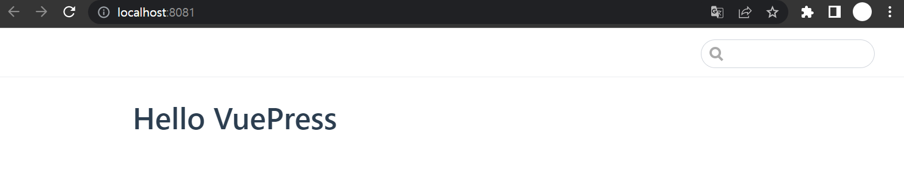
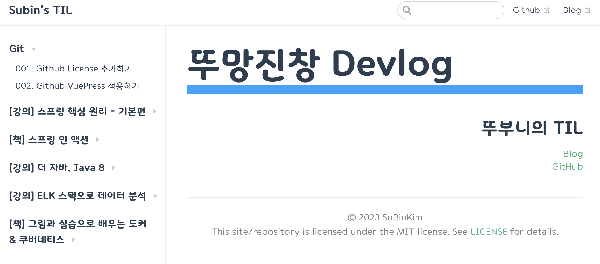

# 002. Github VuePress 적용하기

기존에 사용하던 리포지토리의 Github 페이지를 생성을 위해 VuePress를 적용해보기로 결정했습니다.

## 01. VuePress 시작하기

먼저 페이지를 생성할 레포에 접속을 한 다음, 아래 명령어를 통해 yarn을 설치합니다.

```bash
yarn init -y
```

그 후 `vuepress`를 추가해줍니다.

```bash
yarn add -D vuepress
```

이 과정에서 아래와 같은 에러를 만날 수도 있습니다.

```bash
error An unexpected error occurred: "https://registry.yarnpkg.com/vuepress: self signed certificate in certificate chain".
```

해당 에러는 SSL 문제이며, 다음 설정을 통해 에러를 해결할 수 있습니다.

```bash
yarn config set "strict-ssl" false
```

설치가 완료되면 문서를 저장할 docs 디렉터리을 만들어줍니다.

```bash
mkdir docs
```

그 다음 docs 디렉터리 내에 메인 페이지가 될 README.md를 추가해줍니다.
아래는 VuePress 공식 홈페이지에서 보여준 예시이며, 메인 페이지의 내용은 원하는대로 구성하면 됩니다.

```bash
echo '# Hello VuePress' > docs/README.md
```

그 다음 `package.json`에 아래와 같이 실행 관련 설정을 추가해줍니다.
`dev`는 로컬 환경에서 실행할 때 사용하고, `build`는 실제 운영 환경에서 사용됩니다.

```json
{
  //...
  "scripts": {
    "docs:dev": "vuepress dev docs",
    "docs:build": "vuepress build docs"
  }
  // ...
}
```

로컬 환경에서 실행시켜봅시다.

```bash
yarn docs:dev
```

`build`가 완료되면 다음과 같은 문구를 확인할 수 있습니다.

```bash
success [13:39:45] Build 0e980a finished in 5051 ms!
> VuePress dev server listening at http://localhost:8081/
```

`http://localhost:8081`에 접속하면 이전에 작성한 README.md가 메인 페이지로 표출되는 것을 확인할 수 있습니다.



## 02. 디렉터리 구조 변경하기

### 권장 디렉터리 살펴보기

`VuePress`에서 권장하는 디렉터리 구조는 다음과 같습니다.
여기서는 디렉터리 구조와 관련된 자세한 설명은 생략하며, 궁금하시다면 [공식 문서](https://v1.vuepress.vuejs.org/guide/directory-structure.html#default-page-routing)를 참고하길 바랍니다.

```text
├── docs
│   ├── .vuepress (Optional)
│   │   ├── components (Optional)
│   │   ├── theme (Optional)
│   │   │   └── Layout.vue
│   │   ├── public (Optional)
│   │   ├── styles (Optional)
│   │   │   ├── index.styl
│   │   │   └── palette.styl
│   │   ├── templates (Optional, Danger Zone)
│   │   │   ├── dev.html
│   │   │   └── ssr.html
│   │   ├── config.js (Optional)
│   │   └── enhanceApp.js (Optional)
│   │
│   ├── README.md
│   ├── guide
│   │   └── README.md
│   └── config.md
│
└── package.json
```

### AS-IS

현재 디렉터리 구조는 다음과 같이, 기존에 생성한 디렉터리 및 파일과 vuepress 구성 과정에서 생성한 디렉터리 및 파일이 섞여 있습니다. 이를 권장하는 구조에 맞춰 개선해보려 합니다.

```text
├── docker&k8s
├── docs
│   └── README.md
├── elastic-stack
│   │   └── analyze-data-with-elk-stack
│   │   │   └──json
├── git
├── images
├── java
├── spring
├── README.md
├── .gitignore
└── package.json
```

### TO-BE

vuepress를 통해 페이지 형식으로 표현할 디렉터리 및 파일은 `docs` 내로 옮겼습니다.
그리고 이미지와 같은 정적 파일은 권장하는 구조에 맞춰 `.vuepress` 디렉터리 생성 후 그 안에 `public` 디렉터리를 추가하고, `images`를 옮겨두었습니다.
또한, 구조 개선 과정에서 `elastic-stack > analyze-data-with-elk-stack > json` 디렉터리는 실습 코드만 모아둘 `practice` 디렉터리로 옮겼습니다.

```text
├── docs
│   ├── .vuepress (Optional)
│   │   └── public (Optional)
│   │   │   └── images
│   ├── docker&k8s
│   ├── elastic-stack
│   ├── git
│   ├── java
│   ├── spring
│   └── README.md
├── practice
│   │   └── elastic-stack
├── README.md
├── .gitignore
└── package.json
```

## 03. 사이트 구성하기

VuePress 사이트를 구성하기 위해서는 `.vuepress/config.js` 파일이 필수입니다.
`.vuepress` 디렉터리 내에 `config.js` 파일을 추가한 다음, 아래와 같이 구성하였습니다.

```javascript
const sidebar = require('./auto-sidebar-generator');

module.exports = {
  title: "Subin's TIL",
  description: "Subin's Today I Learned",
  base: "/TIL/",
  head: [
    ["link", { rel: "icon", href: "/images/favicon.png" }]
  ],
  themeConfig: {
    nav: [
      { text: 'Github', link: 'https://github.com/Kim-SuBin' },
      { text: 'Blog', link: 'https://subin-0320.tistory.com/' }
    ],
    sidebar: [
      sidebar.getSidebarGroup('/git/', 'Git'),
      sidebar.getSidebarGroup('/springBasic/', '[강의] 스프링 핵심 원리 - 기본편'),
      sidebar.getSidebarGroup('/springInAction/', '[책] 스프링 인 액션'),
      sidebar.getSidebarGroup('/java8/', '[강의] 더 자바, Java 8'),
      sidebar.getSidebarGroup('/analyze-data-with-elk-stack/', '[강의] ELK 스택으로 데이터 분석'),
      sidebar.getSidebarGroup('/docker&k8s/', '[책] 그림과 실습으로 배우는 도커 & 쿠버네티스'),
    ]
  }
};
```
구성 파일에 추가한 내용은 다음과 같습니다.
- `title` : 사이트 제목
- `description` : 사이트 설명
- `base` : 사이트 기본 URL이며, github.io로 사이트를 생성할 예정이면 `base`에 리포지토리명 기입 필수
- `head` : HTML Header 영역에 들어갈 내용
- `themeConfig` : 테마를 구성하는 요소
- `nav` : 상단 메뉴 영역
- `sidebar` : 좌측 메뉴 영역이며, `sidebar: 'auto'`를 통해 자동 생성으로 설정 가능
  - `sidebar`를 좀 더 커스텀하고 Windows와 MacOS에서 호환되도록 `config.js`와 함께 `sidebar-generator.js` 구현함

이외에 추가할 수 있는 구성에 대해서는 [공식문서](https://v1.vuepress.vuejs.org/config/#basic-config)를 참고하길 바랍니다.

## 04. 스타일을 변경하기
[진유림님 TIL의 Home.vue](https://github.com/milooy/TIL/blob/master/documents/.vuepress/components/Home.vue)를 가져와 활용하려고 했으나 잘 되지 않았고,
[박영준님 TIL의 README.md](https://github.com/jun108059/til/blob/master/docs/README.md)와 같이 구성하니 메인 페이지에 적용되는 것을 확인했습니다.
vuepress에서 권장하는 구조로 변경하고, 현재 리포지토리에 맞게 코드를 수정했습니다.

먼저, `README.md`를 다음과 같은 방식으로 구성했습니다.

```html
<div class="titleContainer">
  <h1>
    뚜망진창 Devlog
  </h1>
  <div class="infoContainer">
    <div class="name">뚜부니의 TIL</div>
    <ul style="list-style: none; line-height: 1.5rem;">
      <li>
        <a href="https://subin-0320.tistory.com/">Blog</a>
      </li>
      <li>
        <a href="https://github.com/Kim-SuBin">GitHub</a>
      </li>
    </ul>
  </div>
</div>
<br/>
<div class="footer">
  <hr/>
  <p class="copyright">
    © 2023 SuBinKim
    <br/>
    This site/repository is licensed under the MIT license. See <a href="https://github.com/Kim-SuBin/TIL/blob/main/LICENSE">LICENSE</a> for details.
  </p>
</div>

```
그 다음 `.vuepress > styles > index.styl` 내에 아래와 같이 css 코드를 추가했습니다.
이 때, 원하는 귀여운 폰트가 적용되도록 폰트를 import 받아와 전체 페이지에 적용했습니다.

```css
@import url('https://webfontworld.github.io/binggrae/Binggrae.css');
#app {
  font-family: "Binggrae", cursive !important;
}

img {
  max-width: 700px !important;
  width: 100%;
}

.sidebar {
  overflow-y: overlay;
}

.infoContainer {
  text-align: right;
}

.theme-default-content:not(.custom) {
  max-width: 1200px !important;
  word-break: break-all;
}

h1 {
  font-weight: 700;
  border-bottom: 17px solid #16a2ff;
  word-break: keep-all;
  font-size: 4rem;
}

.name {
  font-weight: 900;
  font-size: 2rem;
}

@media (max-width: 550px) {
  h1 {
    font-size: 3.4rem;
  }

  .name {
    font-size: 1.7rem;
  }
}

@media (max-width: 430px) {
  h1 {
    font-size: 3rem;
  }
}

.footer {
  text-align: center;
}

.copyright {
  color: gray;
  display: inline-block;
}
```

그러면 아래와 같이 귀여운 폰트와 스타일이 적용된 것을 확인할 수 있습니다.



## 05. 플러그인 적용하기

### back-to-top

페이지 스크롤을 통해 아래로 내려갔을 때, 맨 위로 올려주는 버튼이 우측 하단에 생성되는 플러그인입니다.

먼저, yarn을 통해 설치를 해줍니다.

```bash
yarn add -D @vuepress/plugin-back-to-top
```

그 다음 `config.js` 파일 내에 설정을 추가합니다.

```js
module.exports = {
  // ...
  plugins: ['@vuepress/back-to-top']
}
```
### Last Updated

깃 기반으로 마지막 업데이트 날짜를 게시글 우측 하단에 표시하는 플러그인입니다.

별도의 설치 없이 `config.js` 파일 내에 설정을 추가하면 됩니다.

```js
module.exports = {
  // ...
  plugins: ['@vuepress/last-updated']
}
```

기본적으로 시간은 AM, PM을 사용하는 12시간 형식으로 되어 있는데, 24시간으로 변경하고 싶다면 아래와 같이 `config.js` 파일 내에 설정하면 됩니다.

```js
module.exports = {
  // ...
  plugins: [
    [
      '@vuepress/last-updated',
      {
        dateOptions:{
          hour12: false
        }
      }
    ]
  ]
}
```


## 참고

- <https://v1.vuepress.vuejs.org/guide/getting-started.html#manual-installation>
- <https://prove.netlify.app/vuepress_githubpages_travis/vuepress-%EB%A5%BC-%EC%82%AC%EC%9A%A9%ED%95%98%EC%97%AC-%EB%B8%94%EB%A1%9C%EA%B7%B8-%EB%B0%B0%ED%8F%AC%ED%95%98%EA%B8%B0/>
- <https://rios.tistory.com/entry/React-npm-yarn-%EC%84%A4%EC%B9%98-%EC%98%A4%EB%A5%98-error-An-unexpected-error-occurred>
- <https://cnu-jinseop.tistory.com/147>
- <https://kyounghwan01.github.io/blog/Vue/vuepress/vuepress-start/#%E1%84%89%E1%85%A5%E1%86%AF%E1%84%8E%E1%85%B5>
- <https://limdongjin.github.io/vuejs/vuepress/#vuepress%E1%84%82%E1%85%B3%E1%86%AB-%E1%84%86%E1%85%AE%E1%84%8B%E1%85%A5%E1%86%BA%E1%84%8B%E1%85%B5%E1%86%AB%E1%84%80%E1%85%A1>
- <https://github.com/jun108059/til/blob/master/docs/.vuepress>
- <https://github.com/milooy/TIL/blob/master/documents/.vuepress/components/Home.vue>
- <https://vuepress.vuejs.org/plugin/official/plugin-back-to-top.html>