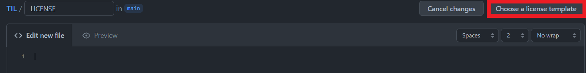
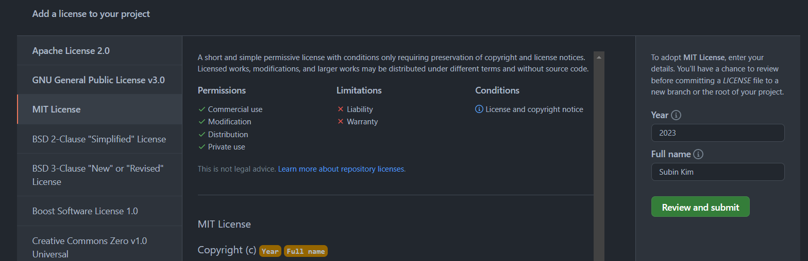
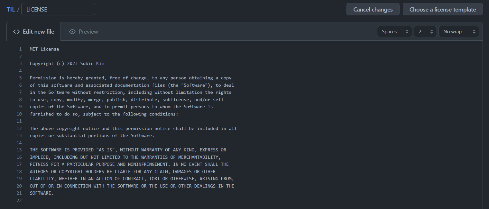
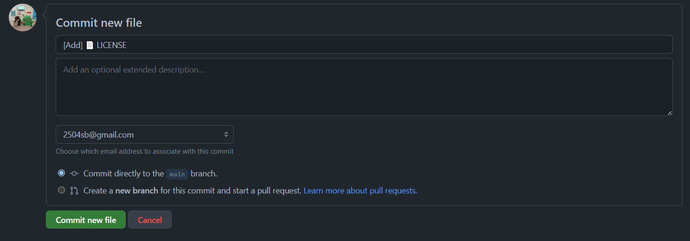

# 001. Github License 추가하기

Github 리포지토리에서 `Add file > Create new file`을 통해 파일 생성 페이지로 이동한다.

파일명을 다음과 같이 `LICENSE`로 설정하면 `Choose a license template` 버튼이 표출된다.

`Choose a license template` 버튼을 클릭하면 보이는 여러 License Template 중 MIT License를 선택하고 `Review and submit` 버튼을 클릭한다.

그러면 다음과 같이 MIT License 관련 내용이 자동으로 추가된다.

그 다음 LICENSE 파일을 추가해주면 Github 리포지토리에 License가 추가된다.

### 참고
- https://docs.github.com/ko/repositories/managing-your-repositorys-settings-and-features/customizing-your-repository/licensing-a-repository
- https://leeborn.tistory.com/entry/GitHub-GitHub-License-%EB%A7%8C%EB%93%A4%EA%B8%B0