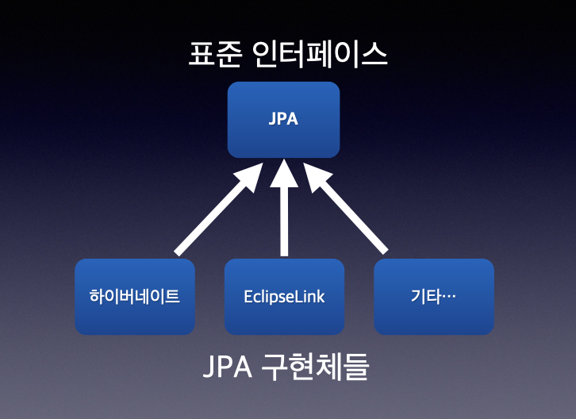
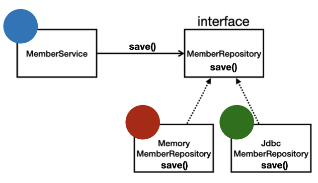

# 01. 객체 지향 설계와 스프링

## 1. 스프링 탄생

### 스프링 이전 (2000년 초반)

- EJB (Enterprise Java Beans)
    - 당시 제일 많이 사용하는 기술
    - 트랜잭션 처리, 분산 처리 지원, EJB 엔티티빈 기술 지원 등 좋은 점도 많았지만 비싼 가격, 느린 속도, 복잡하고 어려우며, EJB에 의존적으로 개발을 해야한다는 단점이 있었음

      ⇒ POJO 라는 개념도 여기서 등장! (오래된 방식의 간단한 자바를 쓰자!!!)

- EJB 지옥 탈출을 위해 개발자들이 오픈 소스를 만들기 시작
    - 스프링 - EJB 보다 단순함
    - 하이버네이트 - EJB 엔티티빈 기술 대체

      ⇒ JPA(Java Persistence API) 로 발전시킴

        

### 스프링 역사

- 2002년 로드 존슨 책 출간 (전설의 시작!)
- EJB 문제점 지적
- 책 출간 직후 **유겐 휠러, 얀 카로프** 가 로드 존슨에게 오픈소스 프로젝트 제안
- 스프링 이름은 전통적인 J2EE(EJB) 라는 겨울을 넘어 새로운 시작이라는 뜻으르 지음

### 릴리즈

- 2003년 스프링 프레임워크 1.0 출시 - XML
- 2006년 스프링 프레임워크 2.0 출시 - XML 편의 기능 지원
- 2009년 스프링 프레임워크 3.0 출시 - 자바 코드로 설정
- 2013년 스프렝 프레임워크 4.0 출시 - 자바 8
- 2014년 스프링 부트 1.0 출시 (스프링의 많은 설정 문제를 해결, 내장 톰캣 지원)
- 2017년 스프링 프레임워크 5.0, 스프링 부트 2.0 출시 - 리엑티브 프로그래밍 지원
- 2020년 9월 스프링 프레임워크 5.2.X, 스프링 부트 2.3.X

## 2. 스프링이란

### 스프링 생태계

- **스프링 프레임워크**
- **스프링 부트**
- 스프링 데이터 - 데이터베이스 CRUD를 편하게 사용할 수 있는 기능 제공
- 스프링 시큐리티 - 보안 관련
- 스프링 배치 - 배치 처리 특화
- 스프링 세션 - 세션 관련
- 스프링 Rest Docs - 문서화 편리화
- 스프링 클라우드 - 클라우드 기술 특화

등등…

### 스프링 프레임워크

- 핵심 기술 : 스프링 DI 컨테이너, AOP, 이벤트, …
- 웹 기술 : 스프링 MVC, 스프링 WebFlux
- 데이터 접근 기술 : 트랜잭션, JDBC, ORM 지원, XML 지원
- 기술 통합 : 캐시, 이메일, 원격접근, 스케줄링
- 테스트 : 스프링 기반 테스트 지원
- 언어 : 코틀린, 그루비

### 스프링 부트

- **스프링을 편리하게 사용할 수 있도록 지원**
- 최근에는 기본으로 사용함
- **단독으로 실행**할 수 있는 스프링 애플리케이션을 쉽게 생성
- Tomcat 같은 **웹 서버를 내장**해서 별도의 웹 서버를 설치하지 않아도 됨
- 손쉬운 빌드 구성을 위한 **starter 종속성** 제공
- 스프링과 3rd part (외부) 라이브러리 자동 구성 ⇒ **버전 관리를 해줌**
- 메트릭, 상태 확인, 외부 구성 같은 **프로덕션 준비 기능** 제공
- 간결한 설정

### 스프링이라는 단어?!

> 💡 스프링이라는 단어는 문맥에 따라 다르게 사용됨

- 스프링 DI 컨테이너 기술
- 스프링 프레임워크
- 스프링 부트, 스프링 프레임워크 등을 모두 포함한 스프링 생태계

### 스프링 핵심

- 자바 언어 기반의 프레임워크
- 스프링은 객체 지향 언어가 가진 강력한 특징을 살려내는 프레임워크
- 스프링은 **좋은 객체 지향 애플리케이션을 개발할 수 있게 도와주는 프레임워크**

## 3. 좋은 객체 지향 프로그래밍이란

### 객체 지향 특징

- 추상화
- 캡슐화
- 상속
- **다형성**

### 객체 지향 프로그래밍

- 컴퓨터 프로그래밍을 목록으로 보는 시각에서 벗어나 여러 개의 독립된 단위, 즉 **객체들의 모임**으로 파악하고자 하는 것이며, 각각의 **객체는 메시지를 주고 받고**, 데이터를 처리할 수 있음 (협력)
- 프로그램을 **유연하고 변경이 용이**하게 만들기 때문에 대규모 소프트웨어 개발에 많이 사용됨 (컴포넌트를 쉽고 유연하게 변경하면서 개발할 수 있음)

### 다형성 (Polymorphism)

- 역할과 구현으로 세상을 구분한다고 할 때?!
    - 운전자 - 자동차
        - 자동차 구현 : K3, 아반떼, 테슬라
        - 운전자가 자동차 K3 에서 아반떼나 테슬라로 변경해도 운전이 가능함

          ⇒ 구현이 변경되는 것이며, 역할은 동일하기 때문에 가능

    - 공연 무대
        - 로미오 역할 : 장동건, 원빈
        - 줄리엣 역할 : 김태희, 송혜교
        - 역할에 대한 배우는 대체가 가능함 ⇒ 여기서 배우는 구현
    - 키보드, 마우스, 세상의 표준 인터페이스들
    - 정렬 알고리즘
    - …
- 역할과 구현을 분리할 때 장점
    - 역할과 구현을 구분하면 단순해지고, 유연해지며 변경이 편리해짐
    - 클라이언트는 대상의 역할(인터페이스)만 알면 됨
    - 클라이언트는 구현 대상의 내부 구조를 몰라도 됨
    - 클라이언트는 구현 대상의 내부 구조가 변경되어도 영향을 받지 않음
    - 클라이언트는 구현 대상 자체를 변경해도 영향을 받지 않음

      ⇒ 자동차를 바꿔도 운전을 할 수 있음

- 자바 언어에서 역할과 구현
    - 역할 = 인터페이스
    - 구현 = 인터페이스를 구현한 클래스, 구현 객체
    - 객체 설계 시 역할(인터페이스)를 먼저 부여하고, 그 역할을 수행하는 구현 객체를 만드는 것이 좋음
    - 수많은 객체 클라이언트와 객체 서버는 서로 협력 관계를 가짐

      ⇒ 클라이언트 : 요청, 서버 : 응답


### 자바 언어의 다형성

- **오버라이딩**된 메서드 실행을 생각해보자!
- 다형성으로 인터페이스를 구현한 객체를 실행 시점에 유연하게 변경할 수 있음
- 상속 관계도 다형성, 오버라이딩 적용 가능

    

    ```java
    public class MemberService { 
        // 둘 중 하나를 선택해서 사용 가능
        // private MemberRepository memberRepository = new MemoryMemberRepository();
        private MemberRepository memberRepository = new JdbcMemberRepository();
    }
    ```


### 다형성의 본질

- 인터페이스를 구현한 객체 인스턴스를 실행 시점에 유연하게 변경할 수 있음
- 다형성의 본질을 이해하려면 협력이라는 객체 사이의 관계에서 시작해야 함
- **클라이언트는 변경하지 않고, 서버의 구현 기능을 유연하게 변경할 수 있음**

### 다형성 정리

- 실세계의 역할과 구현이라는 편리한 컨셉을 다형성을 통해 객체 세상으로 가져올 수 있음
- 유연하고 변경이 용이함
- 확장 가능한 설계
- 클라이언트에 영향을 주지 않고 변경 가능
- **인터페이스를 안정적으로 설계하는 것이 중요함**

### 스프링과 객체 지향

- 다형성이 가장 중요
- 스프링은 다형성을 극대화해서 이용할 수 있게 도와줌
- 제어의 역전(IoC), 의존관계 주입(DI)은 다형성을 활용해서 역할과 구현을 편리하게 다룰 수 있도록 지원

## 4. 좋은 객체 지향 설계의 5가지 원칙 (SOLID)

### SOLID

> 💡 클린 코드로 유명한 로버트 마틴이 좋은 객체 지향 설계의 5가지 원칙 정리

- SRP (Single Responsibility Principle) : 단일 책임 원칙
- OCP (Open/Closed Principle) : 개방-폐쇄 원칙
- LSP (Liskov Substitution Principle) : 리스코프 치환 원칙
- ISP (Interface Segregation Principle) : 인터페이스 분리 원칙
- DIP (Dependency Inversion Principle) : 의존관계 역전 원칙

### SRP 단일 책임 원칙

- **하나의 클래스는 하나의 책임만 가져야 함**
- 변경이 있을 때 파급 효과가 적으면 단일 책임 원칙을 잘 따른 것
    - e.g. UI 변경, 객체 생성과 사용 분리

### OCP 개방-폐쇄 원칙

- **확장에는 열려 있으나 변경에는 닫혀 있어야 함** ⇒ **다형성**을 활용
- 인터페이스를 구현한 새로운 클래스를 하나 만들어 새로운 기능을 구현
- **문제점**
    - MemberService 클라이언트가 구현 클래스를 직접 선택

      ``` java
      // AS-IS
      MemberRepository m = new MemoryMemberRepository();
      
      // TO-BE
      MemberRepository m = new JdbcMemberRepository();
      ```

    - 구현 객체를 변경하려면 클라이언트 코드를 변경해야 함

      ⇒ **다형성을 사용했지만 OCP 원칙을 지킬 수 없음**

    - **문제 해결 방법**

      ⇒ 객체를 생성하고, 연관관계를 맺어주는 별도의 조립, 설정자가 필요


### LSP 리스코프 치환 원칙

- **프로그램의 객체는 프로그램의 정확성을 깨뜨리지 않으면서 하위 타입의 인스턴스로 바꿀 수 있어야 함**
- e.g. 자동차 인터페이스의 엑셀은 앞으로 가는 기능 ⇒ 뒤로 가게 구현하면 LSP 위반, 느리더라도 앞으로 가야함

### ISP 인터페이스 분리 원칙

- **특정 클라이언트를 위한 인터페이스 여러 개가 범용 인터페이스 하나보다 나음**
- 자동차 인터페이스 → 운전 인터페이스, 정비 인터페이스로 분리

  → 사용자 클라이언트를 운전자 클라이언트, 정비사 클라이언트로 분리 가능

  ⇒ 정비 인터페이스 자체가 변해도 운전자 클라이언트에 영향을 주지 않음

- 인터페이스가 명확해지고, 대체 가능성이 높아짐

### DIP 의존관계 역전 원칙

- **추상화에 의존해야지 구현체에 의존하면 안된다**는 원칙

  ⇒ 구현 클래스에 의존하지 말고, 인터페이스에 의존해야 한다는 의미

- OCP에서 설명한 MemberService는 인터페이스에 의존하지만, 구현 클래스에도 동시에 의존 ⇒ DIP 위반

### 정리

- 객체 지향의 핵심은 ************다형성************
- 다형성만으로는 쉽게 부품을 갈아 끼우듯이 개발할 수 없으며, 구현 객체를 변경할 때 클라이언트 코드도 함께 변경됨

**⇒ 다형성만으로는 OCP, DIP를 지킬 수 없음 ( 다른 게 필요함! )**

## 5. 객체 지향 설계와 스프링

### 스프링과 객체 지향의 관계

- **스프링은 다형성 + OCP, DIP를 가능하게 만들어주는 기술 지원**
    - DI 컨테이너 제공
    - DI (Dependency Injection) : 의존 관계, 의존성 주입
- **클라이언트 코드 변경 없이 기능 확장**
- 쉽게 부품을 교체하듯이 개발 가능

### 정리

- 모든 설계에 역할과 구현을 분리하자!
- 애플리케이션 설계도 공연을 설계하듯 배역만 만들어두고, 배우는 언제든지 유연하게 변경할 수 있도록 만드는 것이 좋은 객체 지향 설계!
- 이상적으로 모든 설계에 인스턴스를 부여하자!!!
    - 인터페이스 도입 시 **추상화**라는 비용 발생
    - 기능 확장 가능성이 없다면, 구현 클래스를 직접 사용하고, 향후 꼭 필요할 때 리팩터링해서 인터페이스를 도입하는 것도 방법

## 책 추천

- 객체지향 책 추천 : 객체지향의 사실과 오해
- 스프링 책 추천 : 토비의 스프링
- JPA 책 추천 : 자바 ORM 표준 JPA 프로그래밍

> 본 게시글은 [스프링 핵심 원리 - 기본편](https://www.inflearn.com/course/%EC%8A%A4%ED%94%84%EB%A7%81-%ED%95%B5%EC%8B%AC-%EC%9B%90%EB%A6%AC-%EA%B8%B0%EB%B3%B8%ED%8E%B8) 강의를 참고하여 작성되었습니다.
>
>
> 상세한 내용이 궁금하시다면 강의 수강을 추천해 드립니다.
>