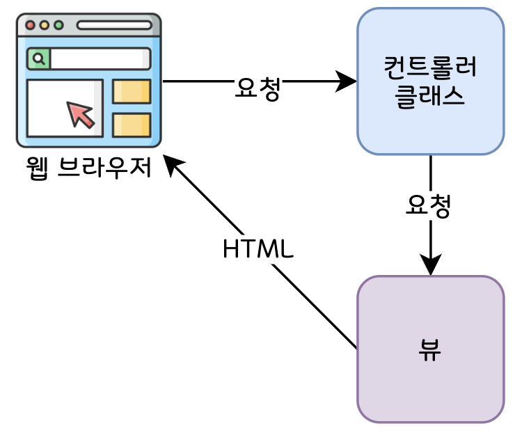

# 02. 웹 애플리케이션 개발하기

## 2.1 정보 보여주기

스프링 웹 애플리케이션에서 **컨트롤러는 데이터를 가져오고 처리**하며, **뷰는 브라우저에 보여주는 데이터를 HTML로** 나타낸다. 여기서는 페이지를 생성하기 위해 다음 컴포넌트에 대해 알아볼 예정이다.

- 도메인 클래스
- 스프링 MVC 컨트롤러 클래스
- 뷰 템플릿

이들의 관계는 아래와 같이 정리할 수 있다.



### 2.1.1 도메인 설정하기

애플리케이션의 도메인은 해당 애플리케이션의 이해와 필요한 개념을 다루는 영역이다.

```java
@Data
@RequiredArgsConstructor
public class Ingredient {
	private final String id;
	private final String name;
}
```

@Data 애노테이션을 지정하면, **@Data 내에는 @Getter @Setter 등이 포함**되어 있기 때문에 속성들의 게터와 세터 등을 생성하라고 Lombok에 알려준다. 그리고 **@RequiredArgsConstructor** 애노테이션을 지정하면 소스 코드에 생략되어 있는 final 속성들을 **초기화하는 생성자를 생성**하라고 Lombok에 알려준다.

그러면 Lombok에서는 **컴파일 시 자동 생성**하여 런타임 시에 사용할 수 있도록 한다.

### 2.1.2 컨트롤러 클래스 생성하기

컨트롤러는 아래와 같은 동작을 수행한다.

- HTTP 요청 처리
- 브라우저에 보여줄 HTML을 뷰에 요청
- REST 형태의 응답 몸체에 직접 데이터 추가

이 장에서는 웹 브라우저의 콘텐츠를 생성하기 위해 뷰를 사용하는 컨트롤러에 초점을 둔다.

```java
@Controller
@RequestMapping("/design")
public class DesignTacoController {
	@GetMapping
	public String showDesignForm(Model model) {
		// ...
		return "design";
	}
}
```

위 코드와 같이 **@Controller 애노테이션**을 적용한 클래스는 **컨트롤러로 식별**되며, 스프링은 스프링 애플리케이션 컨텍스트의 빈으로 이 클래스의 인스턴스를 자동 생성한다. **@RequestMapping 애노테이션**은 **지정한 경로로 시작하는 요청에 대해 처리**하며, 여기서는 “/design”으로 시작하는 경로에 대해서 처리한다.

**@GetMapping**은 **스프링 4.3에서 소개된 새로운 애노테이션**으로, 더 간결하고 HTTP GET 요청에 특화되어 있다. 이러한 @GetMapping은 요청에 대응하는 애노테이션 중 하나이며, 스프링 MVC에서 사용할 수 있는 **요청-대응 애노테이션**은 아래와 같다. 참고로, 요청-대응 애노테이션을 선언할 때는 가급적이면 특화된 것을 사용하는 것이 좋다.

| 애노테이션 | 설명 |
| --- | --- |
| @RequestMapping | 다목적 요청을 처리한다. |
| @GetMapping | HTTP GET 요청을 처리한다. |
| @PostMapping | HTTP POST 요청을 처리한다. |
| @PutMapping | HTTP PUT 요청을 처리한다. |
| @DeleteMapping | HTTP DELETE 요청을 처리한다. |
| @PatchMapping | HTTP PATCH 요청을 처리한다. |

**Model**은 컨트롤러와 데이터를 보여주는 뷰 사이에서 **데이터를 운반하는 객체**이다. Model 객체의 속성에 있는 데이터는 뷰가 알 수 있는 서블릿 요청 속성들로 복사된다. 그리고 클래스의 제일 마지막에 **“design”**을 반환하는데, 이는 모델 데이터를 브라우저에 나타내는 데 사용될 **뷰의 논리적인 이름**이다.

## 2.3 폼 입력 유효성 검사하기

스프링은 자바의 빈 유효성 검사 API를 지원하며, 이 API를 구현한 Hibernate 컴포넌트는 스프링 부트의 웹 스타터 의존성으로 자동 추가되어 쉽게 사용할 수 있다. 이러한 유효성 검사를 스프링 MVC에 적용하는 방법은 아래와 같다.

- 유효성을 검사할 클래스에 검사 규칙을 선언한다.
- 유효성 검사를 해야하는 컨트롤러 메서드에 검사를 수행한다는 것을 지정한다.

검사 규칙을 선언하기 위해서는 몇 가지 애노테이션을 활용하며, 이는 도메인 객체의 속성에 지정할 수 있다.

- @NotNull : 값이 없거나 null 인 경우를 제외하고 통과
- @Size(min= , max=) : 값이 지정된 범위 내에 있을 때 통과
- @NotBlank : 속성에 입력한 값이 있으면 통과 (’’나 “”로 넘어온 길이가 0인 값은 Blank여서 통과 X)
- @Pattern(regexp=, flag=) : 값이 지정한 정규식을 만족할 경우 통과
- @Digits(integer=, fraction=) : 값이 지정된 정수와 소수 자리 수보다 적을 경우 통과

이 외에 여러 가지가 존재하는 데, 이와 관련된 내용은 다음 블로그를 참고하길 바란다.

👉🏻 [https://postitforhooney.tistory.com/entry/SpringAnnotationValid와-어노테이션Annotation](https://postitforhooney.tistory.com/entry/SpringAnnotationValid%EC%99%80-%EC%96%B4%EB%85%B8%ED%85%8C%EC%9D%B4%EC%85%98Annotation)

도메인에 위 애노테이션을 선언하여 검사 규칙을 정하면, 그 다음으로는 컨트롤러에 @Valid 애노테이션을 추가해야 자바 빈 유효성 검사를 한다.

```java
@PostMapping
public String processDesign(@Valid Taco design) {
	// ...
}
```

## 2.4 뷰 컨트롤러로 작업하기

모델 데이터나 사용자 입력을 처리하지 않고 단순히 **뷰에 요청을 전달하는 일만 하는 컨트롤러**를 **뷰 컨트롤러**라고 하며, 이러한 뷰 컨트롤러는 앞에서 설명한 방법과 다른 방법으로 정의할 수 있다.

```java
@Configuration
public class WebConfig implements WebMvcConfigurer {
	@Override
	public void addViewControllers(ViewControllerRegistry registry) {
		registry.addViewController("/").setViewName("home");
	}
}
```

WebConfig는 뷰 컨트롤러의 역할을 수행하는 구성 클래스이며, WebMvcConfigurer 인터페이스를 구현한다. WebMvcConfigurer 인터페이스는 스프링 MVC를 구성하는 메서드를 정의하고, 기본적인 구현을 제공한다.

## 2.5 뷰 템플릿 라이브러리 선택하기

스프링 부트 자동-구성에서 지원되는 템플릿은 아래와 같다.

- FreeMarker
- Groovy 템플릿
- JavaServer Pages (JSP)
- Mustache
- Thymeleaf

### 2.5.1 템플릿 캐싱

기본적으로 **템플릿은 최초 사용될 때 한 번만 파싱**된다. 그리고 파싱된 결과는 향후 사용을 위해 **캐시에 저장**된다. 개발할 때는 이러한 템플릿 캐싱이 불편함을 가져온다. 다행히도 캐싱 속성을 **false로 변경하면 캐싱이 비활성화**된다. 단, 프로덕션에서 애플리케이션을 배포할 때는 캐싱이 되어야 하므로 캐싱 비활성화를 했다면, true로 변경하여 캐싱 활성화로 변경해주자.

> 본 게시글은 [스프링 인 액션](https://product.kyobobook.co.kr/detail/S000001942493) 도서를 참고하여 작성되었습니다.
>
>
> 상세한 내용이 궁금하시다면 책을 읽어보실 것을 추천해 드립니다.
>