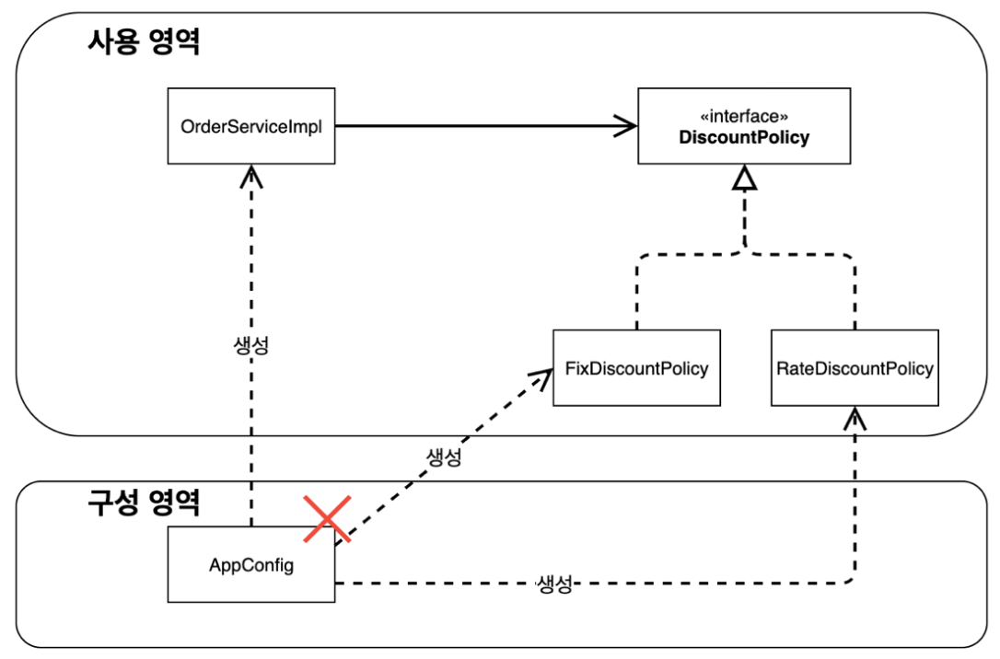

# 03. 스프링 핵심 원리 이해2 - 객체 지향 원리 적용

## 1. 새로운 할인 정책 개발

### 새로운 할인 정책을 확장해보자

- 주문한 금액의 10%를 할인해주는 정률 할인 정책으로 변경하기로 결정했다.
- 변경 과정에서 객체지향 설계 원칙을 잘 준수했는지 확인할 수 있다.

### RateDiscountPolicy 추가


RateDiscountPolicy 코드를 추가해보자

```java
public class RateDiscountPolicy implements DiscountPolicy{

    private int discountPercent = 10;

    @Override
    public int discount(Member member, int price) {
        if (member.getGrade() == Grade.VIP) {
            return price * discountPercent / 100;
        } else {
            return 0;
        }
    }
}
```

이제 정상 동작하는지 확인을 위해 테스트 코드를 작성해보자. IntelliJ에서는 **command + shift + t** 를 클릭하고 **Create New Test** 를 클릭하고 OK를 누르면 테스트 코드 껍데기가 생성된다. 그 안에 아래와 같이 내용을 채워주자.

```java
class RateDiscountPolicyTest {
    RateDiscountPolicy discountPolicy = new RateDiscountPolicy();

    @Test
    @DisplayName("VIP는 10% 할인이 적용되어야 한다")
    void vip_o() {
        // given
        Member member = new Member(1L, "memberVIP", Grade.VIP);
        // when
        int discount = discountPolicy.discount(member, 10000);
        // then
        Assertions.assertThat(discount).isEqualTo(1000);
    }

    @Test
    @DisplayName("VIP가 아니면 할인이 적용되지 않아야 한다")
    void vip_x() {
        // given
        Member member = new Member(1L, "memberBASIC", Grade.BASIC);
        // when
        int discount = discountPolicy.discount(member, 10000);
        // then
        Assertions.assertThat(discount).isZero();
    }
}
```

## 2. 새로운 할인 정책 적용과 문제점

### 새로운 할인 정책 적용

새로운 할인 정책을 애플리케이션에 적용하려면 **OrderServiceImpl** 코드를 고쳐야 한다.

```java
public class OrderServiceImpl implements OrderService {

    private final MemberRepository memberRepository = new MemoryMemberRepository();
    //    private final DiscountPolicy discountPolicy = new FixDiscountPolicy();
    private final DiscountPolicy discountPolicy = new RateDiscountPolicy();

    // ...
}
```

### 문제점 발견

- 역할과 구현을 충분하게 분리했으며, 다형성을 활용하고 인터페이스와 구현 객체를 분리했으나, OCP와 DIP 같은 객체 지향 설계 원칙을 충분히 준수하지 않다.
- **DIP 위반** : 주문 서비스 클라이언트 (OrderServiceImpl) 는 DiscountPolicy 인터페이스 뿐만 아니라 구현 클래스에도 의존하고 있다.

  

- **OCP 위반** : 할인 정책 변경 시 클라이언트 (OrderServiceImpl) 의 소스 코드를 함께 변경해야 한다.

  


### 문제 해결 방법

DIP를 위반하지 않게 인터페이스에만 의존하도록 의존관계를 변경하면 된다.


```java
public class OrderServiceImpl implements OrderService {

    private final MemberRepository memberRepository = new MemoryMemberRepository();
    //    private final DiscountPolicy discountPolicy = new RateDiscountPolicy();
    private DiscountPolicy discountPolicy;

    // ...
}
```

그런데 이렇게 코드를 변경하고 실제로 실행해보면 **NPE(Null Pointer Exception)**가 발생하게 된다.

이러한 문제를 해결하려면 누군가가 클라이언트인 **OrderServiceImpl**에 **DiscountPolicy** 구현 객체를 대신 생성하고 주입해주어야 한다.

## 3. 관심사의 분리

### 애플리케이션을 공연에 비유해보자

- 각각의 인터페이스를 배역이라고 하고, 구현체를 배우라고 생각해보자!
- 이전의 DIP를 위반한 구현체에 의존 관계를 가지고 있던 코드는 로미오 역할(인터페이스)을 하는 레오나르도 디카프리오(구현체, 배우)가 줄리엣 역할(인터페이스)을 하는 여주인공(구현체, 배우)을 직접 초빙하는 것과 같다.

  ⇒ 디카프리오는 공연도 해야하고 동시에 여주인공도 공연에 직접 초빙해야 하는 **다양한 책임**을 가지고 있다.


### 관심사를 분리하자

- 배우는 본인의 역할인 배역을 수행하는 것에만 집중해야 한다.
- 디카프리오는 어떤 여자 주인공이 선택되더라도 똑같이 공연을 할 수 있어야 한다.
- 공연을 구성하고, 담당 배우를 섭외하고, 역할에 맞는 배우를 지정하는 책임을 담당하는 별도의 **공연 기획자**가 나올 시점이다.
- 공연 기획자를 만들고, 배우와 공연 기획자의 책임을 확실히 분리하자!

### AppConfig 등장

애플리케이션의 전체 동작 방식을 구성(config)하기 위해, **구현 객체를 생성하고, 연결하는 책임**을 가지는 별도의 설정 클래스를 만들자.

```java
public class AppConfig {

    public MemberService memberService() {
        return new MemberServiceImpl(new MemoryMemberRepository());
    }

    public OrderService orderService() {
        return new OrderServiceImpl(
                new MemoryMemberRepository(), new FixDiscountPolicy()
        );
    }

}
```

- AppConfig는 애플리케이션의 실제 동작에 필요현 **구현 객체**를 생성한다.
    - MemberServiceImpl
    - MemoryMemberRepository
    - OrderServiceImpl
    - FixDiscountPolicy
- AppConfig는 생성자 객체 인스턴스의 참조(레퍼런스)를 **생성자를 통해서 주입**해준다. ⇒ **생성자 주입**
    - MemberServiceImpl → MemoryMemberRepository
    - OrderServiceImpl → MemoryMemberRepository, FixDiscountPolicy

**AppConfig 생성을 완료했으면, MemberServiceImpl 코드와 OrderServiceImpl 코드에 생성자를 만들자.**

### MemberServiceImpl - 생성자 주입

```java
public class MemberServiceImpl implements MemberService {

    private final MemberRepository memberRepository;

    public MemberServiceImpl(MemberRepository memberRepository) {
        this.memberRepository = memberRepository;
    }

    // ...
}
```

- 설계 변경으로 MemberServiceImple은 MemoryMemberRepository를 의존하지 않으며, **MemberRepository 인터페이스만 의존한다.**
- MemberServiceImpl 입장에서 생성자를 통해 어떤 구현 객체가 들어올지 알 수 없다.
- MemberServiceImple의 생성자를 통해서 어떤 구현 객체를 주입할지는 오직 외부(AppConfig)에서 결정된다.
- MemberServiceImple은 이제 **의존 관계에 대한 고민은 외부에 맡기고 실행에만 집중하면 된다.**
- **클래스 다이어그램**

  

    - **객체 생성과 연결은 AppConfig가 담당한다.**
    - **DIP 완성** : MemberServiceImple은 MemberRepository인 추상에만 의존하면 되며, 구체 클래스를 몰라도 된다.
    - **관심사 분리** : 객체를 생성하고 연결하는 역할과 실행하는 역할이 명확히 분리되었다.
- **회원 객체 인스턴스 다이어그램**

  

    - appConfig 객체는 memoryMemberRepository **객체를 생성**하고 그 참조값을 memberServiceImple을 생성하면서 **생성자를 전달**한다.
    - 클라이언트인 memberServiceImpl 입장에서 보면 **의존관계를 마치 외부에서 주입해주는 것 같다**고 해서 **DI(Dependency Injection)** 우리말로 **의존관계 주입** 또는 **의존성 주입**이라고 한다.

### OrderServiceImple - 생성자 주입

```java
public class OrderServiceImpl implements OrderService {

    private final MemberRepository memberRepository;
    private final DiscountPolicy discountPolicy;

    public OrderServiceImpl(MemberRepository memberRepository, DiscountPolicy discountPolicy) {
        this.memberRepository = memberRepository;
        this.discountPolicy = discountPolicy;
    }

    // ...
}
```

- 설계 변경으로 OrderServiceImpl은 FixDiscountPolicy를 의존하지 않으며, 단지 **DiscountPolicy 인터페이스만 의존한다.**
- OrderServiceImpl 입장에서 생성자를 통해 어떤 구현 객체가 들어올지 알 수 없으며, 이는 외부(AppConfig)에서 결정에서 결정한다.
- OrderServiceImpl에는 MemoryMemberRepository, FixDiscountPolicy 객체의 의존관계가 주입된다.

### AppConfig 실행

실행을 하기 위해 먼저 코드를 수정해주자.

- MemberApp

    ```java
    public class MemberApp {
        public static void main(String[] args) {
            AppConfig appConfig = new AppConfig();
            MemberService memberService = appConfig.memberService();
            Member member = new Member(1L, "memberA", Grade.VIP);
            memberService.join(member);
    
            Member findMember = memberService.findMember(1L);
            System.out.println("member = " + member.getName());
            System.out.println("findMember = " + findMember.getName());
        }
    }
    ```

- OrderApp

    ```java
    public class OrderApp {
        public static void main(String[] args) {
            AppConfig appConfig = new AppConfig();
            MemberService memberService = appConfig.memberService();
            OrderService orderService = appConfig.orderService();
    
            Long memberId = 1L;
            Member member = new Member(memberId, "memberA", Grade.VIP);
            memberService.join(member);
    
            Order order = orderService.createOrder(memberId, "itemA", 10000);
            System.out.println("order = " + order);
            System.out.println("order.calculatePrice() = " + order.calculatePrice());
        }
    }
    ```

- MemberServiceTest

    ```java
    class MemberServiceTest {
        MemberService memberService;
    
        @BeforeEach
        public void beforeEach() {
            AppConfig appConfig = new AppConfig();
            memberService = appConfig.memberService();
        }
    
        @Test
        void join() {
            // given
            Member member = new Member(1L, "memberA", Grade.VIP);
    
            // when
            memberService.join(member);
            Member findMember = memberService.findMember(1L);
    
            // then
            Assertions.assertThat(member).isEqualTo(findMember);
        }
    }
    ```

- OrderServiceTest

    ```java
    class OrderServiceTest {
        MemberService memberService;
        OrderService orderService;
    
        @BeforeEach
        public void beforeEach() {
            AppConfig appConfig = new AppConfig();
            memberService = appConfig.memberService();
            orderService = appConfig.orderService();
        }
    
        @Test
        void createOrder() {
            Long memberId = 1L;
            Member member = new Member(memberId, "memberA", Grade.VIP);
            memberService.join(member);
    
            Order order = orderService.createOrder(memberId, "itemA", 10000);
            Assertions.assertThat(order.getDiscountPrice()).isEqualTo(1000);
        }
    }
    ```


### 정리

- AppConfig를 통해서 관심사를 확실하게 분리했다.
- AppConfig는 구체 클래스를 선택하며, 애플리케이션이 어떻게 동작해야 할지 전체 구성을 책임진다.
- 공연으로 생각해보자
    - AppConfig 라는 공연 기획자는 배역에 맞는 담당 배우를 선택하며, 각 배우들은 담당 기능을 실행하는 책임만 지면 된다.

      ⇒ **서비스는 기능을 실행하는 책임지면 된다.**


## 4. AppConfig 리팩터링

현재 AppConfig는 중복이 있고, 역할에 따른 구현이 잘 보이지 않음

### 기대하는 그림


### 리팩터링

중복을 제거하고, 역할에 따른 구현이 잘 보이도록 리팩터링을 해보자

```java
public class AppConfig {

    public MemberService memberService() {
        return new MemberServiceImpl(memberRepository());
    }

    private MemberRepository memberRepository() {
        return new MemoryMemberRepository();
    }

    public OrderService orderService() {
        return new OrderServiceImpl(memberRepository(), discountPolicy());
    }

    public DiscountPolicy discountPolicy() {
        return new FixDiscountPolicy();
    }

}
```

- new MemoryMemberRepository() 를 중복 제거하고, 이제 MemoryMemberRepository를 다른 구현체로 변경할 때 한 부분만 변경하면 된다.
- AppConfig를 보면 역할과 구현 클래스가 한 눈에 들어오며, 애플리케이션 전체 구성이 어떻게 되어있는지 빠르게 파악할 수 있다.

## 5. 새로운 구조와 할인 정책 적용

AppConfig의 등장으로 애플리케이션이 크게 사용 영역과 객체를 생성하고 구성하는 영역으로 분리되었다.

할인 정책이 변경되면 구성 영역만 변경되면 되며, 사용 영역은 변경되지 않는다.



변경된 할인 정책에 맞게 코드를 변경해주자

```java
public class AppConfig {

    // ...

    public DiscountPolicy discountPolicy() {
//        return new FixDiscountPolicy();
        return new RateDiscountPolicy();
    }

}
```

**구성 영역이 변경되는 것은 당연하다.** AppConfig는 공연의 기획자로, 공연 참가자인 구현 객체들을 모두 알아야 한다.

## 6. 전체 흐름 정리

### 새로운 할인 정책 개발

다형성 덕분에 새로운 정률 할인 정책 코드를 추가로 개발하는 것 자체는 아무 문제 X

### 새로운 할인 정책 적용과 문제점

새로 개발한 정률 할인 정책을 적용하려고 하니 클라이언트 코드인 주문 서비스 구현체도 함께 변경해야 한다는 문제 발생 → 주문 서비스 클라이언트가 인터페이스뿐만 아니라 구체 클래스도 함께 의존

⇒ **DIP 위반**

### 관심사의 분리

애플리케이션의 전체 동작 방식을 구성하기 위해, **구현 객체를 생성하고 연결하는 책임을 가지는 AppConfig 추가**

⇒ 클라이언트 객체는 자신의 역할을 실행하는 것만 집중하며, 권한이 줄어듬 (책임이 명확해짐)

### AppConfig 리팩터링

구성 정보에서 역할과 구현을 명확하게 분리하여, 역할을 잘 드러냄 + 중복 제거

### 새로운 구조와 할인 정책 적용

정액 할인 정책 → 정률 할인 정책으로 변경

AppConfig의 등장으로 애플리케이션이 크게 사용 영역과 객체를 생성하고 구성하는 영역으로 분리되어, 클라이언트 코드 변경 없이 **AppConfig가 있는 구성 영역만 변경하면 새로운 정책 적용 가능**

## 7. 좋은 객체 지향 설계의 5가지 원칙 적용

여기서는 크게 **SRP, DIP, OCP** 세 가지가 적용되어 있음

### SRP 단일 책임 원칙

- **하나의 클래스는 하나의 책임만 가져야 한다.**
- 구현 객체를 생성하고 연결하는 책임은 AppConfig가 담당
- 클라이언트 객체는 실행하는 책임만 담당

### DIP 의존 관계 역전 원칙

- **프로그래머는 추상화에 의존해야지, 구체화에 의존해서는 안된다. 의존성 주입은 이 원칙을 따르는 방법 중 하나이다.**
- 클라이언트는 추상화 인터페이스에만 의존하며, AppConfig가 객체 인스턴스를 클라이언트 코드 대신 생성하여 클라이언트 코드에 의존관계를 주입해준다.

### OCP 개방-폐쇄 원칙

- **소프트웨어 요소는 확장에는 열려 있으나 변경에는 닫혀 있어야 한다**
- 애플리케이션이 크게 사용 영역과 구성 영역으로 나뉘며, 할인 정책이 변경되면 구성 영역인 AppConfig만 변경됨 ⇒ **소트프웨어 요소를 새롭게 확장해도 사용 영역 변경은 닫혀 있음!**

## 8. IoC, DI, 그리고 컨테이너

### 제어의 역전 IoC (Inveresion of Control)

- 기존 프로그램은 클라이언트 구현 객체가 스스로 필요한 서버 구현 객체를 생성하고 연결하고 실행함. ⇒ 구현 객체가 프로그램의 제어 흐름을 스스로 조종
- AppConfig 등장 이후 구현 객체는 로직 실행 역할만 담당하며, 프로그램 제어 흐름은 이제 AppConfig가 가져감 ⇒ 프로그램에 대한 제어 흐름 권한은 모두 AppConfig가 가짐

⇒ 프로그램의 제어 흐름을 직접 제어하는 것이 아닌 외부에서 관리하는 것을 제어의 역전(IoC)라고 함

### 의존관계 주입 DI (Dependency Injection)

- 의존관계는 정적인 클래스 의존 관계와 실행 시점에 결정되는 동적인 객체(인스턴스) 의존 관계 둘을 분리해서 생각해야 함
- **정적인 클래스 의존관계**
    - 클래스가 사용하는 import 코드만 보고 의존관계를 쉽게 판단할 수 있음
    - 정적인 의존 관계는 애플리케이션을 실행하지 않아도 분석할 수 있음

  

- **동적인 객체 인스턴스 의존관계**
    - 애플리케이션 실행 시점에 새로 생성된 객체 인스턴스의 잠조가 연결된 의존 관계

  

    - 애플리케이션 실행 시점(런타임)에 외부에서 실제 구현 객체를 생성하고 클라이언트에 전달해 클라이언트와 서버의 실제 의존관계가 연결되는 것을 **의존관계 주입**이라 한다.
    - 객체 인스턴스를 생성하고, 그 참조값을 전달해서 연결된다.
    - 의존관계 주입을 사용하면 클라이언트 코드를 변경하지 않고 호출하는 대상 타입 인스턴스를 변경할 수 있으며, **정적인 클래스 의존관계 변경 없이 동적인 객체 인스턴스 의존관계를 쉽게 변경할 수 있다.**

### IoC 컨테이너 or DI 컨테이너

- **AppConfig 처럼 객체를 생성하고 관리하면서 의존관계를 연결해주는 것**
- 의존관계 주입에 초점을 맞추어 주로 최근에는 주로 DI 컨테이너라고 함
- 또는 어샘블러, 오브젝트 팩토리 등으로 불리기도 함

## 9. 스프링으로 전환하기

지금까지 순수한 자바 코드만으로 DI를 적용했다. 이제 스프링을 사용해보자!!

AppConfig를 스프링 컨테이너에서 구성(설정) 정보로 사용할 수 있도록 @Configuration 을 붙이고, 메서드에 @Bean 을 붙여 스프링 컨테이너에 등록된 객체인 스프링 빈으로 만들어준다.

```java
@Configuration
public class AppConfig {

    @Bean
    public MemberService memberService() {
        return new MemberServiceImpl(memberRepository());
    }

    @Bean
    public MemberRepository memberRepository() {
        return new MemoryMemberRepository();
    }

    @Bean
    public OrderService orderService() {
        return new OrderServiceImpl(memberRepository(), discountPolicy());
    }

    @Bean
    public DiscountPolicy discountPolicy() {
//        return new FixDiscountPolicy();
        return new RateDiscountPolicy();
    }

}
```

MemberApp과 OrderApp에서 스프링 빈에 등록된 메서드를 찾아와 사용하는 방식으로 코드를 변경해준다.

```java
public class MemberApp {
    public static void main(String[] args) {
        ApplicationContext applicationContext = new AnnotationConfigApplicationContext(AppConfig.class);
        MemberService memberService = applicationContext.getBean("memberService", MemberService.class);
        Member member = new Member(1L, "memberA", Grade.VIP);
        memberService.join(member);

        Member findMember = memberService.findMember(1L);
        System.out.println("member = " + member.getName());
        System.out.println("findMember = " + findMember.getName());
    }
}
```

```java
public class OrderApp {
    public static void main(String[] args) {
        ApplicationContext applicationContext = new AnnotationConfigApplicationContext(AppConfig.class);
        MemberService memberService = applicationContext.getBean("memberService", MemberService.class);
        OrderService orderService = applicationContext.getBean("orderService", OrderService.class);

        Long memberId = 1L;
        Member member = new Member(memberId, "memberA", Grade.VIP);
        memberService.join(member);

        Order order = orderService.createOrder(memberId, "itemA", 20000);
        System.out.println("order = " + order);
        System.out.println("order.calculatePrice() = " + order.calculatePrice());
    }
}
```

### 스프링 컨테이너

- **ApplicationContext**를 스프링 컨테이너라고 한다.
- 스프링 컨테이너는 **@Configuration** 이 붙은 AppConfig를 구성(설정) 정보로 사용한다. 여기서 **@Bean**이라 적힌 메서드를 모두 호출해 반환된 객체를 스프링 컨테이너에 등록한다. 이렇게 스프링 컨테이너에 등록된 객체를 스프링 빈이라 한다.
- 스프링 빈은 **@Bean**이 붙은 메서드 명을 스프링 빈의 이름으로 사용한다. (e.g. memberService, orderService)
- 스프링 빈은 **applicationContext.getBean()** 메서드를 사용해 찾을 수 있다.
- 스프링 컨테이너에서 객체를 스프링 빈으로 등록하고, 스프링 컨테이너에서 스프링 빈을 찾아 사용하도록 변경되었다!

> 본 게시글은 [스프링 핵심 원리 - 기본편](https://www.inflearn.com/course/%EC%8A%A4%ED%94%84%EB%A7%81-%ED%95%B5%EC%8B%AC-%EC%9B%90%EB%A6%AC-%EA%B8%B0%EB%B3%B8%ED%8E%B8) 강의를 참고하여 작성되었습니다.
>
>
> 상세한 내용이 궁금하시다면 강의 수강을 추천해 드립니다.
>